[toc]

# 数据结构

> 前言：数据结构，好比是一类基本工具，每一类数据结构被抽象出来，必定有其广泛的用途。用好数据结构，就相当于用好了这类基本工具。——工欲善其事必先利其器。

## 线性表

无论是一维数组也好，二维、三维数组也好，本质都是一张表：都是一堆数据元素的排列，只不过二维的每一个元素都是一个一维数组（三维以此类推），那么如何运用好数组呢？也是一门学问——见稀疏数组，就是**数组压缩**的例子之一。

**链表**也是线性表，只不过存储方式是链式的，即在计算机中不是连续存储的。

**队列**和**栈**，都是操作受限的线性表，可以有顺序存储结构和链式存储结构。队列强调**先进先出**，只允许队首元素deQueue、队尾元素enQueue（双向除外）；栈强调**后进先出**，只允许在栈顶push和pop，不允许操作、访问栈底元素（双向除外）。

**哈希表**融**数组+链表** 或 未来的 **数组+二叉树** 于一体，严格意义上应该不能在这个概论里说吧……不过数组+链表的结合还是可以放在这里说，它通过**键值对**的形式存放和**快速查找**某元素，主要体现了查询的迅速。

## 稀疏数组

### 思路分析:
当一个数组中大部分元素都为0或者为同一个值时，可以使用稀疏数组来保存该数组。

稀疏数组的处理方式是：

记录数组的**行数**、**列数**、**有多少个不同的值**(或称:**非零值**(仅大部分元素为0的稀疏数组可称))。

把这些不同值的元素的**行、列、值**三个为一组记录下来。

### 代码实现

`SparseArray`

```java
package com.yukinoshita.sparseArray;

import java.lang.reflect.Array;

public class SparseArray {
    //创建一个原始的二维数组   11*11
    public static void main(String[] args) {
        System.out.println("原数组：");
        int[][] chessArray = new int[11][11];
        chessArray[1][2] = 1;
        chessArray[2][3] = 2;
        for (int i = 0; i < chessArray.length; i++) {
            for (int j = 0; j < chessArray[i].length; j++) {
                System.out.print(chessArray[i][j] + " ");
            }
            System.out.println();
        }
        int sum = 0;
        for (int i = 0; i < chessArray.length; i++) {
            for (int j = 0; j < chessArray[i].length; j++) {
                if (chessArray[i][j] != 0) sum++;
            }
        }

        System.out.println("稀疏数组：");
        int[][] spareArray = new int[sum + 1][3];
        spareArray[0][0] = 11;
        spareArray[0][1] = 11;
        spareArray[0][2] = sum;

        int k = 0;
        for (int i = 0; i < chessArray.length; i++) {
            for (int j = 0; j < chessArray[i].length; j++) {
                if (chessArray[i][j] != 0) {
                    k++;
                    spareArray[k][0] = i;
                    spareArray[k][1] = j;
                    spareArray[k][2] = chessArray[i][j];
                }
            }
        }

        for (int i = 0; i < spareArray.length; i++) {
            for (int j = 0; j < spareArray[i].length; j++) {
                System.out.print(spareArray[i][j] + " ");
            }
            System.out.println();
        }
        System.out.println("还原为二维数组：");
        int[][] array = new int[spareArray[0][0]][spareArray[0][1]];
        for (int i = 1; i <= spareArray[0][2]; i++) {
            array[spareArray[i][0]][spareArray[i][1]] = spareArray[i][2];
        }

        for (int i = 0; i < array.length; i++) {
            for (int j = 0; j < array[i].length; j++) {
                System.out.print(array[i][j] + " ");
            }
            System.out.println();
        }
    }
}

```

## 链表

### 单向链表

#### 思路分析

1. 链表是以**节点**的形式**链式存储**
2. 每个节点包含**data域**、**next域**
3. 链表分**带头节点的链表**和**不带头节点的链表**
4. `initList`初始化一个空的单链表
5. `insertList`插入操作有**头插法**和**尾插法**，还可以根据需求在插入时**是否按照顺序**进行插入
   - 先给新节点连接好他的尾部`newNode.setNext(head.getNext())`
   - 再把新节点插入`head.setNext(newNode)`
6. `deleteList`删除操作，要注意判断能否删，可选择传入参数，来对删除元素作限制（例如根据index删、根据data域来删）
7. `traveseList`遍历操作，`while(p!=null)`作为条件，`p=p->next;`作为迭代条件实现遍历操作。
8. `reverseList`[单链表的反转-面试题](####单链表的反转)，使用`p,next,prev`三个指针可实现反转操作。关键步骤为：
   - 初始化`p=head`或者`p=head->next(带头节点写法)`，总之p为第一个有值的节点；`prev=NULL`；
   - 循环条件`while(p!=NULL)`
     - 保存下一个节点位置信息`next=p->next`
     - 反转当前节点指向`p->next=prev`
     - 将前一节点更新，为下次反转做准备`prev=p`。并且更新`p=next`否则死循环。
   - 退出循环时，将头节点位置更新`head=prev`或者`head->next=prev(带头节点的写法)`

#### 代码实现

`SingleLinkedList`

```java
package com.yukinoshita.linkedList;

public class SingleLinkedList {
    Node head = null;//带头节点

    //注意，在使用SingleLinkedList类前，必须执行init操作
    public void initList() {
        head = new Node();
    }

    /**
     * 演示头插法
     * 注意头插法和尾插法的唯一区别是，执行遍历打印操作时，元素顺序会不同
     * 实际开发中，传入参数为Node类型更加合理(因为以后这个Node中的data域可能会存放很多数据！)
     *
     * @param newNode 要往链表中新增的节点
     */
    public void insertList(Node newNode) {
        newNode.setNext(head.getNext());
        head.setNext(newNode);
    }

    public void traverseList() {
        Node p = head.getNext();
        while (p != null) {
            System.out.printf("%d\t", p.getData());
            p = p.getNext();
        }
        System.out.println();
    }

    public void deleteList() {
        //默认删除最后插入的那个元素（作为演示）
        if (head.getNext() != null) {
            head = head.getNext();
        }
    }

    public void reverseList() {
        Node p = head.getNext();
        Node prev = null;
        while (p != null) {
            Node next = p.getNext();
            p.setNext(prev);
            prev = p;
            p = next;
        }
        head.setNext(prev);
    }

    public boolean isEmpty() {
        return head.getNext() == null;
    }
}

class Node {
    private int data;
    private Node next;

    public Node() {
        this.data = 0;
        this.next = null;
    }

    public Node(int data) {
        this.data = data;
        this.next = null;
    }

    public int getData() {
        return data;
    }

    public void setData(int data) {
        this.data = data;
    }

    public Node getNext() {
        return next;
    }

    public void setNext(Node next) {
        this.next = next;
    }

    /**
     * 提示：以后可以考虑重写toString()方法，以便了解节点内数据。
     *
     * @return 虽然本次演示不涉及到toString方法
     */
    @Override
    public String toString() {
        return "data=" + data;
    }
}
```

`SingleLinkedListDemo`

```java
package com.yukinoshita.linkedList;

import java.util.Scanner;

public class SingleLinkedListDemo {
    public static void main(String[] args) {
        SingleLinkedList list = new SingleLinkedList();

        int operate = -1;
        Scanner scanner = new Scanner(System.in);
        while (true) {
            System.out.println("""
                    -------------------------------------
                    0：退出程序
                    1：initList初始化链表操作
                    2：traverseList遍历并打印链表操作
                    3：insertList插入链表新节点
                    4：deleteList删除节点
                    5：reverseList反转链表
                    -------------------------------------
                    """);
            System.out.print("Enter your choice: ");
            operate = scanner.nextInt();
            switch (operate) {
                case 0 -> {
                    System.out.println("程序退出");
                    scanner.close();
                    System.exit(0);
                }
                case 1 -> {
                    System.out.println("链表初始化");
                    list.initList();
                }
                case 2 -> {
                    if (list.isEmpty()) {
                        System.out.println("当前链表为空，请先初始化");
                    } else {
                        System.out.println("链表元素为:");
                        list.traverseList();
                    }
                }
                case 3 -> {
                    if (list.isEmpty()) {
                        System.out.println("当前链表为空，请先初始化");
                    } else {
                        System.out.print("建立节点(先输入data):");
                        Node newNode = new Node(scanner.nextInt());
                        list.insertList(newNode);
                    }
                }
                case 4 -> {
                    if (list.isEmpty()) {
                        System.out.println("当前链表为空，请先初始化");
                    } else {
                        System.out.println("删除节点:");
                        list.deleteList();
                    }
                }
                case 5 -> {
                    if (list.isEmpty()) {
                        System.out.println("当前链表为空，请先初始化");
                    } else {
                        System.out.println("反转链表:");
                        list.reverseList();
                    }
                }
            }
        }
    }
}

```

### 双向链表

#### 思路分析

对比单向链表：

1. 查找更自由，可以从头或尾找起
2. 删除更自由，可以实现**自我删除**，而单链表必须是找到待删除节点的前一个节点。
3. 双向链表的节点中除了data域、next域，还有prev域
4. `traverseList`遍历操作与单向链表一致，只是更加自由（可以额外接受参数，实现从前OR后查找）
5. `insertList`无非是新增了prev域，但是具体实现还是要仔细！
6. `deleteList`无非是新涉及了prev域的操作，并且删除时可以自我删除。

> 总体来说双向链表的实现很简单，在单向的基础上多考虑一个prev域就行。

#### 代码实现

`DoubleLinkedList`

```java
package com.yukinoshita.doubleLinkedList;


public class DoubleLinkedList {
    Node head = null;//定义为首个节点
    Node tail = null;

    public void initList() {
        head = new Node();
        tail = head;
    }

    /**
     * 添加到最后面（可以进一步修改为添加到第k个位置）
     *
     * @param newNode 新节点
     */
    public void insertList(Node newNode) {
        newNode.setNext(tail.getNext());
        newNode.setPrev(tail);
        tail.setNext(newNode);
        tail = newNode;
    }

    public void traverseList() {
        Node p = head.getNext();
        while (p != null) {
            System.out.printf("%d\t", p.getData());
            p = p.getNext();
        }
        System.out.println();
    }

    //从头开始删除元素（此处可以进一步改为删除第k个元素）
    public void deleteList() {
        if (head.getNext() != null) {
            head.getNext().setPrev(null);
            head = head.getNext();
        }
    }

    public boolean isEmpty() {
        return head == null;//因为此时规定head是首个节点
    }
}

class Node {
    private int data;
    private Node next;
    private Node prev;

    public Node() {
        this.data = 0;
        this.next = null;
        this.prev = null;
    }

    public Node(int data) {
        this.data = data;
        this.next = null;
        this.prev = null;
    }

    public int getData() {
        return data;
    }

    public void setData(int data) {
        this.data = data;
    }

    public Node getPrev() {
        return prev;
    }

    public void setPrev(Node prev) {
        this.prev = prev;
    }

    public Node getNext() {
        return next;
    }

    public void setNext(Node next) {
        this.next = next;
    }

}
```

`DoubleLinkedListDemo`

```java
package com.yukinoshita.doubleLinkedList;


import java.util.Scanner;

public class DoubleLinkedListDemo {
    public static void main(String[] args) {
        DoubleLinkedList list = new DoubleLinkedList();

        int operate = -1;
        Scanner scanner = new Scanner(System.in);
        while (true) {
            System.out.println("""
                    -------------------------------------
                    0：退出程序
                    1：initList初始化链表操作
                    2：traverseList遍历并打印链表操作
                    3：insertList插入链表新节点
                    4：deleteList删除节点
                    -------------------------------------
                    """);
            System.out.print("Enter your choice: ");
            operate = scanner.nextInt();
            switch (operate) {
                case 0 -> {
                    System.out.println("程序退出");
                    scanner.close();
                    System.exit(0);
                }
                case 1 -> {
                    System.out.println("链表初始化");
                    list.initList();
                }
                case 2 -> {
                    if (list.isEmpty()) {
                        System.out.println("当前链表为空，请先初始化");
                    } else {
                        System.out.println("链表元素为:");
                        list.traverseList();
                    }
                }
                case 3 -> {
                    if (list.isEmpty()) {
                        System.out.println("当前链表为空，请先初始化");
                    } else {
                        System.out.print("建立节点(先输入data):");
                        Node newNode = new Node(scanner.nextInt());
                        list.insertList(newNode);
                    }
                }
                case 4 -> {
                    if (list.isEmpty()) {
                        System.out.println("当前链表为空，请先初始化");
                    } else {
                        System.out.println("删除节点:");
                        list.deleteList();
                    }
                }
            }
        }
    }
}

```


### 单向环形/循环链表

#### 思路分析

> 有助于解决**约瑟夫问题**

构建一个单向环形链表的思路：

1. 先创建第一个节点，让first指向该节点，并形成环形。
2. 后面每创建一个新的节点，就加入到已有的环形链表（画图理解）
3. `traverseList`当`p.getNext() == first`说明已完成遍历

#### 代码实现

> 这里的单向环形链表的部分方法(`deleteList`操作)是针对于**约瑟夫问题**特化的

`JosephuSolved`

```java
package com.yukinoshita.dataStructure.singleCircleLinkedList;

public class JosephuSolved {
    //Josephu:有5个人，编号从1-5，从第一个人开始报数，每次报到3的人出圈，直到所有人出圈
    //按照出圈顺序打印
    public static void main(String[] args) {
        SingleCircleLinkedList list = new SingleCircleLinkedList();
        list.initList();

        for(int i=0;i<5;i++){
            list.insertList(i+1);
        }

        list.traverseList();

        //在约瑟夫问题中，出去一个后，从下一个接着开始报数
        //也就意味着要修改数据结构中的first、last以适应该问题
        while(!list.isEmpty()){
            System.out.printf("%d\t",list.deleteList(3));
        }
    }

}

```

`SingleCircleLinkedList`

```java
package com.yukinoshita.dataStructure.singleCircleLinkedList;

public class SingleCircleLinkedList {
    private Node first;
    private Node last;
    public void initList(){
        first = null;
        last = null;
    }

    public boolean isEmpty(){
        return first == null;
    }

    public void insertList(int data){
        if(isEmpty()){
            first = new Node(data,first);//自己与自己构成环形
            last = first;
            return;
        }
        Node newNode = new Node(data,first);
        last.setNext(newNode);
        last = newNode;
    }

    /**
     * 从p节点开始，删除第index个节点，但是针对JosePose问题做了特化
     * @param index 索引(大于等于1！)
     * @return 返回被删除节点的编号
     */
    public int deleteList(int index){
        Node prev = last;
        Node p = first;
        if(first.getNext() == first){
            first = null;
            last = null;
            return p.getNum();
        }
        for (int i = 0; i < index - 1; i++) {
            prev = p;
            p=p.getNext();
        }

        //执行删除
        prev.setNext(p.getNext());
        last = prev;
        first = p.getNext();

        return p.getNum();
    }

    public void traverseList(){
        if(isEmpty()){
            System.out.println("链表为空");
            return;
        }
        Node p = first;
        do{
            System.out.printf("%d\t",p.getNum());
            p=p.getNext();
        }while(p!=first);
        System.out.println();
    }
}

class Node{
    private int num;//编号
    private Node next;

    public Node(int num,Node next){
        this.num = num;
        this.next = next;
    }

    public int getNum() {
        return num;
    }

    public void setNum(int num) {
        this.num = num;
    }

    public Node getNext() {
        return next;
    }

    public void setNext(Node next) {
        this.next = next;
    }
}
```

### 链表题目

#### 查找单链表的倒数第k个节点

1. 编写一个方法，接收head节点，同时接收一个index
2. index表示倒数第index个节点
3. 若`index<0`或者`index>length`，则查找不到。
4. 如果在设计单链表时，携带length属性（insert时++、delete时--、有get方法），直接获取总长度，遍历后即可到达第`length-index+1`个节点，即到时第k个节点。若没有length，则需要先遍历一遍获得**单链表**总长度。(毕竟是单链表，只能从前往后遍历，所以需要预先知道总长才能查询到倒数第k个)

#### 单链表的反转

见单向链表的[思路分析](###单向链表)部分`reverseList`。

#### 从尾到头打印单链表

1. 方式一：先reverse，再打印，但是破坏了原来的结构（不推荐）
2. 方式二：把节点压入栈中，利用栈后进先出的的特点，实现逆序打印

#### 合并两个有序的单链表，合并后仍保持有序

1. 两个单链表都还没遍历完，就比大小后再插入
2. 有一个为空了，剩下的那个直接接入到最后即可


## 队列

### 数组模拟队列实现

#### 思路分析

核心：**先进先出**，这也是队列应用场景的核心思路。

从代码的角度考虑

1. 我们需要一个arr[]数组来存储每一个元素
2. 规定front指向**第一个元素的前一个位置**，front会随着数据的输出而改变。
3. 规定rear指向**最后一个元素的前一个位置**，rear会随着数据的输入而改变。
4. 当`rear == MAXSIZE - 1`时，队列满
5. 当`rear == front`时，队列为空
6. `enQueue`入队操作时
   - 先判断队列是否已满（使用isFull方法）
   - 将尾指针后移`++rear`, 再入队列
7. `deQueue`出队操作时
   - 先判断队列是否为空（使用isEmpty方法）
   - 将头指针后移`++front`，再出队列
8. `headQueue`查看队首元素，不能将使用`front+1`，不能移动front

>  最后注意一下可能会抛出异常的方法在调用时，要用try	catch包围。


#### 代码实现

`ArrayQueue`

```java
package com.yukinoshita.ArrayQueueDemo;


public class ArrayQueue {
    private int MAXSIZE;
    private int front;//指向队首的前一个位置
    private int rear;//指向队尾
    private int[] arr;

    public ArrayQueue(int size) {
        this.MAXSIZE = size;
        arr = new int[MAXSIZE];
        front = -1;
        rear = -1;
    }

    public boolean isFull() {
        return rear == MAXSIZE - 1;//是队列尾到达MAXSIZE-1,才说明满
    }

    public boolean isEmpty() {
        return rear == front;
    }

    public void enQueue(int data) {
        if (isFull()) {
            System.out.println("队列已满");
            return;
        }
        arr[++rear] = data;
        System.out.printf("元素%d已入队\n", data);
    }

    public int deQueue() {
        if (isEmpty()) {
            throw new RuntimeException("队列为空");
        }
        return arr[++front];
    }

    //但其实这个方法不应该有
    public void showQueue() {
        if (isEmpty()) {
            System.out.println("队列为空，没有数据");
            return;
        }
        for (int i = front + 1; i <= rear; i++) {
            System.out.printf("%d\t", arr[i]);
        }
        System.out.println();
    }

    public int headQueue() {
        if (isEmpty()) {
            throw new RuntimeException("队列为空");
        }
        return arr[front + 1];
    }
}

```

`ArrayQueueDemo`

```java
package com.yukinoshita.ArrayQueueDemo;

import java.util.Scanner;

public class ArrayQueueDemo {
    public static void main(String[] args) {
        ArrayQueue arrayQueue = new ArrayQueue(3);
        char operate = ' ';
        Scanner scanner = new Scanner(System.in);
        while (true) {
            System.out.println("---------------------");
            System.out.println("e(enQueue)入队：");
            System.out.println("d(deQueue)出队：");
            System.out.println("s(showQueue)展示队列：");
            System.out.println("h(headQueue)展示队列头部：");
            System.out.println("q：退出程序");
            System.out.print("Enter operation: ");
            operate = scanner.next().charAt(0);
            System.out.println("---------------------");

            switch (Character.toLowerCase(operate)) {
                case 'e' -> {
                    System.out.print("输入你要入队的元素：");
                    int data = scanner.nextInt();
                    arrayQueue.enQueue(data);
                }
                case 'd' -> {
                    try {
                        System.out.printf("元素%d已出队\n", arrayQueue.deQueue());
                    } catch (Exception e) {
                        System.out.println(e.getMessage());
                    }
                }

                case 's' -> {
                    System.out.println("队列中已有元素为:");
                    arrayQueue.showQueue();
                }
                case 'h' -> {
                    try {
                        System.out.printf("队首元素为%d\n", arrayQueue.headQueue());
                    } catch (Exception e) {
                        System.out.println(e.getMessage());
                    }
                }
                case 'q' -> {
                    scanner.close();
                    System.exit(0);
                }
                default -> System.out.println("Invalid operation");
            }

        }
    }
}

```

> 上述代码基本实现了一个队列，但是存在问题：数组只能使用一次，不能复用！

### 数组模拟环形/循环队列实现

#### 思路分析

需充分利用数组空间，则可用**取模**来实现

1. 规定front为**队首元素**，初始值为0
2. 规定rear为**队尾的后一个元素**，初始值为0
3. 采取空余一个空间的方式，当`(rear+1)%MAXSIZE == front`时，说明队列已满。
4. 当`fornt == rear`时，说明队列为空。
5. `enQueue`入队列操作
   - 先判断队列是否已满`isFull`
   - 再插入元素：`arr[rear] = data`，更新rear：`rear = (rear+1)%MAXSIZE`
6. `deQueue`出队列操作
   - 先判断队列是否为空`isEmpty`
   - 在出队列：`return arr[front]`，更新front：`front = (front+1)%MAXSIZE`
7. 故，队列中有效数据的个数为：`(rear+MAXSIZE-front)%MAXSIZE`，不妨增加一个判断有效数据个数的方法

> 预留一个空间的目的是，方便区分判断队列为空、队列已满的条件。否则，需新增一个变量来辅助判断队列为空还是满。(因为此时rear == front，你不能判断队列是空还是满。)

#### 代码实现

`CircleArrayQueue`

```java
package com.yukinoshita.CircleArrayQueue;


public class CircleArrayQueue {
    private int MAXSIZE;//本代码实现时，空余的一个空间，所以实际有效数据个数为MAXSIZE-1
    private int front;//指向队首
    private int rear;//指向队尾的后一个元素
    private int[] arr;

    public CircleArrayQueue(int size) {
        this.MAXSIZE = size;
        arr = new int[MAXSIZE];
        front = 0;
        rear = 0;
    }

    public boolean isFull() {
        return (rear + 1) % MAXSIZE == front;
    }

    public boolean isEmpty() {
        return rear == front;
    }

    public void enQueue(int data) {
        if (isFull()) {
            System.out.println("队列已满");
            return;
        }
        arr[rear] = data;
        rear = (rear + 1) % MAXSIZE;
        System.out.printf("元素%d已入队\n", data);
    }

    public int deQueue() {
        if (isEmpty()) {
            throw new RuntimeException("队列为空");
        }
        int data = arr[front];
        front = (front + 1) % MAXSIZE;
        return data;

    }

    //但其实这个方法不应该有
    public void showQueue() {
        if (isEmpty()) {
            System.out.println("队列为空，没有数据");
            return;
        }
        for (int i = front; i < front + this.size(); i++) {
            System.out.printf("%d\t", arr[i % MAXSIZE]);
        }
        System.out.println();
    }

    public int size() {
        return (rear + MAXSIZE - front) % MAXSIZE;
    }

    public int headQueue() {
        if (isEmpty()) {
            throw new RuntimeException("队列为空");
        }
        return arr[front];
    }
}

```

`CircleArrayQueueDemo`

```java
package com.yukinoshita.CircleArrayQueue;

import java.util.Scanner;

public class CircleArrayQueueDemo {
    public static void main(String[] args) {
        CircleArrayQueue circleArrayQueue = new CircleArrayQueue(3);
        char operate = ' ';
        Scanner scanner = new Scanner(System.in);
        while (true) {
            System.out.println("---------------------");
            System.out.println("e(enQueue)入队：");
            System.out.println("d(deQueue)出队：");
            System.out.println("s(showQueue)展示队列：");
            System.out.println("h(headQueue)展示队列头部：");
            System.out.println("q：退出程序");
            System.out.print("Enter operation: ");
            operate = scanner.next().charAt(0);
            System.out.println("---------------------");

            switch (Character.toLowerCase(operate)) {
                case 'e' -> {
                    System.out.print("输入你要入队的元素：");
                    int data = scanner.nextInt();
                    circleArrayQueue.enQueue(data);
                }
                case 'd' -> {
                    try {
                        System.out.printf("元素%d已出队\n", circleArrayQueue.deQueue());
                    } catch (Exception e) {
                        System.out.println(e.getMessage());
                    }
                }

                case 's' -> {
                    System.out.println("队列中已有元素为:");
                    circleArrayQueue.showQueue();
                }
                case 'h' -> {
                    try {
                        System.out.printf("队首元素为%d\n", circleArrayQueue.headQueue());
                    } catch (Exception e) {
                        System.out.println(e.getMessage());
                    }
                }
                case 'q' -> {
                    scanner.close();
                    System.exit(0);
                }
                default -> System.out.println("Invalid operation");
            }

        }
    }
}

```

## 栈

### 数组模拟栈实现

#### 思路分析

1. 栈(stack)是一个**后进先出**的有序列表。
2. 栈是限制线性表中元素的插入和删除操作只能在线性表的同一端进行的特殊线性表。允许**插入和删除**的一端，为**变化的一端**，称为**栈顶**；另一端为**固定的一端**，称为**栈底**。
3. 常用方法：
   - `pop`出栈，先判断`isEmpty`，`return arr[top--]`先返回数据，后将top指针向下移动。
   - `push`入栈，先判断`isFull`是否已满，若无，再`arr[++top]`，先指向下一个位置，再入栈。
   - `isFull`判断是否为空，`top == -1`
   - `isEmpty`判断是否已满，`top == maxSize-1`
   
4. 应用场景：
   - 子程序的调用：在跳往子程序前，先将下个指令的地址存到堆栈中，等子程序执行完了，再将地址取出，继续执行源程序。
   - 递归调用：和子程序的调用类似，不过除了存储下一个指令的地址外，还将参数、区域变量等数据存入堆栈。
   - 表达式的转换[**中缀表达式转后缀表达式**]与求值(实际解决)。
   - 二叉树的遍历。
   - 图的深度优先搜索法。

#### 代码实现

`ArrayStack`

> 后续的[栈实现简易计算器](##栈实现简易计算器)也基于下方代码：

```java
package com.yukinoshita.dataStructure.stack;

public class ArrayStack {
    private int maxSize;
    private int[] arr;
    private int top = -1;

    public ArrayStack(int maxSize) {
        this.maxSize = maxSize;
        arr = new int[this.maxSize];
    }

    public boolean isFull(){
        return top == maxSize - 1;
    }

    public boolean isEmpty() {
        return top == -1;
    }

    public int size() {
        return top + 1;
    }

    public int pop(){
        if(isEmpty()){
            throw new RuntimeException("Stack is empty，无法出栈");
        }
        return arr[top--];
    }

    public void push(int data){
        if(isFull()){
            throw new RuntimeException("Stack is full，无法入栈");
        }
        arr[++top] = data;
    }

    public int top(){
        if(isEmpty()){
            throw new RuntimeException("Stack is empty，无法获取栈顶元素");
        }
        return arr[top];
    }

    //此方法仅为自己查看方便
    public void traverse(){
        if(isEmpty()){
            System.out.println("栈为空");
        }else{
            for(int i=top;i>=0;i--){
                System.out.printf("栈arr[%d]=%d \n", i, arr[i]);
            }
        }
    }
}

```

`ArrayStackDemo`

> 就不写一个简易的用户界面了（与前类似）

```java
package com.yukinoshita.dataStructure.stack;

public class ArrayStackDemo {
    public static void main(String[] args) {
        ArrayStack stack = new ArrayStack(5);

        try {
            stack.push(5);
            stack.push(6);
            stack.push(7);
            stack.push(8);
            stack.push(9);
//            stack.push(10);

            stack.traverse();

            System.out.println("出栈："+stack.pop());
            stack.pop();
            stack.pop();
            System.out.println("栈顶元素为："+stack.top());

            stack.traverse();
        } catch (Exception e) {
            System.out.println(e.getMessage());
        }
    }

}

```

### 栈实现简易计算器

#### 思路分析

例如要使用栈完成$2 * 50 - 2 + 8 \div 2 = ?$  $2+3*4 - 1$

> 使用**中缀表达式**[^1]

> 数字可能不仅仅是个位，运算符号包括加+减-乘*除/，其他符号包括小括号、等号。（这一版代码先不考虑实现小括号）

1.  使用一个索引`index`来遍历表达式
2.  使用一个数栈`numStack`和一个符号栈`opStack`分别存放数字和运算符
3.  使用一个`isNum`记录上一个输入的元素
    - 可用作判断输入数字是否为多位数，也可用作判断表达式输入是否有误(比如$1 + - 2$)
4.  当index遍历时，遇到：
   - 数字。
     - 判断上一个入栈的元素，若也为数字，则说明是个多位数；
     - 若上个入栈的不是数字，则直接入栈。
   - 运算符。
     - 如果符号栈为空，直接入栈
     - 只要符号栈不为空，判断当前读取的符号和栈内符号的优先级。若当前符号的**优先级小于等于**栈内符号，则从数栈中**不断**出栈两个数字、符号栈中出栈一个符号进行运算，将结果入数栈；若当前符号**优先级大于**栈内符号，则继续入栈。
   - 小括号。
     - 若为左括号，则直接入符号栈；
     - 若为右括号，判断栈顶符号——栈顶若为左括号，则说明当前表达式输入有误，若不是，则继续出栈，继续进行出栈时的符号判断，直至将左括号出栈，最后将运算结果入数栈。（小括号就相当于一个弱化版的等号，只是将括号范围内做运算）
   - 等号。每次从数栈取两个、符号栈取一个出栈，得到最终计算结果。

> 基于[数组模拟栈实现](##数组模拟栈实现)所使用的`ArraryStack`类（由于这个栈内存储元素仅为int类型，为了建立int与char类型符号的关联，还增加了一个枚举类）
>
> > `CV`前请注意文件目录结构

#### 代码实现

`Calculator`

```java
package com.yukino.caculator;

public class Calculator {
    ArrayStack numStack = new ArrayStack(100);//数栈
    ArrayStack opStack = new ArrayStack(100);//符号栈
    boolean isNum;//记录上一个入栈的元素是否为数字
    boolean endCalculate = false;
    boolean hasNoneUseChar = false;//仅作为最终提示输出的作用

    public int caculate(String input) {
        for (int i = 0; i < input.length(); i++) {
            char ch = input.charAt(i);
            if(String.valueOf(ch).matches("\\d")){
                pushNum(ch);
            }else{
                pushOp(ch);
            }
        }
        if(endCalculate){
            if(hasNoneUseChar){
                System.out.println("输入了无关符号,仅支持0-9以及+-*/=,运算时已忽略无关符号");
            }
            return numStack.pop();
        }else{
            throw new RuntimeException("计算出错,是否是遗漏了'='?");
        }
    }

    //数字
    public void pushNum(char number) {
        int num = Integer.parseInt(String.valueOf(number));
        if(!isNum) {//上一个 是符号入栈
            numStack.push(num);
        }else{
            int temp_num = numStack.pop();
            numStack.push(temp_num*10+num);
        }
        isNum = true;
    }

    //符号
    public void pushOp(char operator){
        boolean isOtherChar = false;//排除输入其他符号的干扰
        switch(operator) {
            case '+'->{
                while(opStack.size()>0) {
                    operate();
                }
                opStack.push(OperateEnum.PLUS.getCode());
            }
            case '-'->{
                while(opStack.size()>0) {
                    operate();
                }
                opStack.push(OperateEnum.MINUS.getCode());
            }
            case  '*'->{
                //一定要先判断是否为空，否则当第一个操作符为*时，会出现抛出异常
                //虽然下面的写法有部分代码重合，但是这样子写逻辑清晰：
                if(opStack.isEmpty()) {
                    opStack.push(OperateEnum.TIMES.getCode());
                }else{
                    while(!opStack.isEmpty() && (opStack.top()==3 || opStack.top()==4)) {
                        //第一个条件判断必须加，因为在operate后，可能使得opStack中为空！(例如1*1*1...)然后导致top()方法抛出异常
                        operate();
                    }
                    opStack.push(OperateEnum.TIMES.getCode());
                }
            }
            case '/'->{
                if(opStack.isEmpty()) {
                    opStack.push(OperateEnum.DIVIDE.getCode());
                }else{
                    while(!opStack.isEmpty() && (opStack.top()==3 || opStack.top()==4)){
                        operate();
                    }
                    opStack.push(OperateEnum.DIVIDE.getCode());
                }
            }
            case '='->{
                while(opStack.size()>0){
                    operate();
                }
                endCalculate = true;
            }
            default -> {
                this.hasNoneUseChar = true;
                isOtherChar = true;
            }
        }
        if(!isOtherChar){
            isNum = false;
        }
    }

    //执行一次运算：
    //从numStack取出两个数、从opStack取出一个符号
    public void operate(){
        int num2 = numStack.pop();
        int num1 = numStack.pop();
        int op = opStack.pop();
        switch(op) {
            case 1->{
                numStack.push(num1+num2);
            }
            case 2->{
                numStack.push(num1-num2);
            }
            case 3->{
                numStack.push(num1*num2);
            }
            case 4->{
                if(num2==0){
                    throw new ArithmeticException("被除数不能为0");
                }
                numStack.push(num1/num2);
            }
        }
    }

}

```

`OperateEnum`

```java
package com.yukino.caculator;

public enum OperateEnum {
    PLUS(1),
    MINUS(2),
    TIMES(3),
    DIVIDE(4);

    private final int code;

    OperateEnum(int code) {
        this.code = code;
    }

    public int getCode() {
        return code;
    }
}

```

`TestCalculator`

```java
package com.yukino.caculator;

public class TestCalculator {
    public static void main(String[] args) {
        Calculator calculator = new Calculator();

//        String input = "1*1*1-1*1*2+3*4-4/2-1+100-10*1=";
        String input = "1+1 0  )({}= ";

        try{
            int res = calculator.caculate(input);
            System.out.printf("计算结果为：%d", res);
        }catch(Exception e){
            System.out.println(e.getMessage());
        }
    }
}

```

> 后期留言：一点都不是“简易”计算器，实现过程会有很多小错误……Debug了很久

### 逆波兰计算器(经典)

#### 思路分析

##### 中缀表达式转后缀表达式

**思路步骤**分析：

1. 初始化两个栈运算符栈`s1`和存储中间结果栈`s2`
2. 从左到右扫描*中缀表达式*[^1]
3. 遇到操作数时，将其压入`s2`
4. 遇到运算符时，比较其与`s1`栈顶运算符的优先级：
   1. 如果`s1`为空，或栈顶元素为`(`，则直接将该运算符入栈
   2. 否则，若优先级比栈顶元素高，也将该符号压入`s1`
   3. 否则，将`s1`栈顶的运算符弹出压入`s2`中，再次转到4.1.与`s1`中新的栈顶元素比较
5. 遇到括号时：
   1. 如果是左括号`(`，则直接压入`s1`
   1. 如果是右括号`)`，则依次弹出`s1`中运算符并压入`s2`，直到遇到左括号`)`为止，此时就将这一对括号丢弃
6. 重复2.---5.步骤，直到表达式最右边
7. 将`s1`中剩余的符号弹出压入`s2`
8. 依次弹出`s2`中元素并输出，**结果的逆序**即为中缀表达式所对应的后缀表达式

> `s2`可用队列优化（省去了取逆序）

> 代码实现均在`PolandNotation`中

##### 利用后缀表达式计算

要求：

1. 输入一个*后缀表达式*[^1]（逆波兰表达式），利用栈（Stack）计算结果
2. 支持小括号和多位整数

#### 代码实现

`PolandNotation`

> 输入后缀表达式，计算结果
>
> 计算很简单：遍历表达式(存到ArrayList中)		遇到数就入栈		遇到符号就取出两个数、计算、结果入栈		最后栈中剩余的就是结果

```java
package com.yukinoshita.dataStructure.stack;

import java.util.ArrayList;
import java.util.List;
import java.util.Stack;

public class PolandNotation {
    public static void main(String[] args) {
        //(3+4)*5-6 => 3 4 + 5 * 6 -
        //为了处理方便，逆波兰表达式的数字和符号间用空格隔开
        String suffixExpression = "3 4 + 5 * 6 - ";
        //1. 先将"3 4 + 5 * 6 - "放到ArrayList中
        //2. 将ArrayList传递给一个方法，遍历ArrayList 配合栈，完成计算

        List<String> rpnList = getListString(suffixExpression);

        System.out.printf("计算结果为：%d", calculate(rpnList));
    }

    //将一个逆波兰表达式，依次将数据和运算符放入到ArrayList中
    public static List<String> getListString(String suffixExpression){
        //将suffixExpression分割
        String[] split = suffixExpression.split(" ");
        List<String> list = new ArrayList<>();
        for(String ele: split){
            list.add(ele);
        }
        return list;
    }

    //计算
    public static int calculate(List<String> rpnList){
        //创建栈（一个即可）
        Stack<String> stack = new Stack<String>();
        //遍历list
        for(String item:rpnList){
            //使用正则表达式取出数（正则表达式为多位数）
            if(item.matches("\\d+")){
                //入栈
                stack.push(item);
            }else{
                //pop出两个数，运算，再将结果入栈
                int num2 = Integer.parseInt(stack.pop());
                int num1 = Integer.parseInt(stack.pop());
                int res = 0;
                if(item.equals("+")){
                    res = num1 + num2;
                }else if(item.equals("-")){
                    res = num1 - num2;
                }else if(item.equals("*")){
                    res = num1 * num2;
                }else if(item.equals("/")){
                    res = num1 / num2;
                }else{
                    throw new RuntimeException("运算法有问题");
                }
                //把res入栈
//                stack.push(""+res);
                stack.push(Integer.toString(res));
            }
        }
        //最后留在stack中的就是结果
        return Integer.parseInt(stack.pop());
    }
}

```

## 哈希表(散列)

### 思路分析

**基本介绍**：

散列表（也叫哈希表），是根据关键码值而直接进行访问的数据结构。

它通过把关键码值映射到表中一个位置来访问记录，以加快查找速度。这个映射函数叫做散列函数，存放记录的数组叫做散列表。

**哈希表的价值**：

对于经常要使用的数据，放在缓存层使用，减少了数据库的压力。哈希表相当于起到了一个缓存层的作用。

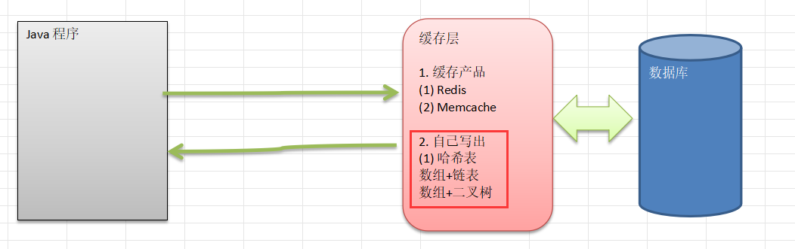

**图解**：

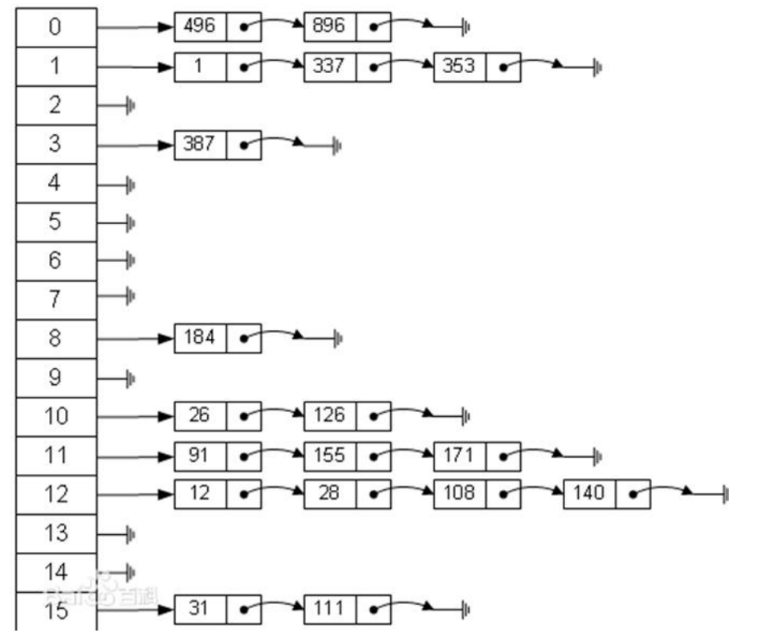

此处用一个实际题目来使用哈希表：

（google公司上机题:）有一个公司，当有新员工来报到时，要求将该员工的信息加入(id，性别，年龄，住址……)，当输入该员工的id时，要求查找到该员工的所有信息。要求不适用数据库，尽量节省内存，速度越快越好=》哈希表（散列）

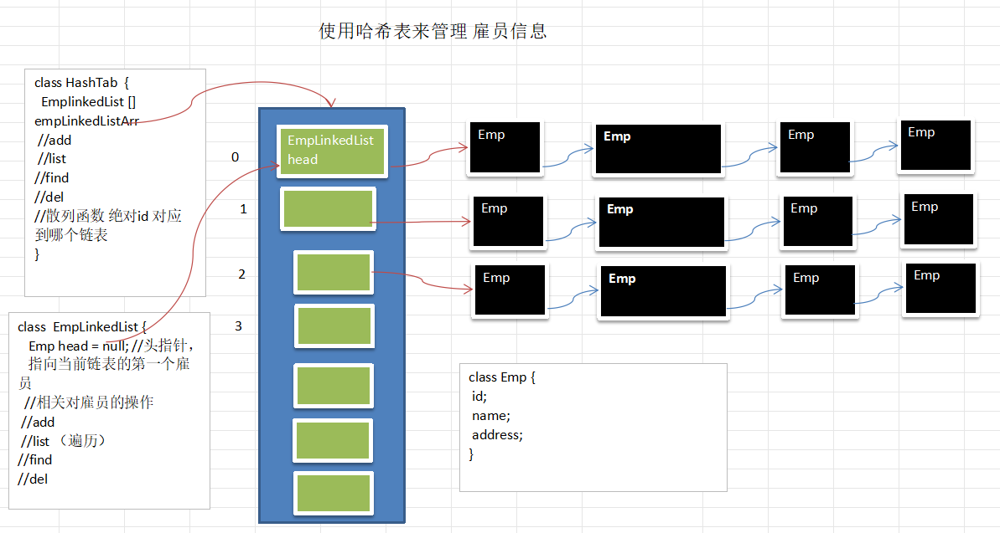

**思路分析**：

1. 使用Emp类管理每个员工的信息。
2. 使用EmpLinkedList表示一条链表。
3. HashTable就是真正的哈希表，里面包含了增加、遍历、查找、删除操作。但是必须有**散列函数**，其作用是指示id对应的链表。

### 代码实现

`HashTabDemo`

```java
package com.yukinoshita.dataStructure.hashTab;

import java.util.Scanner;

public class HashTabDemo {
    public static void main(String[] args) {
        HashTab hashTab = new HashTab(3);

        char operate = ' ';
        Scanner scanner = new Scanner(System.in);
        while (true) {
            System.out.println("---------------------");
            System.out.println("a：增加员工");
            System.out.println("l：显示员工");
            System.out.println("f：查找员工");
            System.out.println("d：删除员工");
            System.out.println("q：退出程序");
            System.out.print("Enter operation: ");
            operate = scanner.next().charAt(0);
            System.out.println("---------------------");

            switch (Character.toLowerCase(operate)) {
                case 'a' -> {
                    System.out.print("输入id:");
                    int id = scanner.nextInt();
                    System.out.print("输入名字:");
                    String name = scanner.next();
                    hashTab.add(new Emp(id, name));
                }
                case 'l' -> {
                    hashTab.list();
                }
                case 'q' -> {
                    scanner.close();
                    System.exit(0);
                }
                case 'f'->{
                    System.out.print("请输入你要查找的员工id：");
                    int id = scanner.nextInt();
                    hashTab.findEmpById(id);
                }
                case 'd'->{
                    System.out.print("请输入你要删除的员工id：");
                    int id = scanner.nextInt();
                    hashTab.deleteByEmpId(id);
                }
                default -> System.out.println("Invalid operation");
            }
        }
    }
}

//员工
class Emp {
    public int id;
    public String name;
    public Emp next = null;//默认为空

    public Emp(int id, String name) {
        this.id = id;
        this.name = name;
    }
}

//链表
class EmpLinkedList {
    private Emp head = null;//此处的head就是第一个员工

    /*
    假定添加员工时，id自增长（从小到大），则将员工添加到最后即可。
     */
    public void add(Emp emp) {
        if (head == null) {
            head = emp;
        } else {
            Emp temp = head;
            while (temp.next != null) {
                temp = temp.next;
            }
            temp.next = emp;
        }
    }

    public void list(int no) {
        Emp p = head;
        if (head == null) {
            System.out.println("List:" + no + " is empty");
        } else {
            do {
                System.out.print("=> id:" + p.id + " name:" + p.name);
                p = p.next;
            } while (p != null);
            System.out.println();
        }
    }

    public Emp findEmpById(int id) {
        if (head == null) {
            System.out.println("链表为空");
            return null;
        } else {
            Emp p = head;
            do {
                if (p.id == id) {
                    return p;
                }
                p = p.next;
            } while (p != null);
            return null;
        }
    }

    public void deleteByEmpId(int id) {
        if(head == null){
            System.out.println("无法删除，未找到该员工");
        }else{
            Emp p = head;
            Emp prev = head;
            do{
                if(p.id == id){
                    prev.next = p.next;//删除p节点
                    System.out.printf("员工%d：%s已成功删除\n",p.id,p.name);
                    return;
                }
                prev = p;
                p=p.next;
            }while(p != null);
            System.out.println("无法删除，未找到该员工");
        }
    }
}

//HashTab用于管理多条链表
class HashTab {
    private EmpLinkedList[] empLinkedListArray = null;
    private int size;//表示有几条链表

    public HashTab(int size) {
        this.size = size;
        empLinkedListArray = new EmpLinkedList[size];
        //不要忘了分别初始化！！！！！上述只是得到了一个数组Array，里面全为null
        for (int i = 0; i < size; i++) {
            empLinkedListArray[i] = new EmpLinkedList();
        }

    }

    public void add(Emp emp) {
        //根据员工id得到该员工应该添加到哪条链表
        int empLinkedListNo = hashFun(emp.id);
        empLinkedListArray[empLinkedListNo].add(emp);
    }

    //遍历所有链表，遍历hashTab（数组+链表才是hashTab）
    public void list() {
        for (int i = 0; i < size; i++) {
            empLinkedListArray[i].list(i);
        }
    }

    //根据输入的id查找员工
    public void findEmpById(int id) {
        //使用散列函数，确定到哪条链表查找（提高查找速度的关键所在！）
        int empLinkedListNo = hashFun(id);

        Emp emp = null;
        emp = empLinkedListArray[empLinkedListNo].findEmpById(id);
        if (emp != null) {
            System.out.println("在第"+empLinkedListNo+"条链表中找到员工："+"id:" + emp.id + " name:" + emp.name);
        }else{
            System.out.println("没有找到该员工");
        }
    }

    public void deleteByEmpId(int id){
        int empLinkedListNo = hashFun(id);//根据散列函数，定位该id所在链表
        empLinkedListArray[empLinkedListNo].deleteByEmpId(id);
    }

    //散列函数（写法很多，此处用%）
    public int hashFun(int id) {
        return id % size;
    }

}


```

## 树

**为什么需要树这种存储结构?**

1. 数组：
   - 优点：通过下标方式查找元素，查找速度快，况且还可以通过排序+查找算法进一步提高查找速度，**随机存取**是其最大优势。
   - 缺点：插入删除元素复杂，涉及到整体移动的问题，耗费大量时间。
2. 链式存储：
   - 优点：插入删除方便。
   - 缺点：查找效率不高，需要从头开始遍历查找。
   > 提一嘴哈希表（数组+链表版），一定程度上集数组和链表之长，既提高查找效率，又简化了插入删除操作。
3. 树：能提高数据的**存储、读取**效率，比如**二叉排序树**，即保证了查询效率，插入删除操作也方便。

**树的常用术语**(不必纠结)：

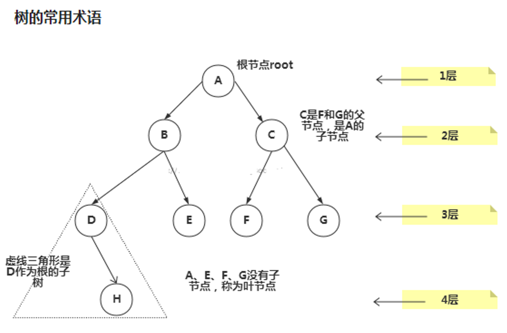

| 术语       | 解释                     |
| ---------- | ------------------------ |
| 节点       | A、B、C……都是节点        |
| 根节点root | A                        |
| 父节点     | C是F和G的父节点          |
| 子节点     | C是A的子节点             |
| 叶子节点   | 没有子节点的节点         |
| 节点的权   | 节点值                   |
| 路径       | 从root找到当前节点的路线 |
| 层         | 如图                     |
| 子树       | D、H为B的子树            |
| 树的高度   | 4                        |
| 森林       | 多棵树构成               |

注意事项：

树分为有序树和无序树，有序树分左右，无序树不分左右。

## 二叉树

### 基本概念

1. 每个节点都**至多**有两个子节点。
2. 二叉树的子节点分为**左节点**和**右节点**。
3. **满二叉树**：如果**所有叶子节点都在最后一层**，且节点总数为$2^n-1$个，其中n为层数，则称**满二叉树**。
4. **完全二叉树**：若二叉树的**所有叶子节点都在最后一层或倒数第二层**，且最后一层的叶子节点**左连续**，倒数第二层的叶子节点**右连续**，则称**完全二叉树**。

### 性质

> 参考《数据结构（C语言版）》--清华大学出版社
>
> 有助于加深对[顺序存储二叉树](###顺序存储二叉树)中“**为什么有这样的特点**”的理解，使之成为严谨的数学推导。（当然不看也行，直接找规律也能推出来）

1. 在二叉树的第$i$层至多有$2^{i-1}$个节点（$i\geq1$）
2. 深度为$k$的二叉树至多有$2^k-1$个节点（$k\geq1$）
3. 对任意一棵二叉树，如果其终端节点数为$n_0$，度为2的节点数为$n_2$，则$n_0=n_2+1$
> 关于第三点的推导：
>
> 已知$n=n_0+n_1+n_2$，其中$n$为**节点总数**（这个式子是基于节点数列出来的）
>
> 又因为$n=n_1+2n_2+1$，这个式子的原因为**节点数等于分支数+1**，只有$n_1$有1个分支，$n_2$有2个分支，$n_0$没有分支。
>
> 两式消去$n_1$即可

4. 具有n个节点的完全二叉树的深度 $\lfloor \log_2 n \rfloor + 1$。

> Proof：
>
> 设深度为k，则根据完全二叉树定义以及性质2可知：
>
> $2^{k-1}-1<n\leq 2^k-1$或$2^{k-1}\leq n < 2^k$，选则其一可解得……

5. 对于一个有n个节点的完全二叉树，对于任一节点$i$（$1 \leq i \leq n$），有：
   - 若$i=1$，则为root节点；若$i>1$，则其**父节点**为$\lfloor i/2 \rfloor$
   - 若$2i>n$，则节点$i$无左子节点，否则其**左子节点**为$2i$
   - 若$2i+1>n$，则节点$i$无右节点，否则其**右子节点**为$2i+1$

### 链式存储二叉树

需要创建一个结点类，应包括数据本身的数据、左节点`left`、右节点`right`、[父节点`root`可选]

连式存储很常见，所以不做代码演示，因为后续的很多都用到了链式存储……

而且遍历、查找方法在节点类中均有写，但是最终我们是通过调用`BinaryTree`这个类里面的方法，所以节点类里面写的方法一般情况是给二叉树用的（如遍历、查找[后续代码可见其用意]）

### 前序/中序/后续遍历

#### 思路分析

> 区分前/中/后序，看父节点什么时候输出。

**概念**：

1. 前序遍历：先输出**父节点**，再遍历左子树和右子树。
2. 中序遍历：先遍历左子树，再输出**父节点**，再遍历右子树。
3. 后续遍历：先遍历左子树，再遍历右子树，最后输出**父节点**。

**流程**：

1. 创建二叉树
2. 遍历
   - 前序遍历
      - 先**输出当前节点**(初始时为root节点)
      - 如果左子节点不为空，则向左递归执行前序遍历
      - 如果右子节点不为空，则向右递归执行前序遍历

   - 中序遍历
      - 如果当前节点的左子节点不为空，则向左递归执行中序遍历
      - **输出当前节点**
      - 如果当前节点的右子节点不为空，则向右递归执行中序遍历

   - 后续遍历
      - 如果当前节点的左子节点不为空，则向左递归执行后序遍历
      - 如果当前节点的右子节点不为空，则向右递归执行后序遍历
      - **输出当前节点**

**小技巧**：

> 无论何种技巧，画图永远不会错

前序遍历就是走到哪输出到哪（**从根先往左下，再回溯尝试往右**）；中序遍历，某个节点没有左节点了（**优先输出左叶子，没有左叶子后就从根往下，输出一次掉一片叶子**），就输出；后序遍历，某个节点同时没有左右了，输出（**优先左叶子，再右叶子，每次输出一次就相当于掉一片叶子**）。

#### 代码实现

`BinaryTreeDemo`

核心为`preOrder`、`infixOrder`、`postOrder`（in class `BinaryTree`和`HumanNode`）

```java
package com.yukinoshita.dataStructure.tree;

public class BinaryTreeDemo {
    public static void main(String[] args) {
        BinaryTree binaryTree = new BinaryTree();
        HumanNode humanNode = new HumanNode(1,"yukino");
        HumanNode humanNode2 = new HumanNode(2,"yukino2");
        HumanNode humanNode3 = new HumanNode(3,"yukino3");
        HumanNode humanNode4 = new HumanNode(4,"yukino4");
        HumanNode humanNode5 = new HumanNode(5,"yukino5");
        //姑且手动创建
        humanNode.setLeft(humanNode2);
        humanNode.setRight(humanNode3);
        humanNode2.setLeft(humanNode4);
        humanNode3.setRight(humanNode5);

        binaryTree.setRoot(humanNode);
        System.out.println("前序遍历：");
        binaryTree.preOrder();
        System.out.println("中序遍历：");
        binaryTree.infixOrder();
        System.out.println("后续遍历：");
        binaryTree.postOrder();
    }
}

//定义BinaryTree 二叉树
class BinaryTree{
    HumanNode root;

    public void setRoot(HumanNode root) {
        this.root = root;
    }

    //前序遍历
    public void preOrder(){
        if(this.root != null){
            this.root.preOrder();
        }else{
            System.out.println("The tree is empty");
        }
    }

    //中序遍历
    public void infixOrder(){
        if (this.root != null) {
            this.root.infixOrder();
        }else{
            System.out.println("The tree is empty");
        }
    }

    //后序遍历
    public void postOrder(){
        if (this.root != null) {
            this.root.postOrder();
        }else{
            System.out.println("The tree is empty");
        }
    }
}

//节点
class HumanNode {
    private int id;
    private String name;
    private HumanNode left;
    private HumanNode right;

    public HumanNode(int id, String name) {
        this.id = id;
        this.name = name;
    }

    //前序遍历
    public void preOrder() {
        System.out.println(this);//先输出父节点
        if (this.left != null) {//左递归
            this.left.preOrder();
        }
        if (this.right != null) {//右递归
            this.right.preOrder();
        }
    }

    //中序遍历
    public void infixOrder() {
        if (this.left != null) {//左递归
            this.left.infixOrder();
        }
        System.out.println(this);//输出父节点
        if (this.right != null) {//右递归
            this.right.infixOrder();
        }
    }

    //后序遍历
    public void postOrder() {
        if (this.left != null) {//左递归
            this.left.postOrder();
        }
        if (this.right != null) {//右递归
            this.right.postOrder();
        }
        System.out.println(this);//输出父节点
    }

    @Override
    public String toString() {
        return "HumanNode{" +
                "id=" + id +
                ", name='" + name + '\'' +
                '}';
    }

    public int getId() {
        return id;
    }

    public void setId(int id) {
        this.id = id;
    }

    public String getName() {
        return name;
    }

    public void setName(String name) {
        this.name = name;
    }

    public HumanNode getLeft() {
        return left;
    }

    public void setLeft(HumanNode left) {
        this.left = left;
    }

    public HumanNode getRight() {
        return right;
    }

    public void setRight(HumanNode right) {
        this.right = right;
    }
}

```

### 前序/中序/后续查找

#### 思路分析

**流程**：

1. 存在一颗二叉树
2. 查找
   - **前序查找**
     - 先判断**当前节点**的id是否等于要查找的
     - 如果相等，则返回当前节点
     - 如果不等，则判断当前节点的**左子节点**是否为空，若不为空，则向左递归。
     - 如果左递归找到节点，则返回；否则，判断判断当前节点的**右子节点**是否为空，若不为空，则继续向右递归。
   - **中序查找**
     - 判断当前节点的**左子节点**是否为空，若不为空，则向左递归。
     - 如果找到，则返回。
     - 如果没找到，则判断**当前节点**是否是要找的绩点，如果是，则返回。
     - 不是，判断**右子节点**是否为空，不为空，则向右递归，找到则返回，否则返回null。
   - **后序查找**
     - 判断当前节点的**左子节点**是否为空，若不为空，则向左递归。
     - 如果找到，则返回。
     - 如果没找到，判断**右子节点**是否为空，不为空，则向左递归，找到则返回。
     - 若没找到，判断**当前节点**是否是想要找的节点，如果是返回，不是则返回null。

> tips1：无论怎样，凡是遇到需要访问左、右节点的操作，均需要先判断是否为空。
>
> tips2：前序-->当前，左，右；		中序-->左，当前，右；		后序-->左，右，当前。

#### 代码实现

`BinaryTreeDemo`

核心为`preOrderSearch`、`infixOrderSearch`、`postOrderSearch`（in class `BinaryTree`和`HumanNode`）

```java
package com.yukinoshita.dataStructure.tree;

public class BinaryTreeDemo {
    public static void main(String[] args) {
        BinaryTree binaryTree = new BinaryTree();
        HumanNode humanNode = new HumanNode(1, "yukino");
        HumanNode humanNode2 = new HumanNode(2, "yukino2");
        HumanNode humanNode3 = new HumanNode(3, "yukino3");
        HumanNode humanNode4 = new HumanNode(4, "yukino4");
        HumanNode humanNode5 = new HumanNode(5, "yukino5");
        //姑且手动创建
        humanNode.setLeft(humanNode2);
        humanNode.setRight(humanNode3);
        humanNode2.setLeft(humanNode4);
        humanNode3.setRight(humanNode5);
        binaryTree.setRoot(humanNode);

        HumanNode res = null;
        System.out.println("前序遍历方式：");
        res = binaryTree.preOrderSearch(1);
        System.out.println("找到节点为："+res);

        System.out.println("中序遍历方式：");
        res = binaryTree.infixOrderSearch(1);
        System.out.println("找到节点为："+res);

        System.out.println("后序遍历方式：");
        res = binaryTree.postOrderSearch(1);
        System.out.println("找到节点为："+res);

    }
}

//定义BinaryTree 二叉树
class BinaryTree {
    HumanNode root;

    public void setRoot(HumanNode root) {
        this.root = root;
    }

    //前序遍历查找
    public HumanNode preOrderSearch(int id) {
        if (this.root != null) {
            return this.root.preOrderSearch(id);
        }
        return null;
    }

    //中序遍历查找
    public HumanNode infixOrderSearch(int id) {
        if (this.root != null) {
            return this.root.infixOrderSearch(id);
        }
        return null;
    }

    //后序遍历查找
    public HumanNode postOrderSearch(int id) {
        if (this.root != null) {
            return this.root.postOrderSearch(id);
        }
        return null;
    }

    //前序遍历
    public void preOrder() {
        if (this.root != null) {
            this.root.preOrder();
        } else {
            System.out.println("The tree is empty");
        }
    }

    //中序遍历
    public void infixOrder() {
        if (this.root != null) {
            this.root.infixOrder();
        } else {
            System.out.println("The tree is empty");
        }
    }

    //后序遍历
    public void postOrder() {
        if (this.root != null) {
            this.root.postOrder();
        } else {
            System.out.println("The tree is empty");
        }
    }
}

//节点
class HumanNode {
    private int id;
    private String name;
    private HumanNode left;
    private HumanNode right;

    public HumanNode(int id, String name) {
        this.id = id;
        this.name = name;
    }

    //前序遍历查找
    public HumanNode preOrderSearch(int id) {
        System.out.println("前序遍历ing");
        if (this.id == id) {
            return this;
        }
        HumanNode humanNode = null;
        if (this.left != null) {
            humanNode = this.left.preOrderSearch(id);
        }
        if (humanNode != null) {
            return humanNode;
        }
        if (this.right != null) {
            humanNode = this.right.preOrderSearch(id);
        }
        return humanNode;
    }

    //中序遍历查找
    public HumanNode infixOrderSearch(int id) {
        System.out.println("中序遍历ing");
        HumanNode humanNode = null;
        if (this.left != null) {
            humanNode = this.left.infixOrderSearch(id);
        }
        if (humanNode != null) {
            return humanNode;
        }
        if (this.id == id) {
            return this;
        }
        if (this.right != null) {
            humanNode = this.right.infixOrderSearch(id);
        }
        return humanNode;
    }

    //后序遍历查找
    public HumanNode postOrderSearch(int id) {
        System.out.println("后序遍历ing");
        HumanNode humanNode = null;
        if (this.left != null) {
            humanNode = this.left.postOrderSearch(id);
        }
        if (humanNode != null) {
            return humanNode;
        }
        if (this.right != null) {
            humanNode = this.right.postOrderSearch(id);
        }
        if (humanNode != null) {
            return humanNode;
        }
        return this.id == id ? this : humanNode;
    }

    //前序遍历
    public void preOrder() {
        System.out.println(this);//先输出父节点
        if (this.left != null) {//左递归
            this.left.preOrder();
        }
        if (this.right != null) {//右递归
            this.right.preOrder();
        }
    }

    //中序遍历
    public void infixOrder() {
        if (this.left != null) {//左递归
            this.left.infixOrder();
        }
        System.out.println(this);//输出父节点
        if (this.right != null) {//右递归
            this.right.infixOrder();
        }
    }

    //后序遍历
    public void postOrder() {
        if (this.left != null) {//左递归
            this.left.postOrder();
        }
        if (this.right != null) {//右递归
            this.right.postOrder();
        }
        System.out.println(this);//输出父节点
    }

    @Override
    public String toString() {
        return "HumanNode{" +
                "id=" + id +
                ", name='" + name + '\'' +
                '}';
    }

    public int getId() {
        return id;
    }

    public void setId(int id) {
        this.id = id;
    }

    public String getName() {
        return name;
    }

    public void setName(String name) {
        this.name = name;
    }

    public HumanNode getLeft() {
        return left;
    }

    public void setLeft(HumanNode left) {
        this.left = left;
    }

    public HumanNode getRight() {
        return right;
    }

    public void setRight(HumanNode right) {
        this.right = right;
    }
}

```

### 删除节点

#### 思路分析

**删除操作**：

1. 如果删除的节点是叶子节点，则删除该节点
2. 如果删除的节点是非叶子节点，则删除子树
> 如果不想把整棵子树删除，
>
> 可以考虑将第二点改为：(放于实现2)
>
> - 若该非叶子节点A只有一个子节点B，则让这个子节点B替代A
> - 若改非叶子节点A有左节点B和右节点C，则让左子节点B替代A
> - 但是其实实现还有有一定难度的：假如要删除的A既有左子节点B和右子节点C，且B、C都各自有两个子节点，这时候就很复杂咯……(我这边暂时用一种简单实现：还是让B替代A，但是在B向左while循环，找到最左边的那个位置，然后把C插入(这样子代码实现简单，但是树的层数会变高……))
>
> > 后续的二叉排序树更有另一套规则

**思路**：

0. 若树只有一个root节点，则判断root是否要要删的，若是，置null。然后进行下面操作：(第0步写在`BinaryTree`的删除方法里[最先判断]，后续5步写在`HumanNode`的删除方法里)

1. 因为二叉排序树是单向的，所以我们判断的是当前节点的子节点是否需要删除，而不是判断当前节点是否需要被删除（除非节点设计上带有父节点、或者查找时带有父节点信息）。
2. 如果当前节点的左子节点不为空`if(this.left != null)`，且为要删除的节点，则删除`this.left = null`(简单粗暴法)，结束递归。
3. 如果当前节点的左子节点不为空`if(this.right != null)`，且为要删除的节点，则删除`this.right = null`(简单粗暴法)，结束递归。
4. 若第2、3步都没删除成功，则向左递归（当然要判断是否为空）。
5. 若第4步没删除成功，则向右递归（当然要判断是否为空）。

#### 代码实现

##### 实现1(直接把子树删掉)

`BinaryTreeDemo`

核心为：`delNodeById`in	class `BinaryTree`和`HumanNode`

```java
package com.yukinoshita.dataStructure.tree;

public class BinaryTreeDemo {
    public static void main(String[] args) {
        BinaryTree binaryTree = new BinaryTree();
        HumanNode humanNode = new HumanNode(1, "yukino");
        HumanNode humanNode2 = new HumanNode(2, "yukino2");
        HumanNode humanNode3 = new HumanNode(3, "yukino3");
        HumanNode humanNode4 = new HumanNode(4, "yukino4");
        HumanNode humanNode5 = new HumanNode(5, "yukino5");
        //姑且手动创建
        humanNode.setLeft(humanNode2);
        humanNode.setRight(humanNode3);
        humanNode2.setLeft(humanNode4);
        humanNode3.setRight(humanNode5);
        binaryTree.setRoot(humanNode);

        binaryTree.preOrder();
        boolean flag = binaryTree.delNodeById(2);
        System.out.println("是否删除成功："+flag);
        binaryTree.preOrder();

    }
}

//定义BinaryTree 二叉树
class BinaryTree {
    HumanNode root;

    public void setRoot(HumanNode root) {
        this.root = root;
    }

    public boolean delNodeById(int id){
        if(this.root == null){
            return false;
        }else if(root.getId() == id){
            this.root = null;
            return true;
        }else{
            return this.root.delNodeById(id);
        }
    }

    //前序遍历查找
    public HumanNode preOrderSearch(int id) {
        if (this.root != null) {
            return this.root.preOrderSearch(id);
        }
        return null;
    }

    //中序遍历查找
    public HumanNode infixOrderSearch(int id) {
        if (this.root != null) {
            return this.root.infixOrderSearch(id);
        }
        return null;
    }

    //后序遍历查找
    public HumanNode postOrderSearch(int id) {
        if (this.root != null) {
            return this.root.postOrderSearch(id);
        }
        return null;
    }

    //前序遍历
    public void preOrder() {
        if (this.root != null) {
            this.root.preOrder();
        } else {
            System.out.println("The tree is empty");
        }
    }

    //中序遍历
    public void infixOrder() {
        if (this.root != null) {
            this.root.infixOrder();
        } else {
            System.out.println("The tree is empty");
        }
    }

    //后序遍历
    public void postOrder() {
        if (this.root != null) {
            this.root.postOrder();
        } else {
            System.out.println("The tree is empty");
        }
    }
}

//节点
class HumanNode {
    private int id;
    private String name;
    private HumanNode left;
    private HumanNode right;

    public HumanNode(int id, String name) {
        this.id = id;
        this.name = name;
    }

    public boolean delNodeById(int id){
        boolean flag = false;
        //左删
        if(this.left != null && this.left.id == id){
            this.left = null;
            return true;
        }
        //右删
        if(this.right != null && this.right.id == id){
            this.right =null;
            return true;
        }
        //左递归
        if(this.left != null){
            flag = this.left.delNodeById(id);
        }
        //左递归删不掉，则右递归
        if(!flag && this.right!= null){
            flag = this.right.delNodeById(id);
        }
        return flag;
    }

    //前序遍历查找
    public HumanNode preOrderSearch(int id) {
        System.out.println("前序遍历ing");
        if (this.id == id) {
            return this;
        }
        HumanNode humanNode = null;
        if (this.left != null) {
            humanNode = this.left.preOrderSearch(id);
        }
        if (humanNode != null) {
            return humanNode;
        }
        if (this.right != null) {
            humanNode = this.right.preOrderSearch(id);
        }
        return humanNode;
    }

    //中序遍历查找
    public HumanNode infixOrderSearch(int id) {
        System.out.println("中序遍历ing");
        HumanNode humanNode = null;
        if (this.left != null) {
            humanNode = this.left.infixOrderSearch(id);
        }
        if (humanNode != null) {
            return humanNode;
        }
        if (this.id == id) {
            return this;
        }
        if (this.right != null) {
            humanNode = this.right.infixOrderSearch(id);
        }
        return humanNode;
    }

    //后序遍历查找
    public HumanNode postOrderSearch(int id) {
        System.out.println("后序遍历ing");
        HumanNode humanNode = null;
        if (this.left != null) {
            humanNode = this.left.postOrderSearch(id);
        }
        if (humanNode != null) {
            return humanNode;
        }
        if (this.right != null) {
            humanNode = this.right.postOrderSearch(id);
        }
        if (humanNode != null) {
            return humanNode;
        }
        return this.id == id ? this : humanNode;
    }

    //前序遍历
    public void preOrder() {
        System.out.println(this);//先输出父节点
        if (this.left != null) {//左递归
            this.left.preOrder();
        }
        if (this.right != null) {//右递归
            this.right.preOrder();
        }
    }

    //中序遍历
    public void infixOrder() {
        if (this.left != null) {//左递归
            this.left.infixOrder();
        }
        System.out.println(this);//输出父节点
        if (this.right != null) {//右递归
            this.right.infixOrder();
        }
    }

    //后序遍历
    public void postOrder() {
        if (this.left != null) {//左递归
            this.left.postOrder();
        }
        if (this.right != null) {//右递归
            this.right.postOrder();
        }
        System.out.println(this);//输出父节点
    }

    @Override
    public String toString() {
        return "HumanNode{" +
                "id=" + id +
                ", name='" + name + '\'' +
                '}';
    }

    public int getId() {
        return id;
    }

    public void setId(int id) {
        this.id = id;
    }

    public String getName() {
        return name;
    }

    public void setName(String name) {
        this.name = name;
    }

    public HumanNode getLeft() {
        return left;
    }

    public void setLeft(HumanNode left) {
        this.left = left;
    }

    public HumanNode getRight() {
        return right;
    }

    public void setRight(HumanNode right) {
        this.right = right;
    }
}

```

##### 实现2(仅删节点)+清晰

`BinaryTree.delNodeById`

```java
//不变
public boolean delNodeById(int id){
        if(this.root == null){
            return false;
        }else if(root.getId() == id){
            this.root = null;
            return true;
        }else{
            return this.root.delNodeById(id);
        }
    }
```

`HumanNode.delNodeById`

- 若该非叶子节点A只有一个子节点B，则让这个子节点B替代A
- 若改非叶子节点A有左节点B和右节点C，则让左子节点B替代A
- 但是其实实现还有有一定难度的：假如要删除的A既有左子节点B和右子节点C，且B、C都各自有两个子节点，这时候就很复杂咯……
  - 我这边暂时用一种简单实现：还是让B替代A，但是**不断在B向左while循环**，找到**最左边的那个位置**，然后把C插入
  - 这样子代码实现简单，但是树的层数会变高……

```java
public boolean delNodeById(int id){
        boolean flag = false;
        //左删
        if(this.left != null && this.left.id == id){
            if(isLeaf(this.left)){//如果是叶子节点
                this.left = null;
            }else{//不是叶子
                if(this.left.left!= null){
                    if(this.left.right != null){//说明要给this.left.right找合适的位置接回去
                        HumanNode temp = this.left;

                        while(temp.left!= null){//找到可以插入的位置
                            temp=temp.left;
                        }
                        temp.left = this.left.right;
                    }
                    this.left = this.left.left;//执行 原先被删除节点的左子节点进行替代的操作
                }else{
                    this.left = this.left.right;
                }
            }
            return true;
        }
        //右删
        if(this.right != null && this.right.id == id){
            if(isLeaf(this.right)){
                this.right =null;
            }else{
                if(this.right.left!= null){
                    if(this.right.right != null){//说明要给this.right.right找合适的位置接回去
                        HumanNode temp = this.right;

                        while(temp.left!= null){//找到可以插入的位置
                            temp=temp.left;
                        }
                        temp.left = this.right.right;
                    }
                    this.right = this.right.left;//执行 原先被删除节点的左子节点进行替代的操作
                }else{
                    this.right = this.right.right;
                }
            }
            return true;
        }
        //左递归
        if(this.left != null){
            flag = this.left.delNodeById(id);
        }
        //左递归删不掉，则右递归
        if(!flag && this.right!= null){
            flag = this.right.delNodeById(id);
        }
        return flag;
    }
```

`main`测试代码1：结果为1 4 6 8 7 3 5

```java
public static void main(String[] args) {
        BinaryTree binaryTree = new BinaryTree();
        HumanNode humanNode = new HumanNode(1, "yukino");
        HumanNode humanNode2 = new HumanNode(2, "yukino2");
        HumanNode humanNode3 = new HumanNode(3, "yukino3");
        HumanNode humanNode4 = new HumanNode(4, "yukino4");
        HumanNode humanNode5 = new HumanNode(5, "yukino5");

        HumanNode humanNode6 = new HumanNode(6, "yukino6");
        HumanNode humanNode7 = new HumanNode(7, "yukino7");
        HumanNode humanNode8 = new HumanNode(8, "yukino7");
        //姑且手动创建
        humanNode.setLeft(humanNode2);
        humanNode.setRight(humanNode3);
        humanNode2.setLeft(humanNode4);
        humanNode3.setRight(humanNode5);

        humanNode4.setLeft(humanNode6);
        humanNode4.setRight(humanNode7);
        humanNode2.setRight(humanNode8);
        binaryTree.setRoot(humanNode);

        binaryTree.preOrder();
        boolean flag = binaryTree.delNodeById(2);
        System.out.println("是否删除成功："+flag);
        binaryTree.preOrder();

    }
```

`main`测试代码2：结果为1 2 4 6 7 8 5

```java
public static void main(String[] args) {
        BinaryTree binaryTree = new BinaryTree();
        HumanNode humanNode = new HumanNode(1, "yukino");
        HumanNode humanNode2 = new HumanNode(2, "yukino2");
        HumanNode humanNode3 = new HumanNode(3, "yukino3");
        HumanNode humanNode4 = new HumanNode(4, "yukino4");
        HumanNode humanNode5 = new HumanNode(5, "yukino5");

        HumanNode humanNode6 = new HumanNode(6, "yukino6");
        HumanNode humanNode7 = new HumanNode(7, "yukino7");
        HumanNode humanNode8 = new HumanNode(8, "yukino7");
        //姑且手动创建
        humanNode.setLeft(humanNode2);
        humanNode.setRight(humanNode3);
        humanNode2.setLeft(humanNode4);
        humanNode3.setRight(humanNode5);

        humanNode3.setLeft(humanNode6);
        humanNode6.setLeft(humanNode7);
        humanNode6.setRight(humanNode8);
        binaryTree.setRoot(humanNode);

        binaryTree.preOrder();
        boolean flag = binaryTree.delNodeById(3);
        System.out.println("是否删除成功："+flag);
        binaryTree.preOrder();

    }
```

### 顺序存储二叉树

#### 思路分析

**说明**：

从数据存储来看，数组存储方式和树存储方式可以相互转换（如下：）

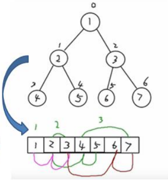

**要求**：

1. 二叉树中的数据用数组的形式存放，如上
2. 在遍历数组时，仍能实现树的**前序/中序/后序遍历**。

**特点**：

1. 顺序存储二叉树，通常只考虑**完全二叉树**。
2. 第n个元素的左子节点为$2*n+1$
3. 第n个元素的右子节点为$2*n+2$
4. 第n个元素的父节点为$(n-1)/2$
   > n表示二叉树中第几个元素（从0开始），且编号顺序为——**低层优先、左节点优先**

> ps：八大排序算法之**堆排序**，就会使用顺序存储二叉树。

#### 代码实现

`ArrayBinaryTreeDemo`

> 实现了数组的前序/中序/后序查找

```java
package com.yukinoshita.dataStructure.tree;

public class ArrayBinaryTreeDemo {
    public static void main(String args[]) {
        int[] arr = {1, 2, 3, 4, 5, 6, 7};
        ArrayBinaryTree arrayBinaryTree = new ArrayBinaryTree(arr);
        System.out.println("前序遍历：");
        arrayBinaryTree.preOrder();//1 2 4 5 3 6 7
        System.out.println("中序遍历：");
        arrayBinaryTree.infixOrder();//4 2 5 1 6 3 7
        System.out.println("后序遍历：");
        arrayBinaryTree.postOrder();//4 5 2 6 7 3 1
    }
}

//实现顺序存储二叉树的遍历
class ArrayBinaryTree {
    private int[] arr;

    //重载，使得不写参数就是代表从根节点开始遍历
    public void postOrder(){
        this.postOrder(0);
    }

    public void infixOrder(){
        this.infixOrder(0);
    }

    public void preOrder(){
        this.preOrder(0);
    }

    /**
     * 顺序存储二叉树的前序遍历
     *
     * @param index 数组下标
     */
    public void preOrder(int index) {
        if (arr == null || arr.length == 0) {
            System.out.println("当前数组为空，无法执行前序遍历");
            return;
        }
        System.out.println("当前节点为:" + arr[index]);

        //如果存在左子节点
        if (2 * index + 1 < arr.length) {
            preOrder(2 * index + 1);
        }
        //如果存在右子节点
        if (2 * index + 2 < arr.length) {
            preOrder(2 * index + 2);
        }
    }

    public void infixOrder(int index) {
        if (arr == null || arr.length == 0) {
            System.out.println("当前数组为空，无法执行前序遍历");
            return;
        }

        if (2 * index + 1 < arr.length) {
            infixOrder(2 * index + 1);
        }

        System.out.println("当前节点为:" + arr[index]);

        if (2 * index + 2 < arr.length) {
            infixOrder(2 * index + 2);
        }
    }

    public void postOrder(int index) {
        if (arr == null || arr.length == 0) {
            System.out.println("当前数组为空，无法执行前序遍历");
            return;
        }

        if (2 * index + 1 < arr.length) {
            postOrder(2 * index + 1);
        }

        if (2 * index + 2 < arr.length) {
            postOrder(2 * index + 2);
        }

        System.out.println("当前节点为:" + arr[index]);
    }

    public ArrayBinaryTree(int[] arr) {
        this.arr = arr;
    }

}
```

### 线索化二叉树

#### 思路分析

**问题**：

将$\{ 1,3,6,8,10,14 \}$构建成一颗二叉树，如下图

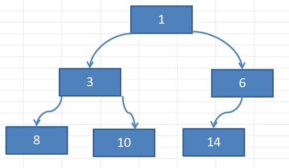

1. 当对上述中序遍历时：8，3，10，1，14，6
2. 但是对于8，10，14，6这几个节点的左右指针没有充分利用
3. 如果有个新需求——充分利用各个节点的指针，**让每个节点可以指向自己的前后节点**
4. 解决方案：**线索化二叉树**

**介绍**：

1. $n$个节点的二叉链表中含有$n+1$个空指针域（推导：$2n-(n-1)=n+1$）。利用二叉链表中的空指针域，存放指向该节点在**某种遍历次序**下的**前驱节点**和**后驱节点**，这种附加的指针称为“线索”。
2. 这种加上了线索的二叉链表称为线索链表，相应的二叉树称为**线索二叉树**。分为**前序线索二叉树**、**中序线索二叉树**、**后序线索二叉树**。
3. 一个节点的前一个节点，称**前驱节点**。
4. 一个节点的后一个节点，称**后继节点**。

**图解——将上述二叉树按中序遍历线索化**：

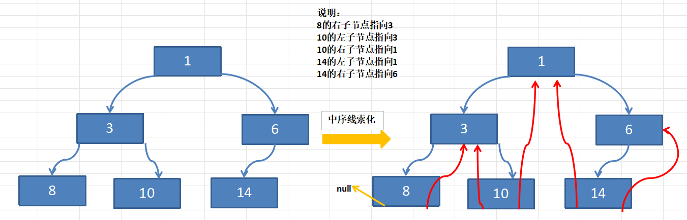

8号左指针指向较为特殊，通过代码运行逻辑可以得出。（特地标出来，是为了说明8的`leftType = =1`，为后续遍历中序线索化二叉树做铺垫）

但是有些问题：线索化后的二叉树，其`left`既可能指向左子树（如1），也可能指向其前驱节点（如10）；其`right`既可能指向后继节点（如8），也可能指向其右子树（如1、3）。

- [x] 进一步简化、讲清楚找**红色线索**的方法！！！参考[blog](https://blog.csdn.net/m0_56494923/article/details/130457392)画出线索的方法，很简单，易于记忆！

***画出线索的方法（重要！这是分析の方法）***:

1. 中序线索找法
   - 根据特定的遍历方式，写出最终的输出。例如上述想实现中序线索化，则先用中序遍历的思路看看——**8，3，10，1，14，6**
   - 根据这个输出顺序，给**左或右为空的节点**连接上对应的**前驱节点**、**后继节点**
   - **由于是中序，8号左边null**。其余的：**8右为3**；**10左为3**，**10右为1**；1左右？不需要；**14左1**，**14右6**；6不需要左，最终6右不需要。
2. 前序线索找法
   - 先用前序遍历得到输出：**1，3，8，10，6，14**
   - 给**左或右为空的节点**连接上对应的**前驱节点**、**后继节点**
   - 1不需要；3不需要；**8左3**，**8右10**；**10左8**，**10右6**；**6右14**；**14左6**，**14右仍为null**(经测：14的`rightType==0`)；
3. 后序线索找法
   - 先用后序遍历得到输出：**8，10，3，14，6，1**
   - 给**左或右为空的节点**连接上对应的**前驱节点、后继节点**
   - **8左为null**，**8右为10**；**10左为8**，**10右为3**；3不需要；**14左为3**，**14右为1**；**6右为1**；1不需要。

**线索化代码流程**：（步骤执行顺序的不同）

1. 前序线索化：
   -  线索化当前节点：处理**前驱结点**+处理**后继节点**
   -  如果左节点的`leftType == 0` ，再线索化左子树（左递归）
   -  如果右节点的`rightType == 0`，再线索化右子树（右递归）
   -  > 进入前序线索化，在进入左、右递归前！一定要判断`某某Type == 0`！不然会进入死递归！坐等`StackOverflowError`吧！

2. 中序线索化：
   -  线索化左子树
   -  线索化当前节点：处理**前驱结点**+处理**后继节点**
   -  线索化右子树

3. 后序线索化：
   -  线索化左子树
   -  线索化右子树
   -  线索化当前节点：处理**前驱结点**+处理**后继节点**

> 神奇吧，只有前序线索化在进入递归前需要判断……

- [x] 必须要给`threadedNode(HumanNode node)`方法画一个图解！（这玩意的设置前驱节点和设置后继节点的代码部分并不是很直观、。而且，画图这一过程可以加深我的印象以及理解。）

**图解--设置前驱结点、后继节点**：

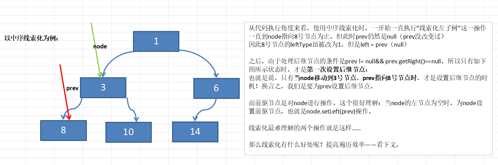

#### 代码实现

##### 中序线索化

`ThreadedBinaryTreeDemo`

要点在于：在`HumanNode`中新增了`leftType`和`rightType`两个字段及对应getter、setter方法。

在`ThreadedBinaryTree`中使用了`threadedNode`方法用于(**中序**)线索化二叉树

```java
package com.yukinoshita.dataStructure.tree.threadedBinaryTree;

public class ThreadedBinaryTreeDemo {
    public static void main(String[] args) {
        ThreadedBinaryTree threadedBinaryTree = new ThreadedBinaryTree();

        HumanNode root = new HumanNode(1,"yukino");
        HumanNode node2 = new HumanNode(3,"yukinoshita");
        HumanNode node3 = new HumanNode(6,"yu");
        HumanNode node4 = new HumanNode(8,"kino");
        HumanNode node5 = new HumanNode(10,"yuKiNO");
        HumanNode node6 = new HumanNode(14,"shita");

        root.setLeft(node2);
        root.setRight(node3);
        node2.setLeft(node4);
        node2.setRight(node5);
        node3.setLeft(node6);

        threadedBinaryTree.setRoot(root);
        threadedBinaryTree.threadedNode();

        //测试是否线索化成功：
        System.out.printf("10号节点的前驱节点id为：%d \t 后继节点id为：%d",node5.getLeft().getId(),node5.getRight().getId());
        System.out.println("8号节点的右指针类型："+node4.getRightType());
//        System.out.println(node4.getLeft().getId());//注意，8号节点的left为null，因为此时prev == null。（调试发现）
        //虽然8号节点的leftType已经被设置为1，但是left指向为null。
    }
}


//线索化二叉树
class ThreadedBinaryTree {
    HumanNode root;

    private HumanNode prev = null;//在递归进行线索化时，prev总是为前一个节点

    public void setRoot(HumanNode root) {
        this.root = root;
    }

    //重载，自动从root节点开始线索化
    public void threadedNode(){
        this.threadedNode(root);
    }

    /**
     * 二叉树中进行线索化的方法（此为中序）
     *
     * @param node 当前需要线索化的节点
     */
    public void threadedNode(HumanNode node) {
        //如果node == null，不能线索化
        if (node == null) {
            return;
        }
        //1. 线索化左子树
        threadedNode(node.getLeft());

        //2. 线索化当前节点
        //处理当前节点的前驱节点
        if (node.getLeft() == null) {
            node.setLeft(prev);//让当前节点指向前驱节点
            node.setLeftType(1);//(修改指针类型)说明此时的左指针是指向前驱节点，非左子树
        }
        //处理后继节点
        if (prev != null && prev.getRight() == null) {//此时应该是node递归到了"下一个"，看看上一个prev的right是不是为空
            prev.setRight(node);        //这时才设置是设置后继节点的时候(画图理解)
            prev.setRightType(1);
        }

        prev = node;//每处理一个节点后，更新！

        //3. 线索化右子树
        threadedNode(node.getRight());
    }


}

class HumanNode {
    private int id;
    private String name;
    private HumanNode left;
    private HumanNode right;

    /*
        规定leftType == 0，指向的是左子树；为1，指向前驱节点
        规定rightType == 0，指向的是右子树；为1，指向后继节点
     */
    private int leftType;
    private int rightType;

    public int getLeftType() {
        return leftType;
    }

    public void setLeftType(int leftType) {
        this.leftType = leftType;
    }

    public int getRightType() {
        return rightType;
    }

    public void setRightType(int rightType) {
        this.rightType = rightType;
    }

    public HumanNode(int id, String name) {
        this.id = id;
        this.name = name;
    }

    @Override
    public String toString() {
        return "HumanNode{" +
                "id=" + id +
                ", name='" + name + '\'' +
                '}';
    }

    public int getId() {
        return id;
    }

    public void setId(int id) {
        this.id = id;
    }

    public String getName() {
        return name;
    }

    public void setName(String name) {
        this.name = name;
    }

    public HumanNode getLeft() {
        return left;
    }

    public void setLeft(HumanNode left) {
        this.left = left;
    }

    public HumanNode getRight() {
        return right;
    }

    public void setRight(HumanNode right) {
        this.right = right;
    }
}

```

##### 前序线索化

`threadedNode`

```java
/**
     * 前序线索化二叉树
     *
     * @param node 当前需要线索化的节点
     */
    public void threadedNode(HumanNode node) {
        if (node == null) {
            return;
        }
        //1. 线索化当前节点
        //1.1. 设置前驱节点
        if (node.getLeft() == null) {
            node.setLeft(prev);
            node.setLeftType(1);
        }
        //1.2. 设置后继节点
        if (prev != null && prev.getRight() == null) {
            prev.setRight(node);
            prev.setRightType(1);
        }
        prev = node;

        //2. 向左递归线索化，但是必须是有效节点
        if (node.getLeftType() == 0) {
            threadedNode(node.getLeft());
        }

        //3. 向右递归线索化
        if (node.getRightType() == 0) {
            threadedNode(node.getRight());
        }
    }
```


##### 后序线索化

`threadedNode`

```java
    /**
     * 后序线索化二叉树
     *
     * @param node 当前需要线索化的节点
     */
    public void threadedNode(HumanNode node) {
        if (node == null) {
            return;
        }
        //1. 向左递归线索化
        threadedNode(node.getLeft());

        //2. 向右递归线索化
        threadedNode(node.getRight());

        //3. 线索化当前节点
        //3.1. 设置前驱节点
        if (node.getLeft() == null) {
            node.setLeft(prev);
            node.setLeftType(1);
        }
        //3.2. 设置后继节点
        if (prev != null && prev.getRight() == null) {
            prev.setRight(node);
            prev.setRightType(1);
        }
        prev = node;
    }
```

`完整版`

```java
package com.yukinoshita.dataStructure.tree.threadedBinaryTree;

public class ThreadedBinaryTreeDemo {
    public static void main(String[] args) {
        ThreadedBinaryTree threadedBinaryTree = new ThreadedBinaryTree();

        HumanNode root = new HumanNode(1, "yukino");
        HumanNode node2 = new HumanNode(3, "yukinoshita");
        HumanNode node3 = new HumanNode(6, "yu");
        HumanNode node4 = new HumanNode(8, "kino");
        HumanNode node5 = new HumanNode(10, "yuKiNO");
        HumanNode node6 = new HumanNode(14, "shita");

        root.setLeft(node2);
        root.setRight(node3);
        node2.setLeft(node4);
        node2.setRight(node5);
        node3.setLeft(node6);

        threadedBinaryTree.setRoot(root);
        threadedBinaryTree.threadedNode();

        //测试是否线索化成功：
        System.out.println("理应新增的线索测试：");
        System.out.printf("8号右边为：%d号节点\n", node4.getRight().getId());
        System.out.printf("10号左边为：%d号节点\n", node5.getLeft().getId());
        System.out.printf("10号右边为：%d号节点\n", node5.getRight().getId());
        System.out.printf("14号左边为：%d号节点\n", node6.getLeft().getId());
        System.out.printf("14号右边为：%d号节点\n", node6.getRight().getId());
        System.out.printf("6号右边为：%d号节点\n", node3.getRight().getId());
        
    }
}


//线索化二叉树
class ThreadedBinaryTree {
    HumanNode root;

    private HumanNode prev = null;//在递归进行线索化时，prev总是为前一个节点

    public void setRoot(HumanNode root) {
        this.root = root;
    }


    //重载，自动从root节点开始线索化
    public void threadedNode() {
        this.threadedNode(root);
    }

    /**
     * 后序线索化二叉树
     *
     * @param node 当前需要线索化的节点
     */
    public void threadedNode(HumanNode node) {
        if (node == null) {
            return;
        }
        //1. 向左递归线索化
        threadedNode(node.getLeft());

        //2. 向右递归线索化
        threadedNode(node.getRight());

        //3. 线索化当前节点
        //3.1. 设置前驱节点
        if (node.getLeft() == null) {
            node.setLeft(prev);
            node.setLeftType(1);
        }
        //3.2. 设置后继节点
        if (prev != null && prev.getRight() == null) {
            prev.setRight(node);
            prev.setRightType(1);
        }
        prev = node;
    }
}

class HumanNode {
    private int id;
    private String name;
    private HumanNode left;
    private HumanNode right;

    /*
        规定leftType == 0，指向的是左子树；为1，指向前驱节点
        规定rightType == 0，指向的是右子树；为1，指向后继节点
     */
    private int leftType;
    private int rightType;

    public int getLeftType() {
        return leftType;
    }

    public void setLeftType(int leftType) {
        this.leftType = leftType;
    }

    public int getRightType() {
        return rightType;
    }

    public void setRightType(int rightType) {
        this.rightType = rightType;
    }

    public HumanNode(int id, String name) {
        this.id = id;
        this.name = name;
    }

    @Override
    public String toString() {
        return "HumanNode{" +
                "id=" + id +
                ", name='" + name + '\'' +
                '}';
    }

    public int getId() {
        return id;
    }

    public void setId(int id) {
        this.id = id;
    }

    public String getName() {
        return name;
    }

    public void setName(String name) {
        this.name = name;
    }

    public HumanNode getLeft() {
        return left;
    }

    public void setLeft(HumanNode left) {
        this.left = left;
    }

    public HumanNode getRight() {
        return right;
    }

    public void setRight(HumanNode right) {
        this.right = right;
    }
}

```


### 遍历线索化二叉树

#### 思路分析

要求：对已经(中序)线索化的二叉树采取相同策略(中序)的遍历方式。

问题：因为线索化后，各个节点的指向以发生变化，因此原先的遍历方式不能再使用，需要用新的遍历方式遍历线索化二叉树。

优点：由于各个节点可以通过线型方式遍历，所以无需使用递归，提高了遍历的效率。

#### 代码实现

##### 遍历中序线索化二叉树

`ThreadedBinaryTreeDemo`

新增`threadedList`**遍历中序线索化二叉树**方法

```java
    //遍历中序线索化二叉树
    public void threadedList() {
        HumanNode node = root;
        while (node != null) {

            //循环地找到leftType == 1的节点
            //对应中序遍历的 “左递归优先”
            while (node.getLeftType() == 0) {
                node = node.getLeft();
            }
            System.out.println(node);

            //如果当前节点的右指针指向后继节点，则一直输出
            while (node.getRightType() == 1) {
                node = node.getRight();
                System.out.println(node);
            }
            node = node.getRight();

        }
    }
```


`完整版`

```java
package com.yukinoshita.dataStructure.tree.threadedBinaryTree;

public class ThreadedBinaryTreeDemo {
    public static void main(String[] args) {
        ThreadedBinaryTree threadedBinaryTree = new ThreadedBinaryTree();

        HumanNode root = new HumanNode(1, "yukino");
        HumanNode node2 = new HumanNode(3, "yukinoshita");
        HumanNode node3 = new HumanNode(6, "yu");
        HumanNode node4 = new HumanNode(8, "kino");
        HumanNode node5 = new HumanNode(10, "yuKiNO");
        HumanNode node6 = new HumanNode(14, "shita");

        root.setLeft(node2);
        root.setRight(node3);
        node2.setLeft(node4);
        node2.setRight(node5);
        node3.setLeft(node6);

        threadedBinaryTree.setRoot(root);
        threadedBinaryTree.threadedNode();

        //测试遍历中序线索化二叉树
        threadedBinaryTree.threadedList();// 8 3 10 1 14 6
    }
}


//线索化二叉树
class ThreadedBinaryTree {
    HumanNode root;

    private HumanNode prev = null;//在递归进行线索化时，prev总是为前一个节点

    public void setRoot(HumanNode root) {
        this.root = root;
    }

    //遍历中序线索化二叉树
    public void threadedList() {
        HumanNode node = root;
        while (node != null) {

            //循环地找到leftType == 1的节点
            //对应中序遍历的 “左递归优先”
            while (node.getLeftType() == 0) {
                node = node.getLeft();
            }
            System.out.println(node);

            //如果当前节点的右指针指向后继节点，则一直输出
            while (node.getRightType() == 1) {
                node = node.getRight();
                System.out.println(node);
            }
            node = node.getRight();

        }
    }

    //重载，自动从root节点开始线索化
    public void threadedNode() {
        this.threadedNode(root);
    }

    /**
     * 二叉树中进行线索化的方法（此为中序）
     *
     * @param node 当前需要线索化的节点
     */
    public void threadedNode(HumanNode node) {
        //如果node == null，不能线索化
        if (node == null) {
            return;
        }
        //1. 线索化左子树
        threadedNode(node.getLeft());

        //2. 线索化当前节点
        //处理当前节点的前驱节点
        if (node.getLeft() == null) {
            node.setLeft(prev);//让当前节点指向前驱节点
            node.setLeftType(1);//(修改指针类型)说明此时的左指针是指向前驱节点，非左子树
        }
        //处理后继节点
        if (prev != null && prev.getRight() == null) {//此时应该是node递归到了"下一个"，看看上一个prev的right是不是为空
            prev.setRight(node);        //这时才设置是设置后继节点的时候(画图理解)
            prev.setRightType(1);
        }

        prev = node;//每处理一个节点后，更新！

        //3. 线索化右子树
        threadedNode(node.getRight());
    }


}

class HumanNode {
    private int id;
    private String name;
    private HumanNode left;
    private HumanNode right;

    /*
        规定leftType == 0，指向的是左子树；为1，指向前驱节点
        规定rightType == 0，指向的是右子树；为1，指向后继节点
     */
    private int leftType;
    private int rightType;

    public int getLeftType() {
        return leftType;
    }

    public void setLeftType(int leftType) {
        this.leftType = leftType;
    }

    public int getRightType() {
        return rightType;
    }

    public void setRightType(int rightType) {
        this.rightType = rightType;
    }

    public HumanNode(int id, String name) {
        this.id = id;
        this.name = name;
    }

    @Override
    public String toString() {
        return "HumanNode{" +
                "id=" + id +
                ", name='" + name + '\'' +
                '}';
    }

    public int getId() {
        return id;
    }

    public void setId(int id) {
        this.id = id;
    }

    public String getName() {
        return name;
    }

    public void setName(String name) {
        this.name = name;
    }

    public HumanNode getLeft() {
        return left;
    }

    public void setLeft(HumanNode left) {
        this.left = left;
    }

    public HumanNode getRight() {
        return right;
    }

    public void setRight(HumanNode right) {
        this.right = right;
    }
}

```

##### 遍历前序线索化二叉树

`threadedList`

```java
    public void threadedList() {
        HumanNode node = root;
        while (node != null) {
            while (node.getLeftType() == 0) {//左指针不是线索
                System.out.println(node);//则边访问，边移动
                node = node.getLeft();
            }
            System.out.println(node);
            node = node.getRight();
        }
    }
```

`完整版`：

```java
package com.yukinoshita.dataStructure.tree.threadedBinaryTree;

public class ThreadedBinaryTreeDemo {
    public static void main(String[] args) {
        ThreadedBinaryTree threadedBinaryTree = new ThreadedBinaryTree();

        HumanNode root = new HumanNode(1, "yukino");
        HumanNode node2 = new HumanNode(3, "yukinoshita");
        HumanNode node3 = new HumanNode(6, "yu");
        HumanNode node4 = new HumanNode(8, "kino");
        HumanNode node5 = new HumanNode(10, "yuKiNO");
        HumanNode node6 = new HumanNode(14, "shita");

        root.setLeft(node2);
        root.setRight(node3);
        node2.setLeft(node4);
        node2.setRight(node5);
        node3.setLeft(node6);

        threadedBinaryTree.setRoot(root);
        threadedBinaryTree.threadedNode();

        //测试是否线索化成功：
//        System.out.printf("10号节点的前驱节点id为：%d \t 后继节点id为：%d \n", node5.getLeft().getId(), node5.getRight().getId());
//        System.out.println("14号节点的左指针类型：" + node6.getLeftType());

        //测试遍历前序线索化二叉树是否成功：
        threadedBinaryTree.threadedList();
    }
}


//线索化二叉树
class ThreadedBinaryTree {
    HumanNode root;

    private HumanNode prev = null;//在递归进行线索化时，prev总是为前一个节点

    public void setRoot(HumanNode root) {
        this.root = root;
    }

    public void threadedList() {
        HumanNode node = root;
        while (node != null) {
            while (node.getLeftType() == 0) {//左指针不是线索
                System.out.println(node);//则边访问，边移动
                node = node.getLeft();
            }
            System.out.println(node);
            node = node.getRight();
        }
    }

    //重载，自动从root节点开始线索化
    public void threadedNode() {
        this.threadedNode(root);
    }

    /**
     * 前序线索化二叉树
     *
     * @param node 当前需要线索化的节点
     */
    public void threadedNode(HumanNode node) {
        if (node == null) {
            return;
        }
        //1. 线索化当前节点
        //1.1. 设置前驱节点
        if (node.getLeft() == null) {
            node.setLeft(prev);
            node.setLeftType(1);
        }
        //1.2. 设置后继节点
        if (prev != null && prev.getRight() == null) {
            prev.setRight(node);
            prev.setRightType(1);
        }
        prev = node;

        //2. 向左递归线索化，但是必须是有效节点
        if (node.getLeftType() == 0) {
            threadedNode(node.getLeft());
        }

        //3. 向右递归线索化
        if (node.getRightType() == 0) {
            threadedNode(node.getRight());
        }
    }
}

class HumanNode {
    private int id;
    private String name;
    private HumanNode left;
    private HumanNode right;

    /*
        规定leftType == 0，指向的是左子树；为1，指向前驱节点
        规定rightType == 0，指向的是右子树；为1，指向后继节点
     */
    private int leftType;
    private int rightType;

    public int getLeftType() {
        return leftType;
    }

    public void setLeftType(int leftType) {
        this.leftType = leftType;
    }

    public int getRightType() {
        return rightType;
    }

    public void setRightType(int rightType) {
        this.rightType = rightType;
    }

    public HumanNode(int id, String name) {
        this.id = id;
        this.name = name;
    }

    @Override
    public String toString() {
        return "HumanNode{" +
                "id=" + id +
                ", name='" + name + '\'' +
                '}';
    }

    public int getId() {
        return id;
    }

    public void setId(int id) {
        this.id = id;
    }

    public String getName() {
        return name;
    }

    public void setName(String name) {
        this.name = name;
    }

    public HumanNode getLeft() {
        return left;
    }

    public void setLeft(HumanNode left) {
        this.left = left;
    }

    public HumanNode getRight() {
        return right;
    }

    public void setRight(HumanNode right) {
        this.right = right;
    }
}

```


##### 遍历后序线索化二叉树

`threadedList`

这个代码很复杂，已经需要使用**三叉链表**了。

> 引用自[博客](https://blog.csdn.net/m0_56494923/article/details/130457392)，暂时不深入思考、以及实现。
>
> - [ ] 有空再说。
>
> 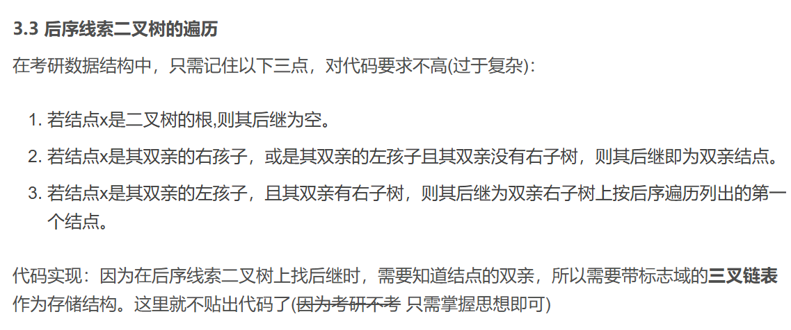

## 赫夫曼树

> Huffman，赫夫曼，哈夫曼，霍夫曼。

### 基本概念介绍

1. **路径和路径长度**：从一个节点往下可以到达的孩子或孙子节点的通路，成为**路径**；通路中分支的数目称为**路径长度**。若根节点为第1层，则第L层的节点的路径长度为$L-1$
2. **结点的权、带权路径长度**：节点中含有一个有某种含义的数值，称为**节点的权**；路径长度*节点的权 = **带权路径长度**

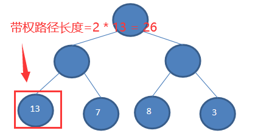

3. **树的带权路径长度**：**所有叶子节点的带权路径长度之和**，称为**树的带权路径长度**，记为**WPL（weighted path length）**，赫夫曼树的特点就是***带权路径长度最短***，也就是要让权值越大的节点离根节点越近。
4. ***WPL最小的就是赫夫曼树***，**图解**(e.g.中间的是赫夫曼树)：

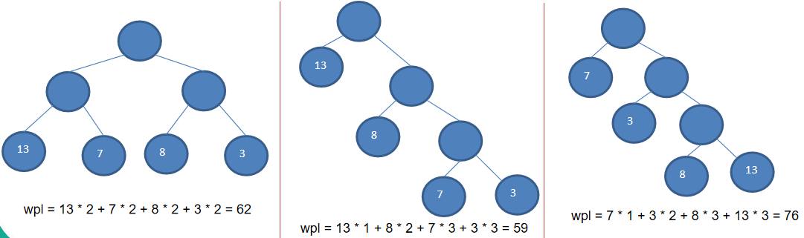

### 创建赫夫曼树

#### 思路分析

构成赫夫曼树的**步骤**：

1) 将数据从小到大排序(首次，将每个数据都看作根节点) / 或根据每棵树的根节点进行排序(非首次--or通用讲法)。
2) 取出根节点权值最小的两颗二叉树 
3) 组成一颗新的二叉树, 该新的二叉树的根节点的权值是前面两颗二叉树根节点权值的和  
4) 再将这颗新的二叉树，以根节点的权值大小再次排序（也就是回到第一步）。不断重复 ，直到数列中，所有的数据都被处理，就得到一颗赫夫曼树

**简单理解**：一，排序；二，取出最小两颗，组成新树，根节点为；三，回到第一步。（也就是图解中，三张图片为一轮）

**图解**：

以$\{ 15,8,6,1,20,10 \}$为例

- 执行第一步排序，得到$\{ 1,6,8,10,15,20 \}$，相当于有6棵树，每棵树都是一个单独的节点：

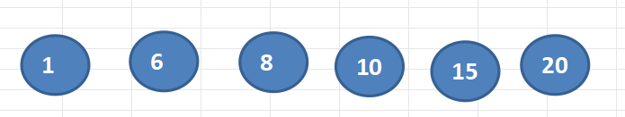

- 第二步，取出最小的两颗二叉树；第三步，新的二叉树的根节点的权值是前面两颗二叉树根节点权值的和。

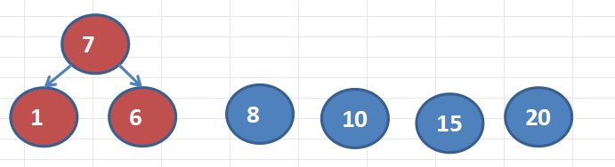

- 第四步（也可以说是回到），再以新的这些树的**根节点**进行从小到大排序：

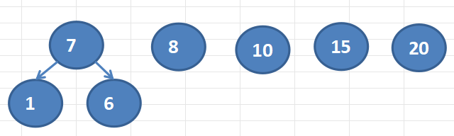

- 开始重复：再次执行第一步（上面已经排有序了）。

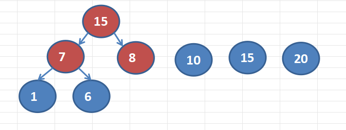

- 再排序：(注意！实际代码运行此处有差异！)

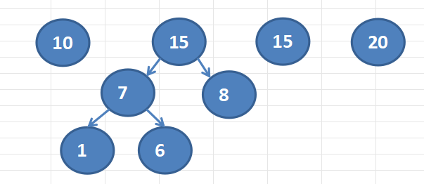

- 再取、再排：

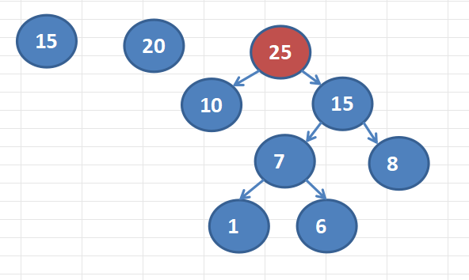

- 再取、再排：

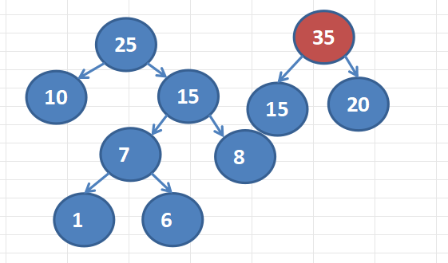

- 最后一步——赫夫曼树的降临：

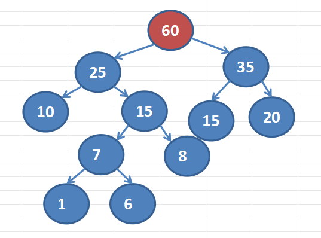

> （上述仅能展示思路！！但是最终的二叉树视代码实现而定！！）
>
> > 我的实现代码中，最终得到的huffmanTree就不是上面这个形状的，原因在于有一步的排序过程——出现了两个根节点为15的树。
> >
> > 我的代码中，采取的策略是——新生成的树都是在ArrayList末尾进行add，然后再排序，所以新生成、根节点为15的树应该在旧的那个之后……下面给出修改后过程（中间有所不同）
> >
> > > 为什么前序遍历后怎么和预期不一样……问题就出在这里……

小结：赫夫曼树根据排序方式的不同，最终形成的赫夫曼树的结构也不同。但是WPL一致、最小。这里的"排序方法"语义较小，是指遇到相同元素的情况下，该如何排序。

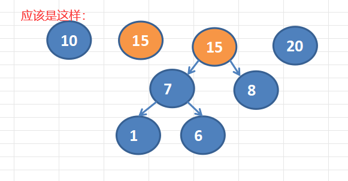

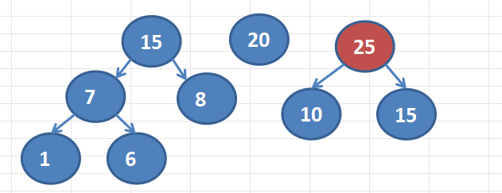

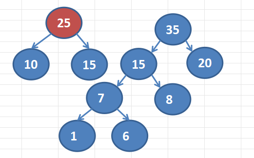

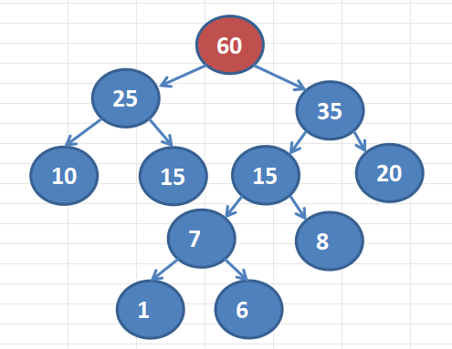

所以代码的前序遍历应该为：

$60 \quad 25 \quad 10 \quad 15 \quad 35 \quad 15 \quad 7 \quad 1 \quad 6 \quad 8 \quad 20$

#### 代码实现

`HuffmanTree`

主要代码：`createHuffmanTree`创建赫夫曼树

```java
package com.yukinoshita.dataStructure.huffmanTree;

import java.util.ArrayList;
import java.util.Collections;
import java.util.List;

public class HuffmanTree {
    public static void main(String[] args) {
        int[] arr = {15, 8, 6, 1, 20, 10};
//        int[] arr = {13, 7, 8, 3, 29, 6,1};
//        int [] arr = {};
        Node root = createHuffmanTree(arr);
        preOrder(root);

    }

    public static void preOrder(Node root) {
        if (root == null) {
            System.out.println("huffman tree is empty");
        }else{
            root.preOrder();
        }
    }

    public static Node createHuffmanTree(int[] arr){
        if(arr.length ==0){
            return null;
        }
        List<Node> nodes = new ArrayList<Node>();
        for(int val:arr){
            nodes.add(new Node(val));
        }

        while(nodes.size() > 1){
            //排序
            Collections.sort(nodes);
            //取出最小
            Node leftNode = nodes.get(0);
            //取出次小
            Node rightNode = nodes.get(1);
            //构建新子树：
            Node newNode = new Node(leftNode.weight+ rightNode.weight,leftNode,rightNode);
            //删除已处理的，加入新的树
            nodes.remove(leftNode);
            nodes.remove(rightNode);
            nodes.add(newNode);
        }

        //返回这棵树的根节点
        return nodes.get(0);
    }

}

class Node implements Comparable<Node> {
    int weight;
    Node left;
    Node right;

    Node(int weight) {
        this.weight = weight;
        this.left = null;
        this.right = null;
    }

    public Node(int weight, Node left, Node right) {
        this.weight = weight;
        this.left = left;
        this.right = right;
    }

    @Override
    public String toString() {
        return "Node{" +
                "weight=" + weight +
                '}';
    }

    @Override
    public int compareTo(Node o) {
        //表示从小到大排
        return this.weight - o.weight;
    }

    //前序遍历：(用于测试)
    public void preOrder(){
        System.out.println(this);
        if(this.left != null) this.left.preOrder();
        if(this.right != null) this.right.preOrder();
    }
}


```

### 赫夫曼编码

#### 思路分析

> 直接采用atguigu的介绍：[视频链接](https://www.bilibili.com/video/BV1E4411H73v?spm_id_from=333.788.player.switch&vd_source=31d39c465d959f9ebfb4e20fc1ca0a9d&p=115)。

**基本介绍**

赫夫曼编码也翻译为**哈夫曼编码(Huffman Coding)**，又称霍夫曼编码，是一种编码方式, 属于一种程序算法

赫夫曼编码是赫哈夫曼树在电讯通信中的经典的应用之一。

赫夫曼编码广泛地用于**数据文件压缩**。其压缩率通常在20%～90%之间

赫夫曼码是**可变字长编码(VLC)**的一种。Huffman于1952年提出一种编码方法，称之为最佳编码

**原理**：

1. 通信领域中信息的处理方式1-定长编码

   - `i like like like java do you like a java`       // 共40个字符(包括空格)
   - `105 32 108 105 107 101 32 108 105 107 101 32 108 105 107 101 32 106 97 118 97 32 100 111 32 121 111 117 32 108 105 107 101 32 97 32 106 97 118 97`//对应Ascii码
   - `01101001 00100000 01101100 01101001 01101011 01100101 00100000 01101100 01101001 01101011 01100101 00100000 01101100 01101001 01101011 01100101 00100000 01101010 01100001 01110110 01100001 00100000 01100100 01101111 00100000 01111001 01101111 01110101 00100000 01101100 01101001 01101011 01100101 00100000 01100001 00100000 01101010 01100001 01110110 01100001`//对应的二进制
   - 按照二进制来传递信息，总的长度是  359   (包括空格)
   - [在线转码工具](https://www.mokuge.com/tool/asciito16/)
2. 通信领域中信息的处理方式2-变长编码
   - `i like like like java do you like a java`       // 共40个字符(包括空格)
   - `d:1 y:1 u:1 j:2  v:2  o:2  l:4  k:4  e:4 i:5  a:5  空格:9`// 各个字符对应的个数
   - `0=空格 ,  1=a, 10=i, 11=e, 100=k, 101=l, 110=o, 111=v, 1000=j, 1001=u, 1010=y, 1011=d` 说明：按照各个字符出现的次数进行编码，原则是出现次数越多的，则编码越小，比如 空格出现了9 次， 编码为0 ,其它依次类推.
   - 按照上面给各个字符规定的编码，则我们在传输  "i like like like java do you like a java" 数据时，编码就是10010110100...
- >  但是这种编码方式不是**前缀编码**[^9]，会出现二义性。

3. 通信领域中信息的处理方式3-赫夫曼编码

   - `i like like like java do you like a java`       // 共40个字符(包括空格)

   - `d:1 y:1 u:1 j:2  v:2  o:2  l:4  k:4  e:4 i:5  a:5   :9`  // 各个字符对应的个数

   - 按照上面字符出现的次数构建一颗赫夫曼树, 次数作为权值。


**赫夫曼编码详解**：

传输的字符串为：`i like like like java do you like a java`

1. 统计各个字符对应的个数`d:1 y:1 u:1 j:2  v:2  o:2  l:4  k:4  e:4 i:5  a:5   :9`
2. 按照上面字符出现的次数构建一颗赫夫曼树, 次数作为权值（字符也要传入）

> 也就是传入$arr=[1,1,1,2,2,2,4,4,4,5,5,9]$去[创建赫夫曼树](###创建赫夫曼树)：
>
> 构成赫夫曼树的步骤：
>
> 1. 从小到大进行排序, 将每一个数据，每个数据都是一个节点 ， 每个节点可以看成是一颗最简单的二叉树
>
> 2. 取出根节点权值最小的两颗二叉树 
>
> 3. 组成一颗新的二叉树, 该新的二叉树的根节点的权值是前面两颗二叉树根节点权值的和  
>
> 4. 再将这颗新的二叉树，以根节点的权值大小 再次排序， 不断重复  1-2-3-4 的步骤，直到数列中，所有的数据都被处理，就得到一颗赫夫曼树
>
> 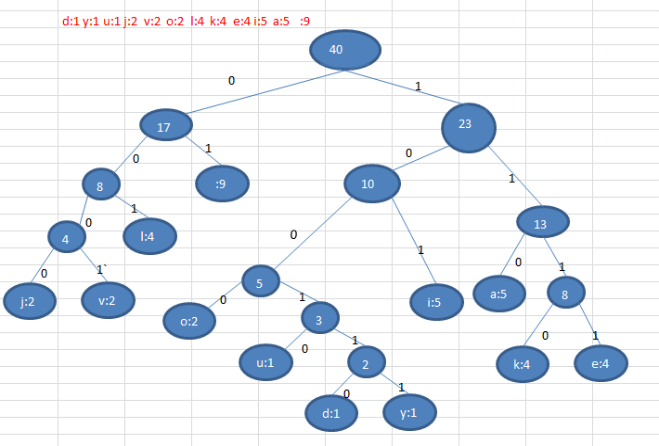

3. 根据赫夫曼树，给各个字符,规定编码 (前缀编码)， 向左的路径为0 向右的路径为1 ， 编码如下：`o:000	u: 10010	d: 100110  y: 100111  i: 101a : 110  k: 1110  e: 1111  j: 0000  v: 0001l: 001   : 01`
4. 按照上面的赫夫曼编码，我们的"i like like like java do you like a java"   字符串对应的编码为 (注意这里我们使用的无损压缩)`1010100110111101111010011011110111101001101111011110100001100001110011001111000011001111000100100100110111101111011100100001100001110`通过赫夫曼编码处理  长度为  133
5. 长度为:133 说明:原来长度是  359 , 压缩了  (359-133) / 359 = 62.9%。此编码满足前缀编码,，即字符的编码都不能是其他字符编码的前缀。不会造成匹配的多义性。赫夫曼编码是无损处理方案。

#### 数据压缩

**思路**：

1. Node { data (存放数据)， weight (权值)， left  和 right }
2. 得到  "i like like like java do you like a java"   对应的 byte[] 数组
3. 编写一个方法，将准备构建赫夫曼树的Node 节点放到 List  , 形式 [Node[date=97 ,weight = 5], Node[]date=32,weight = 9]......],  体现 d:1 y:1 u:1 j:2  v:2  o:2  l:4  k:4  e:4 i:5  a:5   :9  
4. 可以通过List 创建对应的赫夫曼树

**代码解释**：

这个代码过程较多，但是每一部分并不难。
简单归纳下：总体的目标是把原始数据对应的`byte[]` 压缩为更小的`byte[]`
1. 获取原始数据的byte[]
2. 将这个根据这个byte[]构建赫夫曼树，规则详见[创建赫夫曼树](###创建赫夫曼树)，这里简单回顾：
   -  排序-》取出两个最小的节点，构成新节点-》删除两个最小节点，将新的节点加入到数组-》只要数组长度大于1，就循环整个操作-》最后通过nodesArray.get(0)就获取到了赫夫曼树的根节点。
   > 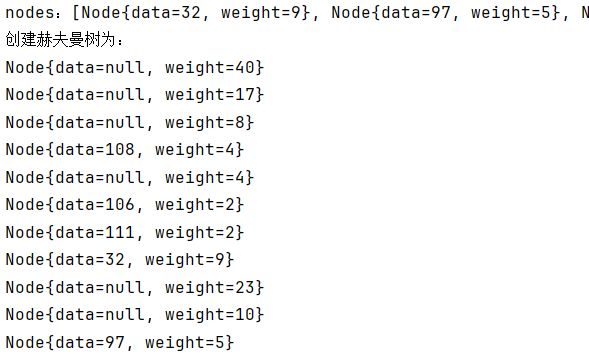

3. 创建**赫夫曼树**后，就要利用赫夫曼树，得到对应的**赫夫曼编码**，规则为——为每一个叶子节点的值data编一个"码"，这个码就是从根节点到叶子节点的路径，每向左拼接一个"0"，每向右拼接一个"1"。最终得到赫夫曼编码，存放在Map<key,value>中，key就是数据，比如97('a'的ASCII)，value就是对应的码，比如01
> 
4. 根据这个赫夫曼编码，可以将原始数据压缩，压缩过程又细分两步：
   1. 由于光是通过赫夫曼编码处理后，得到的只是"0100110101010..."这样的**字符串**，甚至比原先的字符串还长，所以要将这个字符串转换为8位一个的byte
   2. 第二步就是转换，不足8位就截断。`huffmanCodeBytes[k] = (byte) Integer.parseInt(strByte, 2);`其中，strByte是每次取了8位（不足就截断）。
5. 最后得到的`huffmanCodeBytes`就是最终结果（类型为`byte[]`，且长度比`str.getBytes()`要短，就做到了压缩）
> 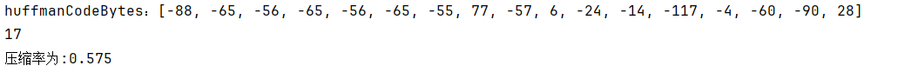

可能需要补充的知识？

原码、反码、补码的转换。（也就是在压缩过程，为什么从"10101000"变成huffmanCodeBytes中的-88）

10101000(补码)->10100111(反码)->11011000(原码)

补码-1 = 反码；符号位不变，反码取反=原码。原码对应值计算为-88。

##### 实现1

`HuffmanCode`

> 若对此代码不懂，再看一遍：[p117](https://www.bilibili.com/video/BV1E4411H73v?spm_id_from=333.788.player.switch&vd_source=31d39c465d959f9ebfb4e20fc1ca0a9d&p=117)至[p120](https://www.bilibili.com/video/BV1E4411H73v?spm_id_from=333.788.player.switch&vd_source=31d39c465d959f9ebfb4e20fc1ca0a9d&p=120)。

```java
package com.yukinoshita.dataStructure.huffmanCode;

import java.util.*;

public class HuffmanCode {
    public static void main(String[] args) {
        String str = "i like like like java do you like a java";
        byte[] contentBytes = str.getBytes();
        System.out.println("还未压缩前的长度：" + contentBytes.length);
        List<Node> nodes = getNodes(contentBytes);
        System.out.println("nodes：" + nodes);

        System.out.println("创建赫夫曼树为：");
        Node huffmanTreeRoot = createHuffmanTree(nodes);
        huffmanTreeRoot.preOrder();

        //测试是否生成了对应的huffman编码
//        getCodes(huffmanTreeRoot,"",stringBuilder);
//        getCodes(huffmanTreeRoot);
        Map<Byte, String> huffmanCodes = getCodes(huffmanTreeRoot); //(其实不新生成也行，如上)
        System.out.println("生成的赫夫曼编码为：" + HuffmanCode.huffmanCodes);

        byte[] huffmanCodeBytes = zip(contentBytes, huffmanCodes);
        System.out.println("huffmanCodeBytes："+Arrays.toString(huffmanCodeBytes));
        System.out.println("压缩率为:"+(contentBytes.length-huffmanCodeBytes.length * 1.0) / contentBytes.length * 1.0);

    }

    /**
     * 将一个字符串对应的byte[] 数组，通过生成的赫夫曼编码表，返回压缩后的byte[]
     *
     * @param bytes        原始字符串对应的byte数组
     * @param huffmanCodes (根据字符串)生成的赫夫曼编码
     * @return 赫夫曼编码压缩处理后的byte数组
     */
    private static byte[] zip(byte[] bytes, Map<Byte, String> huffmanCodes) {
        StringBuilder stringBuilder = new StringBuilder();
        for (byte b : bytes) {
            stringBuilder.append(huffmanCodes.get(b));
        }
//        System.out.println("测试：stringBuilder: "+stringBuilder.toString());
        //将"010001000101010101010..."转成byte数组
        //或者：int len =(stringBuilder.length() + 7) / 8;
        int len;
        if (stringBuilder.length() % 8 == 0) {
            len = stringBuilder.length() / 8;
        } else {
            len = stringBuilder.length() / 8 + 1;
        }
        //创建 存储压缩后的by数组
        byte[] huffmanCodeBytes = new byte[len];
        for (int i = 0, k = 0; i < stringBuilder.length(); i += 8, k++) {//因为是每8位对应一个byte
            String strByte;
            if (i + 8 > stringBuilder.length()) {//不够8位
                strByte = stringBuilder.substring(i);
            }else{
                strByte = stringBuilder.substring(i, i + 8);
            }
            //将strByte 转成一个byte，放入到huffmanCodeBytes
            huffmanCodeBytes[k] = (byte) Integer.parseInt(strByte, 2);
        }
        return huffmanCodeBytes;
    }

    //为了调用getCodes方便，重载一下：
    private static Map<Byte, String> getCodes(Node node) {
        if (node == null) {
            return null;
        }
        getCodes(node.left, "0", stringBuilder);
        getCodes(node.right, "1", stringBuilder);
        return huffmanCodes;
    }


    //生成赫夫曼树对应的赫夫曼编码
    //思路：
    //1. 将赫夫曼编码表放在Map<Byte,String>  键:值 = ASCII:码  e.g. 97:001
    static Map<Byte, String> huffmanCodes = new HashMap<>();
    //2. 在生成赫夫曼编码表时，需要去拼接路径，故用一个StringBuilder存储某个叶子节点的路径
    static StringBuilder stringBuilder = new StringBuilder();

    /**
     * 得到传入的node节点所有的叶子节点的赫夫曼编码，存放到huffmanCodes中
     *
     * @param node          传入节点
     * @param code          路径(左边为0，右边为1)
     * @param stringBuilder 用于拼接路径
     */
    private static void getCodes(Node node, String code, StringBuilder stringBuilder) {
        StringBuilder builder = new StringBuilder(stringBuilder);
        //将code加入到builder
        builder.append(code);
        if (node != null) {//node为空不处理
            if (node.data == null) {//说明node为非叶子节点
                //递归处理
                getCodes(node.left, "0", builder);//向左
                getCodes(node.right, "1", builder);//向右
            } else {//是叶子节点
                huffmanCodes.put(node.data, builder.toString());
            }
        }
    }

    /**
     * @param bytes 接收字节数组
     * @return 返回一个List，形式：[Node[data:97,weight=5], Node[data:32,weight:9],...]
     */
    private static List<Node> getNodes(byte[] bytes) {
        ArrayList<Node> nodes = new ArrayList<>();

        //遍历bytes，统计每一个byte出现的次数->Map
        Map<Byte, Integer> counts = new HashMap<>();
        for (byte b : bytes) {
            Integer count = counts.get(b);
            if (count == null) {//Map还没有这个字符数据
                counts.put(b, 1);
            } else {
                counts.put(b, count + 1);
            }
        }

        //把每一个键值对转成一个Node对象，并加入到nodes集合
        //遍历map
        for (Map.Entry<Byte, Integer> entry : counts.entrySet()) {
            nodes.add(new Node(entry.getKey(), entry.getValue()));
        }
        return nodes;
    }

    private static Node createHuffmanTree(List<Node> nodes) {
        while (nodes.size() > 1) {
            Collections.sort(nodes);

            Node leftNode = nodes.get(0);
            Node rightNode = nodes.get(1);
            Node newNode = new Node(null, leftNode.weight + rightNode.weight);
            newNode.left = leftNode;
            newNode.right = rightNode;

            nodes.remove(0);
            nodes.remove(0);
            nodes.add(newNode);
        }
        return nodes.get(0);
    }
}

class Node implements Comparable<Node> {
    Byte data;//存放数据，如'a'
    int weight;
    Node left, right;

    public Node(Byte data, int weight) {
        this.data = data;
        this.weight = weight;
    }

    //前序遍历
    public void preOrder() {
        System.out.println(this);
        if (this.left != null) {
            this.left.preOrder();
        }
        if (this.right != null) {
            this.right.preOrder();
        }
    }

    @Override
    public String toString() {
        return "Node{" +
                "data=" + data +
                ", weight=" + weight +
                '}';
    }

    @Override
    public int compareTo(Node o) {
        return this.weight - o.weight;
    }
}

```

##### 封装后实现2

`HuffmanCode`

```java
package com.yukinoshita.dataStructure.huffmanCode;

import java.util.*;

public class HuffmanCode {
    public static void main(String[] args) {
        //输入的原始数据
        String str = "i like like like java do you like a java";
        byte[] contentBytes = str.getBytes();//得到其byte数组
        byte[] huffmanBytes = huffmanZip(contentBytes);
        System.out.println("压缩后："+Arrays.toString(huffmanBytes));
//        对此部分进行封装：
//        System.out.println("还未压缩前的长度：" + contentBytes.length);
//
//        //通过getNodes方法得到byte[]数组对应的节点（）
//        List<Node> nodes = getNodes(contentBytes);
//        System.out.println("nodes：" + nodes);
//
//        System.out.println("创建赫夫曼树为：");
//        Node huffmanTreeRoot = createHuffmanTree(nodes);
//        huffmanTreeRoot.preOrder();
//
//        //测试是否生成了对应的huffman编码
////        getCodes(huffmanTreeRoot,"",stringBuilder);
////        getCodes(huffmanTreeRoot);
//        Map<Byte, String> huffmanCodes = getCodes(huffmanTreeRoot); //(其实不新生成也行，如上)
//        System.out.println("生成的赫夫曼编码为：" + HuffmanCode.huffmanCodes);
//
//        byte[] huffmanCodeBytes = zip(contentBytes, huffmanCodes);
//        System.out.println("huffmanCodeBytes："+Arrays.toString(huffmanCodeBytes));
//        System.out.println("压缩率为:"+(contentBytes.length-huffmanCodeBytes.length * 1.0) / contentBytes.length * 1.0);

    }

    //将方法进行封装，使得调用方便

    /**
     *
     * @param bytes 原始字符串对应的字节数组
     * @return 经过赫夫曼编码处理后的字节数组
     */
    public static byte[] huffmanZip(byte[] bytes){
        List<Node> nodes = getNodes(bytes);
        //根据nodes创建huffmanTree
        Node huffmanTreeRoot = createHuffmanTree(nodes);
        //根据huffmanTree获得赫夫曼编码
        Map<Byte, String> huffmanCodes = getCodes(huffmanTreeRoot);
        //根据赫夫曼编码对原始数据对应的字节码数组进行压缩
//        byte[] huffmanCodeBytes = zip(bytes, huffmanCodes);
//        return huffmanCodeBytes;
        return zip(bytes,huffmanCodes);
    }

    /**
     * 将一个字符串对应的byte[] 数组，通过生成的赫夫曼编码表，返回压缩后的byte[]
     *
     * @param bytes        原始字符串对应的byte数组
     * @param huffmanCodes (根据字符串)生成的赫夫曼编码
     * @return 赫夫曼编码压缩处理后的byte数组
     */
    private static byte[] zip(byte[] bytes, Map<Byte, String> huffmanCodes) {
        StringBuilder stringBuilder = new StringBuilder();
        for (byte b : bytes) {
            stringBuilder.append(huffmanCodes.get(b));
        }
//        System.out.println("测试：stringBuilder: "+stringBuilder.toString());
        //将"010001000101010101010..."转成byte数组
        //或者：int len =(stringBuilder.length() + 7) / 8;
        int len;
        if (stringBuilder.length() % 8 == 0) {
            len = stringBuilder.length() / 8;
        } else {
            len = stringBuilder.length() / 8 + 1;
        }
        //创建 存储压缩后的by数组
        byte[] huffmanCodeBytes = new byte[len];
        for (int i = 0, k = 0; i < stringBuilder.length(); i += 8, k++) {//因为是每8位对应一个byte
            String strByte;
            if (i + 8 > stringBuilder.length()) {//不够8位
                strByte = stringBuilder.substring(i);
            }else{
                strByte = stringBuilder.substring(i, i + 8);
            }
            //将strByte 转成一个byte，放入到huffmanCodeBytes
            huffmanCodeBytes[k] = (byte) Integer.parseInt(strByte, 2);
        }
        return huffmanCodeBytes;
    }

    //为了调用getCodes方便，重载一下：
    private static Map<Byte, String> getCodes(Node node) {
        if (node == null) {
            return null;
        }
        getCodes(node.left, "0", stringBuilder);
        getCodes(node.right, "1", stringBuilder);
        return huffmanCodes;
    }


    //生成赫夫曼树对应的赫夫曼编码
    //思路：
    //1. 将赫夫曼编码表放在Map<Byte,String>  键:值 = ASCII:码  e.g. 97:001
    static Map<Byte, String> huffmanCodes = new HashMap<>();
    //2. 在生成赫夫曼编码表时，需要去拼接路径，故用一个StringBuilder存储某个叶子节点的路径
    static StringBuilder stringBuilder = new StringBuilder();

    /**
     * 得到传入的node节点所有的叶子节点的赫夫曼编码，存放到huffmanCodes中
     *
     * @param node          传入节点
     * @param code          路径(左边为0，右边为1)
     * @param stringBuilder 用于拼接路径
     */
    private static void getCodes(Node node, String code, StringBuilder stringBuilder) {
        StringBuilder builder = new StringBuilder(stringBuilder);
        //将code加入到builder
        builder.append(code);
        if (node != null) {//node为空不处理
            if (node.data == null) {//说明node为非叶子节点
                //递归处理
                getCodes(node.left, "0", builder);//向左
                getCodes(node.right, "1", builder);//向右
            } else {//是叶子节点
                huffmanCodes.put(node.data, builder.toString());
            }
        }
    }

    /**
     * 需要对每一个字符出现的次数做统计，统计出来的数字即为weight
     * 换言之，weight反映了这个字符在原数据（str）中出现的频率
     * 频率越高，自然，后续构建赫夫曼树时，就要将它放到距离根节点较近的位置上。
     * @param bytes 接收字节数组
     * @return 返回一个List，形式：[Node[data:97,weight=5], Node[data:32,weight:9],...]
     */
    private static List<Node> getNodes(byte[] bytes) {
        ArrayList<Node> nodes = new ArrayList<>();

        //遍历bytes，统计每一个byte出现的次数->Map
        Map<Byte, Integer> counts = new HashMap<>();
        for (byte b : bytes) {
            Integer count = counts.get(b);
            if (count == null) {//Map还没有这个字符数据
                counts.put(b, 1);
            } else {
                counts.put(b, count + 1);
            }
        }

        //把每一个键值对转成一个Node对象，并加入到nodes集合
        //遍历map
        for (Map.Entry<Byte, Integer> entry : counts.entrySet()) {
            nodes.add(new Node(entry.getKey(), entry.getValue()));
        }
        return nodes;
    }

    private static Node createHuffmanTree(List<Node> nodes) {
        while (nodes.size() > 1) {
            Collections.sort(nodes);

            Node leftNode = nodes.get(0);
            Node rightNode = nodes.get(1);
            Node newNode = new Node(null, leftNode.weight + rightNode.weight);
            newNode.left = leftNode;
            newNode.right = rightNode;

            nodes.remove(0);
            nodes.remove(0);
            nodes.add(newNode);
        }
        return nodes.get(0);
    }
}

class Node implements Comparable<Node> {
    Byte data;//存放数据，如'a'
    int weight;
    Node left, right;

    public Node(Byte data, int weight) {
        this.data = data;
        this.weight = weight;
    }

    //前序遍历
    public void preOrder() {
        System.out.println(this);
        if (this.left != null) {
            this.left.preOrder();
        }
        if (this.right != null) {
            this.right.preOrder();
        }
    }

    @Override
    public String toString() {
        return "Node{" +
                "data=" + data +
                ", weight=" + weight +
                '}';
    }

    @Override
    public int compareTo(Node o) {
        return this.weight - o.weight;
    }
}

```

#### 数据解压

**思路**：

1. 将赫夫曼压缩后的字节数组	转换为  二进制字符串。使用`byteToBitString`方法
2. 再将这个二进制字符串 对照 赫夫曼编码 转换为原始字符串。使用`decode`方法

`HuffmanCode`

> 注意：此代码有bug（没修）——如果最后

```java
package com.yukinoshita.dataStructure.huffmanCode;

import java.util.*;

public class HuffmanCode {
    public static void main(String[] args) {
        String str = "i like like like java do you like a java";
        byte[] contentBytes = str.getBytes();//得到其byte数组
        byte[] huffmanCodeBytes = huffmanZip(contentBytes);
        System.out.println("压缩后：" + Arrays.toString(huffmanCodeBytes));

        byte[] sourceBytes = decode(huffmanCodes, huffmanCodeBytes);
        System.out.println(new String(sourceBytes));

    }

    /**
     * 对数据解码的方法
     * @param huffmanCodes 赫夫曼编码表map
     * @param huffmanBytes 赫夫曼编码得到的字节数组
     * @return 原来字符串对应的数组
     */
    private static byte[] decode(Map<Byte, String> huffmanCodes, byte[] huffmanBytes) {
        //1. 先得到huffmanBytes对应的二进制字符串（010100010）
        StringBuilder stringBuilder = new StringBuilder();
        for (int i = 0; i < huffmanBytes.length; i++) {
            //判断是不是最后一个字节
            boolean flag = (i == huffmanBytes.length - 1);
            byte b = huffmanBytes[i];
            stringBuilder.append(byteToBitString(!flag, b));
        }
//        System.out.println("测试：赫夫曼字节数组对应的二进制字符串"+stringBuilder.toString());
        //把二进制字符串按照赫夫曼表进行解码
        //把赫夫曼表进行调换，因为要反向查询。
        Map<String, Byte> map = new HashMap<>();
        for (Map.Entry<Byte, String> entry : huffmanCodes.entrySet()) {
            map.put(entry.getValue(), entry.getKey());
        }
//        System.out.println("测试："+map);

        //创建一个List，存放byte
        List<Byte> list = new ArrayList<>();
        for (int i = 0; i < stringBuilder.length();) {
            int count = 1;
            boolean flag = true;
            Byte b = null;
            while (flag) {
                String key = stringBuilder.substring(i, i + count);//i不动，让count移动
                b = map.get(key);
                if (b == null) {//说明没有匹配到
                    count++;
                } else {
                    flag = false;
                }
            }
            list.add(b);
            i += count;
        }
        //for结束后，list中就存放了所有的字符
        //还要把list中的数据放入byte[]并返回
        byte[] bytes = new byte[list.size()];
        for (int i = 0; i < bytes.length; i++) {
            bytes[i] = list.get(i);
        }
        return bytes;
    }


    /**
     * 讲一个byte转成一个二进制字符串
     *
     * @param flag 高位需要补位（true），不需要（false）
     * @param b    传入的byte值
     * @return 该byte对应的二进制的字符串（补码形式返回）
     */
    private static String byteToBitString(boolean flag, byte b) {
        int temp = b;//将b转成int
        //如果是正数，还需要补高位
        if (flag) {
            temp |= 256;//按位或256
        }
        String str = Integer.toBinaryString(temp);//返回的是temp对应的二进制的补码
        if (flag || temp < 0) {
            return str.substring(str.length() - 8);
        } else {
            return str;
        }

    }

    //将方法进行封装，使得调用方便

    /**
     * @param bytes 原始字符串对应的字节数组
     * @return 经过赫夫曼编码处理后的字节数组
     */
    public static byte[] huffmanZip(byte[] bytes) {
        List<Node> nodes = getNodes(bytes);
        //根据nodes创建huffmanTree
        Node huffmanTreeRoot = createHuffmanTree(nodes);
        //根据huffmanTree获得赫夫曼编码
        Map<Byte, String> huffmanCodes = getCodes(huffmanTreeRoot);
        //根据赫夫曼编码对原始数据对应的字节码数组进行压缩
//        byte[] huffmanCodeBytes = zip(bytes, huffmanCodes);
//        return huffmanCodeBytes;
        return zip(bytes, huffmanCodes);
    }

    /**
     * 将一个字符串对应的byte[] 数组，通过生成的赫夫曼编码表，返回压缩后的byte[]
     *
     * @param bytes        原始字符串对应的byte数组
     * @param huffmanCodes (根据字符串)生成的赫夫曼编码
     * @return 赫夫曼编码压缩处理后的byte数组
     */
    private static byte[] zip(byte[] bytes, Map<Byte, String> huffmanCodes) {
        StringBuilder stringBuilder = new StringBuilder();
        for (byte b : bytes) {
            stringBuilder.append(huffmanCodes.get(b));
        }
//        System.out.println("测试：stringBuilder: "+stringBuilder.toString());
        //将"010001000101010101010..."转成byte数组
        //或者：int len =(stringBuilder.length() + 7) / 8;
        int len;
        if (stringBuilder.length() % 8 == 0) {
            len = stringBuilder.length() / 8;
        } else {
            len = stringBuilder.length() / 8 + 1;
        }
        //创建 存储压缩后的by数组
        byte[] huffmanCodeBytes = new byte[len];
        for (int i = 0, k = 0; i < stringBuilder.length(); i += 8, k++) {//因为是每8位对应一个byte
            String strByte;
            if (i + 8 > stringBuilder.length()) {//不够8位
                strByte = stringBuilder.substring(i);
            } else {
                strByte = stringBuilder.substring(i, i + 8);
            }
            //将strByte 转成一个byte，放入到huffmanCodeBytes
            huffmanCodeBytes[k] = (byte) Integer.parseInt(strByte, 2);
        }
        return huffmanCodeBytes;
    }

    //为了调用getCodes方便，重载一下：
    private static Map<Byte, String> getCodes(Node node) {
        if (node == null) {
            return null;
        }
        getCodes(node.left, "0", stringBuilder);
        getCodes(node.right, "1", stringBuilder);
        return huffmanCodes;
    }


    //生成赫夫曼树对应的赫夫曼编码
    //思路：
    //1. 将赫夫曼编码表放在Map<Byte,String>  键:值 = ASCII:码  e.g. 97:001
    static Map<Byte, String> huffmanCodes = new HashMap<>();
    //2. 在生成赫夫曼编码表时，需要去拼接路径，故用一个StringBuilder存储某个叶子节点的路径
    static StringBuilder stringBuilder = new StringBuilder();

    /**
     * 得到传入的node节点所有的叶子节点的赫夫曼编码，存放到huffmanCodes中
     *
     * @param node          传入节点
     * @param code          路径(左边为0，右边为1)
     * @param stringBuilder 用于拼接路径
     */
    private static void getCodes(Node node, String code, StringBuilder stringBuilder) {
        StringBuilder builder = new StringBuilder(stringBuilder);
        //将code加入到builder
        builder.append(code);
        if (node != null) {//node为空不处理
            if (node.data == null) {//说明node为非叶子节点
                //递归处理
                getCodes(node.left, "0", builder);//向左
                getCodes(node.right, "1", builder);//向右
            } else {//是叶子节点
                huffmanCodes.put(node.data, builder.toString());
            }
        }
    }

    /**
     * 需要对每一个字符出现的次数做统计，统计出来的数字即为weight
     * 换言之，weight反映了这个字符在原数据（str）中出现的频率
     * 频率越高，自然，后续构建赫夫曼树时，就要将它放到距离根节点较近的位置上。
     *
     * @param bytes 接收字节数组
     * @return 返回一个List，形式：[Node[data:97,weight=5], Node[data:32,weight:9],...]
     */
    private static List<Node> getNodes(byte[] bytes) {
        ArrayList<Node> nodes = new ArrayList<>();

        //遍历bytes，统计每一个byte出现的次数->Map
        Map<Byte, Integer> counts = new HashMap<>();
        for (byte b : bytes) {
            Integer count = counts.get(b);
            if (count == null) {//Map还没有这个字符数据
                counts.put(b, 1);
            } else {
                counts.put(b, count + 1);
            }
        }

        //把每一个键值对转成一个Node对象，并加入到nodes集合
        //遍历map
        for (Map.Entry<Byte, Integer> entry : counts.entrySet()) {
            nodes.add(new Node(entry.getKey(), entry.getValue()));
        }
        return nodes;
    }

    private static Node createHuffmanTree(List<Node> nodes) {
        while (nodes.size() > 1) {
            Collections.sort(nodes);

            Node leftNode = nodes.get(0);
            Node rightNode = nodes.get(1);
            Node newNode = new Node(null, leftNode.weight + rightNode.weight);
            newNode.left = leftNode;
            newNode.right = rightNode;

            nodes.remove(0);
            nodes.remove(0);
            nodes.add(newNode);
        }
        return nodes.get(0);
    }
}

class Node implements Comparable<Node> {
    Byte data;//存放数据，如'a'
    int weight;
    Node left, right;

    public Node(Byte data, int weight) {
        this.data = data;
        this.weight = weight;
    }

    //前序遍历
    public void preOrder() {
        System.out.println(this);
        if (this.left != null) {
            this.left.preOrder();
        }
        if (this.right != null) {
            this.right.preOrder();
        }
    }

    @Override
    public String toString() {
        return "Node{" +
                "data=" + data +
                ", weight=" + weight +
                '}';
    }

    @Override
    public int compareTo(Node o) {
        return this.weight - o.weight;
    }
}

```

#### 文件的压缩和解压

`zipFile`方法和`unZipFile`方法

```java
package com.yukinoshita.dataStructure.huffmanCode;

import java.io.*;
import java.util.*;

public class HuffmanCode {
    public static void main(String[] args) {
        //测试压缩文件
//        String srcFile = "C:\\Users\\26423\\Desktop\\ceshi22.bmp";
//        String dstFile ="C:\\Users\\26423\\Desktop\\ceshi22.zip";
//        zipFile(srcFile, dstFile);
//        System.out.println("压缩文件成功");

        //测试解压文件
        String zipFile = "C:\\Users\\26423\\Desktop\\ceshi22.zip";
        String dstFile = "C:\\Users\\26423\\Desktop\\ceshi2333.bmp";
        unZipFile(zipFile, dstFile);
        System.out.println("解压文件成功");
    }

    /**
     * 完成对文件的解压
     * @param zipFile 准备解压文件
     * @param dstFile 将文件解压到哪个路径
     */
    public static void unZipFile(String zipFile, String dstFile) {
        //定义文件输入流
        InputStream is = null;
        //定义对象输入流
        ObjectInputStream ois = null;
        //定义文件输出流
        OutputStream os = null;

        try{
            //创建文件输入流
            is = new FileInputStream(zipFile);
            //创建一个和 is关联的对象输入流
            ois = new ObjectInputStream(is);
            //读取byte数组 huffmanCodes
            byte[] huffmanBytes = (byte[])ois.readObject();
            //读取赫夫曼编码表
            Map<Byte,String> huffmanCodes = (Map<Byte,String>)ois.readObject();

            //解码
            byte[] bytes = decode(huffmanCodes, huffmanBytes);
            //将bytes写入到目标文件
            os = new FileOutputStream(dstFile);
            //写数据到dstFile文件
            os.write(bytes);
        }catch(Exception e){
            System.out.println(e.getMessage());
        }finally {
            try {
                os.close();
                ois.close();
                is.close();
            } catch (IOException e) {
                System.out.println(e.getMessage());
            }
        }


    }

    /**
     * 对文件进行压缩
     * @param srcFile 希望压缩的文件的完整路径
     * @param dstFile 压缩后的文件放到哪个目录下
     */
    public static void zipFile(String srcFile,String dstFile){
        //创建输出流

        //创建文件的输入流
        FileInputStream is = null;
        //创建输出流
        FileOutputStream os = null;
        ObjectOutputStream oos = null;
        try {
            is = new FileInputStream(srcFile);
            //创建一个和源文件大小一样的byte[]
            byte[] b = new byte[is.available()];
            //读取文件
            is.read(b);
            //直接对源文件压缩
            byte[] huffmanBytes = huffmanZip(b);
            //创建文件的输出流,存放压缩文件
            os = new FileOutputStream(dstFile);
            //创建一个和文件输出流关联的ObjectOutputStream
            oos = new ObjectOutputStream(os);
            //把赫夫曼编码后的字节数组写入压缩文件
            oos.writeObject(huffmanBytes);
            //这里以对象流的形式写入 赫夫曼编码（是为了以后恢复源文件时使用）
            //注意一定要把赫夫曼编码写入压缩文件（不然恢复不了）
            oos.writeObject(huffmanCodes);
        } catch (Exception e) {
            System.out.println(e.getMessage());
        } finally {
            try {
                is.close();
                oos.close();
                os.close();
            } catch (Exception e) {
                System.out.println(e.getMessage());
            }
        }
    }

    /**
     * 对数据解码的方法
     * @param huffmanCodes 赫夫曼编码表map
     * @param huffmanBytes 赫夫曼编码得到的字节数组
     * @return 原来字符串对应的数组
     */
    private static byte[] decode(Map<Byte, String> huffmanCodes, byte[] huffmanBytes) {
        //1. 先得到huffmanBytes对应的二进制字符串（010100010）
        StringBuilder stringBuilder = new StringBuilder();
        for (int i = 0; i < huffmanBytes.length; i++) {
            //判断是不是最后一个字节
            boolean flag = (i == huffmanBytes.length - 1);
            byte b = huffmanBytes[i];
            stringBuilder.append(byteToBitString(!flag, b));
        }
//        System.out.println("测试：赫夫曼字节数组对应的二进制字符串"+stringBuilder.toString());
        //把二进制字符串按照赫夫曼表进行解码
        //把赫夫曼表进行调换，因为要反向查询。
        Map<String, Byte> map = new HashMap<>();
        for (Map.Entry<Byte, String> entry : huffmanCodes.entrySet()) {
            map.put(entry.getValue(), entry.getKey());
        }
//        System.out.println("测试："+map);

        //创建一个List，存放byte
        List<Byte> list = new ArrayList<>();
        for (int i = 0; i < stringBuilder.length();) {
            int count = 1;
            boolean flag = true;
            Byte b = null;
            while (flag) {
                String key = stringBuilder.substring(i, i + count);//i不动，让count移动
                b = map.get(key);
                if (b == null) {//说明没有匹配到
                    count++;
                } else {
                    flag = false;
                }
            }
            list.add(b);
            i += count;
        }
        //for结束后，list中就存放了所有的字符
        //还要把list中的数据放入byte[]并返回
        byte[] bytes = new byte[list.size()];
        for (int i = 0; i < bytes.length; i++) {
            bytes[i] = list.get(i);
        }
        return bytes;
    }


    /**
     * 讲一个byte转成一个二进制字符串
     *
     * @param flag 高位需要补位（true），不需要（false）
     * @param b    传入的byte值
     * @return 该byte对应的二进制的字符串（补码形式返回）
     */
    private static String byteToBitString(boolean flag, byte b) {
        int temp = b;//将b转成int
        //如果是正数，还需要补高位
        if (flag) {
            temp |= 256;//按位或256
        }
        String str = Integer.toBinaryString(temp);//返回的是temp对应的二进制的补码
        if (flag || temp < 0) {
            return str.substring(str.length() - 8);
        } else {
            return str;
        }

    }

    //将方法进行封装，使得调用方便

    /**
     * @param bytes 原始字符串对应的字节数组
     * @return 经过赫夫曼编码处理后的字节数组
     */
    public static byte[] huffmanZip(byte[] bytes) {
        List<Node> nodes = getNodes(bytes);
        //根据nodes创建huffmanTree
        Node huffmanTreeRoot = createHuffmanTree(nodes);
        //根据huffmanTree获得赫夫曼编码
        Map<Byte, String> huffmanCodes = getCodes(huffmanTreeRoot);
        //根据赫夫曼编码对原始数据对应的字节码数组进行压缩
//        byte[] huffmanCodeBytes = zip(bytes, huffmanCodes);
//        return huffmanCodeBytes;
        return zip(bytes, huffmanCodes);
    }

    /**
     * 将一个字符串对应的byte[] 数组，通过生成的赫夫曼编码表，返回压缩后的byte[]
     *
     * @param bytes        原始字符串对应的byte数组
     * @param huffmanCodes (根据字符串)生成的赫夫曼编码
     * @return 赫夫曼编码压缩处理后的byte数组
     */
    private static byte[] zip(byte[] bytes, Map<Byte, String> huffmanCodes) {
        StringBuilder stringBuilder = new StringBuilder();
        for (byte b : bytes) {
            stringBuilder.append(huffmanCodes.get(b));
        }
//        System.out.println("测试：stringBuilder: "+stringBuilder.toString());
        //将"010001000101010101010..."转成byte数组
        //或者：int len =(stringBuilder.length() + 7) / 8;
        int len;
        if (stringBuilder.length() % 8 == 0) {
            len = stringBuilder.length() / 8;
        } else {
            len = stringBuilder.length() / 8 + 1;
        }
        //创建 存储压缩后的by数组
        byte[] huffmanCodeBytes = new byte[len];
        for (int i = 0, k = 0; i < stringBuilder.length(); i += 8, k++) {//因为是每8位对应一个byte
            String strByte;
            if (i + 8 > stringBuilder.length()) {//不够8位
                strByte = stringBuilder.substring(i);
            } else {
                strByte = stringBuilder.substring(i, i + 8);
            }
            //将strByte 转成一个byte，放入到huffmanCodeBytes
            huffmanCodeBytes[k] = (byte) Integer.parseInt(strByte, 2);
        }
        return huffmanCodeBytes;
    }

    //为了调用getCodes方便，重载一下：
    private static Map<Byte, String> getCodes(Node node) {
        if (node == null) {
            return null;
        }
        getCodes(node.left, "0", stringBuilder);
        getCodes(node.right, "1", stringBuilder);
        return huffmanCodes;
    }


    //生成赫夫曼树对应的赫夫曼编码
    //思路：
    //1. 将赫夫曼编码表放在Map<Byte,String>  键:值 = ASCII:码  e.g. 97:001
    static Map<Byte, String> huffmanCodes = new HashMap<>();
    //2. 在生成赫夫曼编码表时，需要去拼接路径，故用一个StringBuilder存储某个叶子节点的路径
    static StringBuilder stringBuilder = new StringBuilder();

    /**
     * 得到传入的node节点所有的叶子节点的赫夫曼编码，存放到huffmanCodes中
     *
     * @param node          传入节点
     * @param code          路径(左边为0，右边为1)
     * @param stringBuilder 用于拼接路径
     */
    private static void getCodes(Node node, String code, StringBuilder stringBuilder) {
        StringBuilder builder = new StringBuilder(stringBuilder);
        //将code加入到builder
        builder.append(code);
        if (node != null) {//node为空不处理
            if (node.data == null) {//说明node为非叶子节点
                //递归处理
                getCodes(node.left, "0", builder);//向左
                getCodes(node.right, "1", builder);//向右
            } else {//是叶子节点
                huffmanCodes.put(node.data, builder.toString());
            }
        }
    }

    /**
     * 需要对每一个字符出现的次数做统计，统计出来的数字即为weight
     * 换言之，weight反映了这个字符在原数据（str）中出现的频率
     * 频率越高，自然，后续构建赫夫曼树时，就要将它放到距离根节点较近的位置上。
     *
     * @param bytes 接收字节数组
     * @return 返回一个List，形式：[Node[data:97,weight=5], Node[data:32,weight:9],...]
     */
    private static List<Node> getNodes(byte[] bytes) {
        ArrayList<Node> nodes = new ArrayList<>();

        //遍历bytes，统计每一个byte出现的次数->Map
        Map<Byte, Integer> counts = new HashMap<>();
        for (byte b : bytes) {
            Integer count = counts.get(b);
            if (count == null) {//Map还没有这个字符数据
                counts.put(b, 1);
            } else {
                counts.put(b, count + 1);
            }
        }

        //把每一个键值对转成一个Node对象，并加入到nodes集合
        //遍历map
        for (Map.Entry<Byte, Integer> entry : counts.entrySet()) {
            nodes.add(new Node(entry.getKey(), entry.getValue()));
        }
        return nodes;
    }

    private static Node createHuffmanTree(List<Node> nodes) {
        while (nodes.size() > 1) {
            Collections.sort(nodes);

            Node leftNode = nodes.get(0);
            Node rightNode = nodes.get(1);
            Node newNode = new Node(null, leftNode.weight + rightNode.weight);
            newNode.left = leftNode;
            newNode.right = rightNode;

            nodes.remove(0);
            nodes.remove(0);
            nodes.add(newNode);
        }
        return nodes.get(0);
    }
}

class Node implements Comparable<Node> {
    Byte data;//存放数据，如'a'
    int weight;
    Node left, right;

    public Node(Byte data, int weight) {
        this.data = data;
        this.weight = weight;
    }

    //前序遍历
    public void preOrder() {
        System.out.println(this);
        if (this.left != null) {
            this.left.preOrder();
        }
        if (this.right != null) {
            this.right.preOrder();
        }
    }

    @Override
    public String toString() {
        return "Node{" +
                "data=" + data +
                ", weight=" + weight +
                '}';
    }

    @Override
    public int compareTo(Node o) {
        return this.weight - o.weight;
    }
}

```

#### 文件压缩注意事项

1. 如果文件本身就是经过压缩的，那么使用赫夫曼编码压缩后大小不会有明显变化，比如视频、ppt、png。
2. 赫夫曼编码是按字节来处理的，因此可以处理所有文件（二进制文件、文本文件）(.xml)
3. 如果一个文件中的内容重复数据不多，压缩效果也不会很明显。

## 二叉搜索树

### 基本介绍

**二叉搜索树**，**BST(Binary Search Tree)**，对于二叉搜索树的任何一个**非叶子节点**，要求**左子节点的值比当前节点的值小**，**右子节点的值比当前节点的值大**。如果有相同的值，可以放在左子节点或右子节点。

### 二叉搜索树的创建和遍历

新加入节点时：

1. 若新加入节点为空，直接返回。
2. 比较插入值和当前节点值大小，若小于当前节点值，判断左节点是否为空，若为空，直接插入到左节点，否则向左递归地插入
3. 否则（大于等于），判断右节点是否为空，若为空则直接插入到右节点，否则向右递归地插入

`BinarySearchTreeDemo`

```java
package com.yukinoshita.dataStructure.binarySearchTree;


public class BinarySearchTreeDemo {
    public static void main(String[] args) {
        BinarySearchTree bst = new BinarySearchTree();
        int[] arr = {7, 8, 2, 1, 13, 5};
        for (int i = 0; i < arr.length; i++) {
            bst.add(new Node(arr[i]));
        }
        System.out.println("测试二叉搜索树的中序遍历：");
        bst.inOrder();//发现刚好是升序
    }
}

class BinarySearchTree {
    private Node root;

    public void add(Node node) {
        if (root == null) {
            root = node;
        } else {
            root.addNode(node);
        }
    }

    public void inOrder() {
        root.inOrder();
    }
}

class Node {
    int value;
    Node left;
    Node right;

    public Node(int value) {
        this.value = value;
    }

    //递归地添加节点的方法
    public void addNode(Node node) {
        if (node == null) return;

        if (this.value < node.value) {
            if (this.right != null) this.right.addNode(node);
            else this.right = node;
        } else {
            if (this.left != null) this.left.addNode(node);
            else this.left = node;
        }
    }

    //中序遍历
    public void inOrder() {
        if (this.left != null) this.left.inOrder();
        System.out.println(this);
        if (this.right != null) this.right.inOrder();
    }

    @Override
    public String toString() {
        return "Node{" +
                "value=" + value +
                '}';
    }
}

```

### 二叉搜索树节点的删除

#### 思路分析

> 由于删除时情况较多（但是不难），所以还是需要理一下所有可能的情况

分以下三种情况：

1. 删除叶子节点
2. 删除只有1颗子树的节点
3. 删除有2颗子树的节点

**具体思路**：

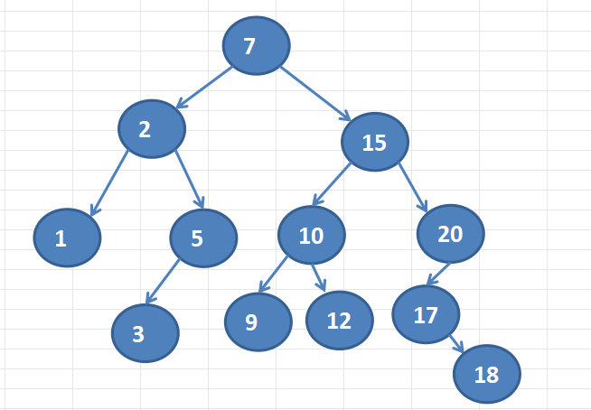

1. 若删除叶子节点
   - 先要找到目标节点`targetNode`
   - 在找的同时，要用`parentNode`标记其父节点
   - 确定`targetNode`是`parentNode`的左子节点还是右子节点，再删除。

2. 删除只有一颗子树的节点
   -  先要找到目标节点`targetNode`
   -  在找的同时，要用`parentNode`标记其父节点
   -  确定`targetNode`是`parentNode`的左子节点还是右子节点，以及确定`targetNode`是有左子树还是右子树
   -  因此有四种情况：
      -  `targetNode`是`parentNode`的左子节点，`targetNode`有左子树——`parent.left = targetNode.left`
      -  `targetNode`是`parentNode`的左子节点，`targetNode`有右子树——`parent.left = targetNode.right`
      -  `targetNode`是`parentNode`的右子节点，`targetNode`有左子树——`parent.right = targetNode.left`
      -  `targetNode`是`parentNode`的右子节点，`targetNode`有右子树——`parent.right = targetNode.right`
   -  删除5为例：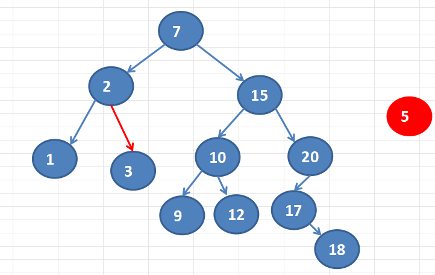

3. 删除有两颗子树的节点

   - 先要找到目标节点`targetNode`

   -  在找的同时，要用`parentNode`标记其父节点

   -  从`targetNode`的右子树里找到最小的节点    （或从`targetNode`的左子树里找最大的节点（同样的流程））

   - 如图找到：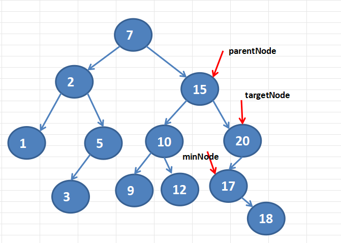

   - 用`temp`临时存储最小节点`minNode`的值，删除`minNode`，这一步删除有点特殊：`targetNode.left = minNode.right`。这是一句通用的写法，可以适应不同情况：因为既然是在`targetNode`的右子树里找的`minNode`，所以其左边必定无节点，且无论其右节点是否为空，都可以这样子写。

   - 如图删除：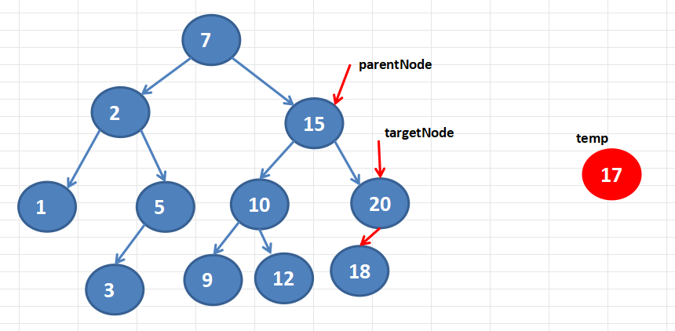

   - 删除`targetNode`，即`targetNode.value = temp`

   - 如图：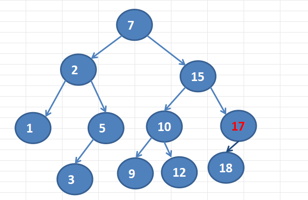

4. 特别注意！上述找到的`parentNode`可能为null，说明要删除的节点是root节点。

> 思考：上述思路可能有可以改进的地方——也就是"**找到要删除的节点的父节点**"，为了这个父节点，代码实现中还特地写了一个独立的方法去查找。好处是清晰，坏处是可能效率略降低？（原路多找一次）。
>
> 可能的改进思路：可以把`search`待删除节点的方法作一定修改：可以返回一个集合，里面装两个节点（被删除节点和父节点）；可以直接返回父节点，后续删除时只是需要多判断一下其左右节点哪个是要被删除的，如何保证被删除的节点的稳定——通过`if(this.left.value == val)`来判断？那么左右节点值都一样呢？（以及万一是根节点要被删除，那么如何返回这个父节点的问题）
>
> 代码暂时不作优化。

#### 代码实现

`BinarySearchTreeDemo`

```java
package com.yukinoshita.dataStructure.binarySearchTree;


public class BinarySearchTreeDemo {
    public static void main(String[] args) {
        BinarySearchTree bst = new BinarySearchTree();
        int[] arr = {7, 15, 2, 1, 10, 5, 20, 9, 12, 3, 17, 18};
        for (int i = 0; i < arr.length; i++) {
            bst.add(new Node(arr[i]));
        }
        //测试delNode方法
        System.out.println("删除前：");
        bst.inOrder();
        bst.delNode(7);
        System.out.println("删除后：");
        bst.inOrder();
    }
}

class BinarySearchTree {
    private Node root;

    //删除结点
    public void delNode(int value){
        if(root == null) return;
        Node targetNode = search(value);
        if(targetNode == null) return;//找不到待删除节点
        Node parentNode = searchParent(value);
        if(parentNode == null){
            //说明要删除的节点就是root节点（也要分三种……）
            //如果左右为空，直接删
            if(root.left == null && root.right == null){
                root = null;
            }
            //如果左右都有子树，选取右子树中最小的
            else if(root.left!=null && root.right != null){
                //temp 为 找到的root的右子树的最小节点
                //还要记录其的parent，已正确执行删除这个最小节点的操作
                Node temp = root.right;
                Node parentOfTemp = root;
                while(temp.left!=null){
                    parentOfTemp = temp;
                    temp = temp.left;
                }
                parentOfTemp.left = temp.right;
                root.value = temp.value;
            }
            //如果只有左或右，直接更新root
            else{
                if(root.left != null) root = root.left;
                else root = root.right;
            }
            return;
        }

        //待删除的节点不是root（保证了操作parentNode时不出错）
        //1.待删除节点为叶子节点
        if(targetNode.left == null && targetNode.right == null) {
            if(parentNode.left!=null && parentNode.left.value == value) parentNode.left =null;
            else parentNode.right = null;
        }
        //2.待删除节点有左子树和右子树
        else if(targetNode.left != null && targetNode.right != null) {
            //temp 为 找到的targetNode的右子树的最小节点
            //还要记录其的parent，已正确执行删除这个最小节点的操作
            Node temp = targetNode.right;
            Node parentOfTemp = targetNode;
            while(temp.left!=null){
                parentOfTemp = temp;
                temp = temp.left;
            }
            parentOfTemp.left = temp.right;
            targetNode.value = temp.value;
        }
        //3.待删除节点只有左子树或右子树
        else{
            //目标节点在parentNode的左边
            if(parentNode.left != null && parentNode.left.value == value){
                //目标节点有左子树
                if(targetNode.left!=null){
                    parentNode.left = targetNode.left;
                }else{
                    parentNode.left = targetNode.right;
                }
            }else{//目标节点在parentNode的右边
                if(targetNode.left!=null){
                    parentNode.right = targetNode.left;
                }else{
                    parentNode.right = targetNode.right;
                }
            }
        }
    }

    //查找要删除的节点
    public Node search(int value){
        if(root == null) return null;//我总是忘记--这种判断自身是否为空的操作……但其实很必要加，不然就会报空指针异常
        return root.search(value);
    }

    //查找要删除节点的父节点
    public Node searchParent(int value){
        if(root == null) return null;
        return root.searchParent(value);
    }

    public void add(Node node) {
        if (root == null) {
            root = node;
        } else {
            root.addNode(node);
        }
    }

    public void inOrder() {
        root.inOrder();
    }
}

class Node {
    int value;
    Node left;
    Node right;

    public Node(int value) {
        this.value = value;
    }

    //查找待删除节点的父节点
    public Node searchParent(int value){
        if((this.left!=null && this.left.value == value) || (this.right != null && this.right.value == value)){
            return this;
        }else{
            //不好的写法，是暴力查找！
//            if(this.left != null) return this.left.searchParent(value);
//            if(this.right != null) return this.right.searchParent(value);

            //效率高的写法：
            //如果要查找的值小于当前的值，且当前节点的左子节点不为空
            if(value < this.value && this.left!=null) return this.left.searchParent(value);
            else if(value >= this.value && this.right!=null) return this.right.searchParent(value);
            return null;
        }
    }

    //查找为value的节点
    public Node search(int value) {
        if (this.value == value) {
            return this;
        } else if (value < this.value) {
            if (this.left == null) return null;//说明找不到
            return this.left.search(value);//递归地继续找
        } else {
            if (this.right == null) return null;
            return this.right.search(value);
        }
    }

    //递归地添加节点的方法
    public void addNode(Node node) {
        if (node == null) return;

        if (this.value < node.value) {
            if (this.right != null) this.right.addNode(node);
            else this.right = node;
        } else {
            if (this.left != null) this.left.addNode(node);
            else this.left = node;
        }
    }

    //中序遍历
    public void inOrder() {
        if (this.left != null) this.left.inOrder();
        System.out.println(this);
        if (this.right != null) this.right.inOrder();
    }

    @Override
    public String toString() {
        return "Node{" +
                "value=" + value +
                '}';
    }
}

```

> 后记：代码中有一部分可以拿出来作为一个方法`int delRightTreeMin(Node node){}`
>
> 说明：`node`为传入的结点，方法作用是删除以node为根节点这棵二叉排序树的最小根节点，最后返回最小节点`minNode`的值。
>
> ps：该方法可用于替换代码中的两部分——一是待删除结点有左右子树且待删除结点就是root，二是待删除结点有左右子树且待删除结点不是root。

## 平衡二叉树

**问题**：

如下图可见**二叉搜索树**可能存在的问题:

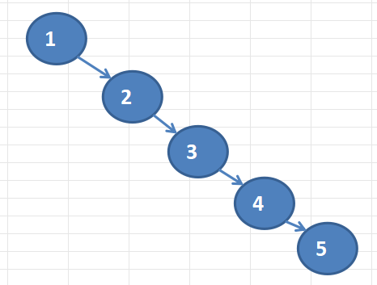

有以下问题：1.左子树都为空，更像单链表；2.插入速度没有影响，但查询速度大幅减低(每次向下一层前还需要和左比较，比链表还慢)，不能发挥BST（BinarySearchTree）的查询优势。

解决方案：**平衡二叉树（AVL）**

**基本介绍**

1. **平衡二叉树**也叫**平衡二叉搜索树（Self-balancing binary search tree）**又被称**AVL树**，可以保证**查询效率较高**。
2. 特点：
   - 是一颗**空树**或它的**左右子树的高度差的绝对值不超过1**。
   - **左右子树都是一棵平衡二叉树**。
3. 常用实现算法有：红黑树、AVL、替罪羊树、Treap、伸展树等

为了使得一棵普通的二叉搜索树变成平衡二叉树，也就是让左右子树的高度差降低，我们引出一些方法——e.g.**左旋转**、**右旋转**、**双旋转**

### 左旋转

适用于右子树高度大于左子树的情况

**左旋转步骤**：

1. 保存当前节点的值，已该值创建`newNode`
2. 将`newNode`的left设置为当前节点的左子树
3. 将`newNode`的right设置为当前节点的右子树的左子树
4. 将当前节点的值更新为右子树的值
5. 将当前节点的right设置为右子树的右子树
6. 将当前节点的left设置为`newNode`

**左旋转图解**：

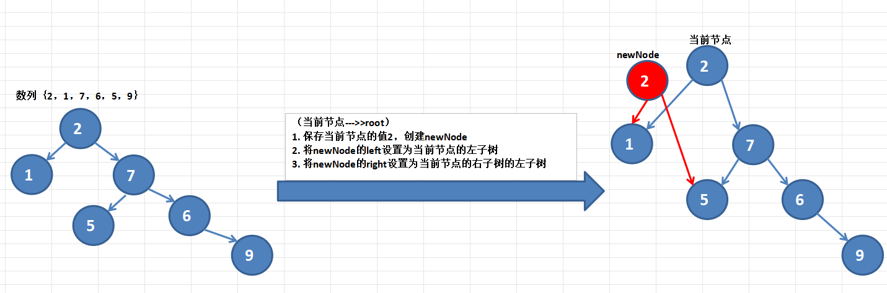

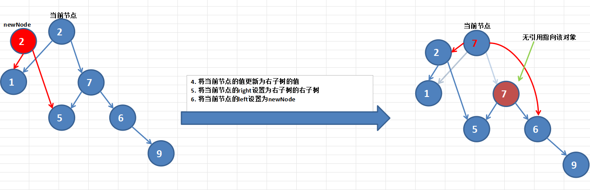

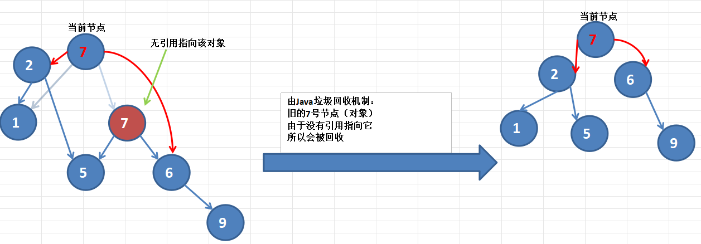

至此，这棵树就符合平衡二叉树的定义。

可以看出：左旋转用于当一棵树的左子树的高度小于右子树的高度时。（记忆，想象一个旋钮，把它往左边旋转，那么右边就"旋上去"，右边高度就降低了）

#### 代码实现

1. 新增三个方法`height`、`leftHeight`、`rightHeight`

```java
//返回右子树的高度
public int rightHeight() {
    if (right == null) {
        return 0;
    }
    return right.height();
}

//返回左子树的高度
public int leftHeight() {
    if (left == null) {
        return 0;
    }
    return left.height();
}

//返回以当前结点为根节点的树的高度
public int height() {
    return Math.max(left == null ? 0 : left.height(), right == null ? 0 : right.height()) + 1;
}
```

2. 左旋转方法`leftRotate`

```java
//左旋转方法
private void leftRotate(){
    //1. 创建新节点，记录当前节点的值
    Node newNode = new Node(this.value);
    //2. 将newNode的left设置为当前节点的左子树
    newNode.left = this.left;
    //3. 将newNode的right设置为当前节点的右子树的左子树
    newNode.right = this.right.left;//****这里不用判断有没有右子树，因为如果this.right为空的话，也不可能会导致右子树比左子树高，更不会执行左旋转*****
    //4. 将当前节点的值更新为右子树的值
    this.value = this.right.value;
    //5. 将当前节点的right设置为右子树的右子树
    this.right = this.right.right;
    //6. 将当前节点的left设置为newNode
    this.left = newNode;
}
```

### 右旋转

适用于左子树高度大于右子树的情况

**右旋转步骤**：

1. 保存当前结点的值，以该值创建`newNode`
2. 将`newNode`的left设置为当前节点的右子树
3. 将`newNode`的right设置为当前结点的左子树的右子树
4. 将当前结点的值更新为左子树的值
5. 将当前结点的left设置为左子树的左子树
6. 将当前结点的right设置为`newNode`

**右旋转图解**：

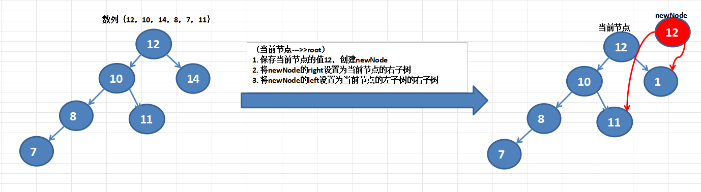

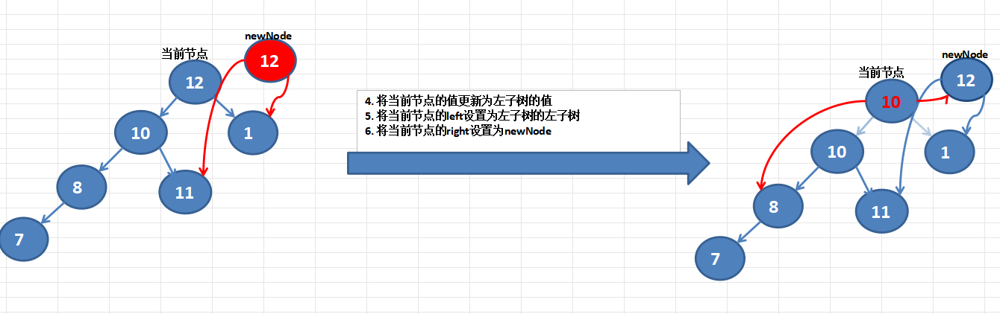

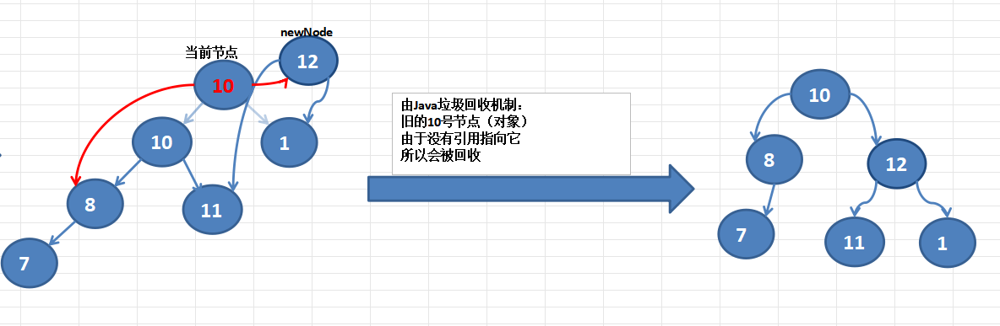

#### 代码实现

`rightRotate`

```java
//右旋转
private void rightRotate(){
    Node newNode = new Node(value);
    newNode.right = this.right;
    newNode.left = this.left.right;
    this.value = this.left.value;
    this.left = this.left.left;
    this.right = newNode;
}
```

在添加节点时使用左旋转和右旋转方法：

`Node.add`方法

```java
//递归地添加节点的方法
public void add(Node node) {
    if (node == null) return;

    if (this.value < node.value) {
        if (this.right != null) this.right.add(node);
        else this.right = node;
    } else {
        if (this.left != null) this.left.add(node);
        else this.left = node;
    }

    //当添加完一个节点后：右子树高度 - 左子树高度 > 1，左旋转
    if(rightHeight()-leftHeight() > 1){
        leftRotate();
    }
    //当添加完一个节点后：左子树高度 - 右子树高度 > 1，右旋转
    if(leftHeight()-rightHeight() > 1){
        rightRotate();
    }
}
```

### 双旋转

有情况下，仅凭一次左旋转或右旋转是无法使的二叉搜索树转换为平衡二叉树的。

e.g.`int[] arr={10,11,7,6,8,9};`此时发现，经过一次右旋转后，反而使得右子树的高度比左子树的高度大1。

**图示**：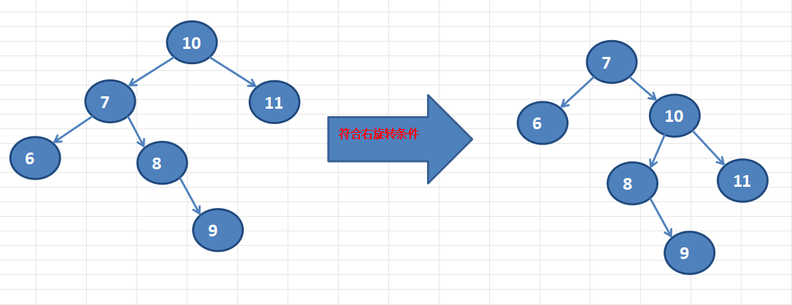

**解决方法——双旋转思路+图解**：

1. 当**符合右旋转**的条件时（`this.leftHeight() - this.rightHeight() > 1`）
   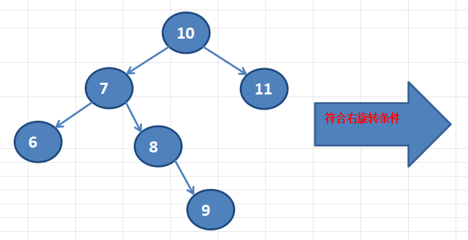

2. 且如果它的 **左子树的右子树的高度 大于 左子树的左子树的高度**，即`this.left.rightHeight() > this.left.leftHeight()`
   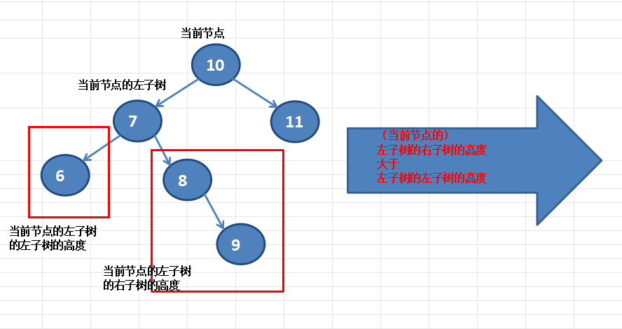

3. 先需**对当前节点的左子树进行左旋转**，即`this.left.leftRotate()`
   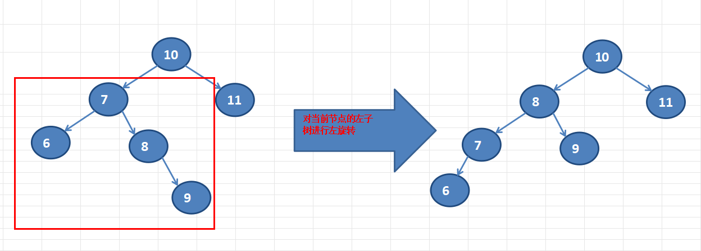

4. 再对当前节点进行右旋转，即`this.rightRotate()`
   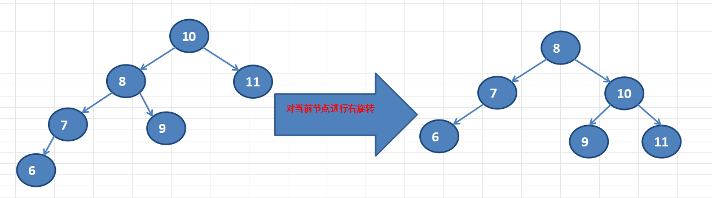


#### 代码实现

`Node.add`方法的修改，使其能够进行双旋转（可以对比[右旋转代码实现](####右旋转代码实现)里面的add方法，有什么区别）

```java
public void add(Node node) {
    if (node == null) return;

    if (this.value < node.value) {
        if (this.right != null) this.right.add(node);
        else this.right = node;
    } else {
        if (this.left != null) this.left.add(node);
        else this.left = node;
    }

    //当添加完一个节点后：右子树高度 - 左子树高度 > 1，左旋转
    if (rightHeight() - leftHeight() > 1) {
        //如果它的右子树的左子树的高度 大于 它的右子树的右子树的高度
        if(this.right!=null && this.right.leftHeight() > this.right.rightHeight()) {
            //先需要对当前节点的右结点 进行右旋转
            this.right.leftRotate();
        }
        leftRotate();
    }
    //当添加完一个节点后：左子树高度 - 右子树高度 > 1，右旋转
    else if (leftHeight() - rightHeight() > 1) {
        //如果它的左子树的右子树的高度 大于 它的左子树的左子树的高度
        if(this.left!=null && this.left.rightHeight() > this.left.leftHeight()){
            //先需要对当前节点的左结点 进行左旋转
            this.left.leftRotate();
        }
        rightRotate();
    }
}
```

## 多叉树

**二叉树存在问题**

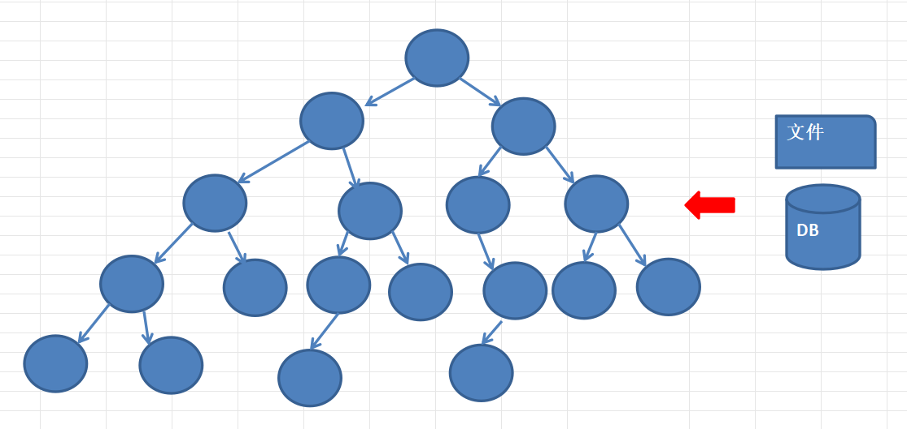

1. 二叉树加载到内存时，如果节点数量过多，会存在问题：
2. 构建二叉树时，需进行多次i/o操作（海量数据一般在文件或数据库中），对构建效率有影响。
3. 海量数据也会造成树的高度过大（谁告诉你一定是满二叉树?）

**多叉树基本介绍**

1. 在二叉树中，每个结点有数据项，最多有两个子节点。如果允许每个结点可以有更多的数据项和子结点，就是**多叉树（Multiway Tree）**
2. 2-3树、2-3-4树就是多叉树，多叉树通过重新组织结点，减少树的高度，能对二叉树进行优化
3. 举例图：

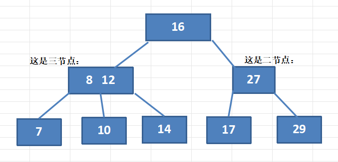

**B树基本介绍**

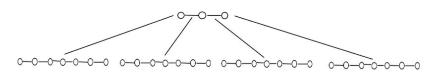

1. B树通过重新组织结点，降低树的高度，减少了i/o读写次数来提升效率
2. **文件系统及数据库系统的设计者利用了磁盘预读原理**，**将一个节点的大小设为等于一个页**(页得大小通常为4k)，这样**每个节点只需要一次I/O**就可以完全载入
3. 将树的度M设置为1024，在600亿个元素中最多只需要4次I/O操作就可以读取到想要的元素，B树(B+)广泛应用于文件存储系统以及数据库系统中

**2-3树基本介绍**

2-3树是最简单的B树结构，具有如下特点:

1. 2-3树的**所有叶子节点都在同一层**（B树都满足）
2. 有两个子节点的节点叫**二节点**，二节点**要么没有子节点**，**要么有两个**子节点
3. 有三个子节点的节点叫**三节点**，三节点**要么没有子节点**，**要么有三个**子节点
4. 2-3树是由**二节点和三节点**构成的树。

### 2-3树

**关于三节点的说明**：

   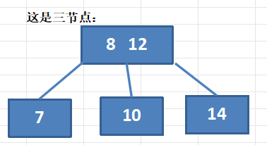7号节点在8号左边，10号介于8和12中间，14在12右边。

**构建2-3树**：

**插入规则**：

1. 2-3树的**所有叶子节点都在同一层**。（B树都满足这个条件）
2. 二节点要么没有子节点，要么有两个子节点。
3. 三节点要么没有子节点，要么有三个子节点。
4. 当按照规则插入一个数到某个节点时，不能满足上面三个要求，就需要拆，**先向上拆**，**如果上层满，则拆本层**，拆后仍然需要满足上面3个条件。 
5. 对于三节点的子树的值大小仍然遵守（BST 二叉搜索树）的规则

**图解**：

以数列$\{ 16, 24, 12, 32, 14, 26, 34, 10, 8, 28, 38, 20 \} $为例

1. 插入16，24，12，32。十分自然：

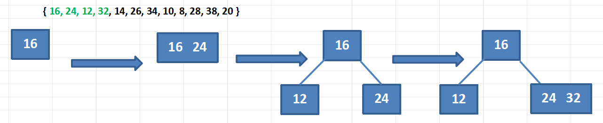

2. 插入14（简单）

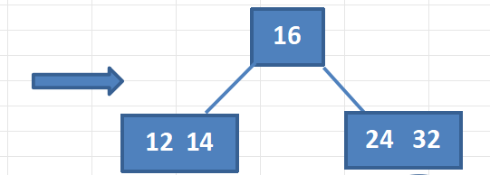

3. 插入26（需拆上一层）

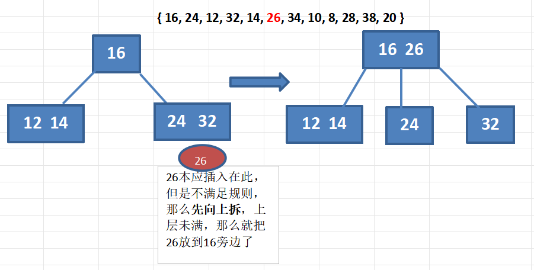

4. 插入34（简单）

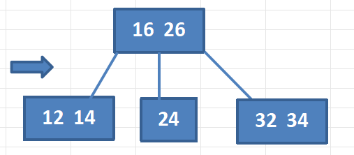

5. 插入10（复杂）

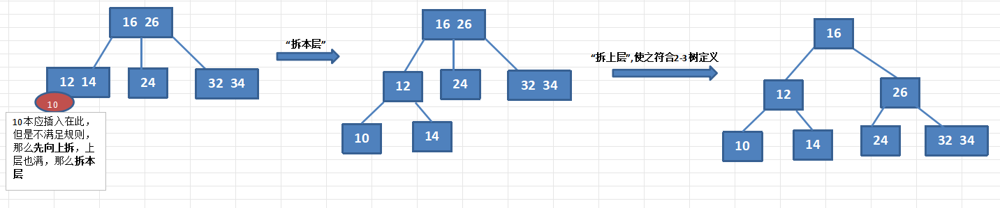

6. 插入8（自然）

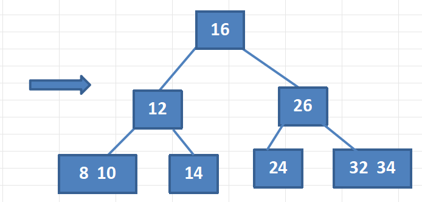

7. 插入28（中间过程演示）

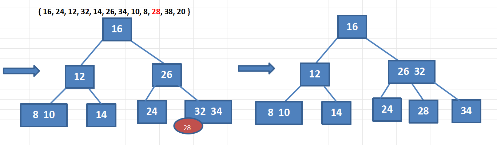

8. 插入38（简单）

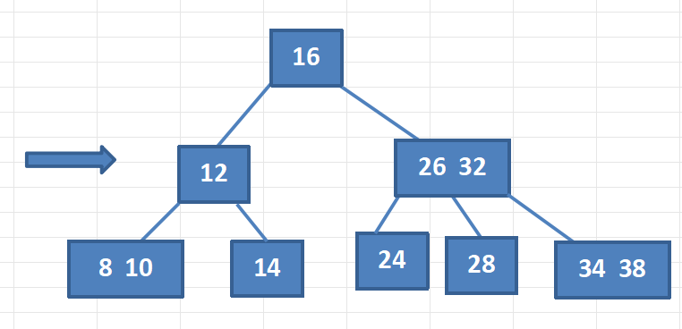

9. 插入20（简单）

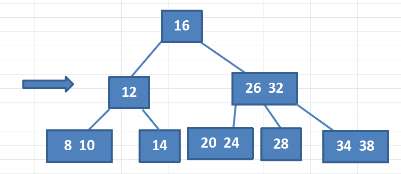


### 2-3-4树

2-3-4树概念和2-3树类似，多了一个四节点，也是一种B树

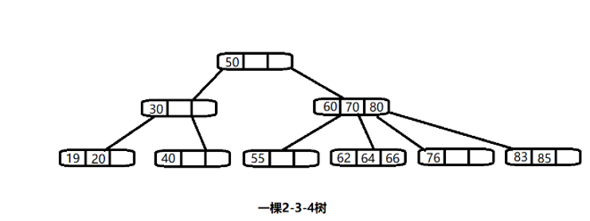

### B树

**B-tree树**即**B树**，B即Balanced，平衡的意思。有人把B-tree翻译成B-树，容易让人产生误解。会以为B-树是一种树，而B树又是另一种树。实际上，**B-tree就是指的B树**。（还有写成**B-树**的，实际上没有"B减树"，就是B树）

1. **B树的阶**：节点的最多子节点个数。比如2-3树的阶是3，2-3-4树的阶是4
2. **B树的搜索**：从根结点开始，对结点内的关键字（有序）序列进行二分查找，如果命中则结束，否则进入查询关键字所属范围的儿子结点；重复，直到所对应的儿子指针为空，或已经是叶子结点
3. 关键字集合分布在整颗树中, 即**叶子节点和非叶子节点都存放数据**
4. 搜索**有可能在非叶子结点结束**（已找到）
5. 其搜索性能**等价于在关键字全集内做一次二分查找**

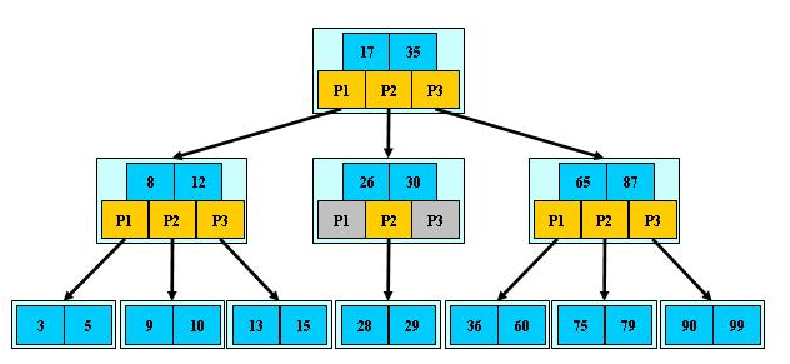

### B+树

B+树是B树的变体，也是一种多路搜索树。

1. B+树的搜索与B树也基本相同，区别是B+树只有达到叶子结点才命中（B树可以在非叶子结点命中），其性能也等价于在关键字全集做一次二分查找
2. 所有关键字都出现在叶子结点的链表中（即数据只能在叶子节点【也叫稠密索引】），且链表中的关键字(数据)恰好是有序的。
3. 不可能在非叶子结点命中
4. 非叶子结点相当于是叶子结点的索引（稀疏索引），叶子结点相当于是存储（关键字）数据的数据层
5. 更适合文件索引系统
6. B树和B+树各有自己的应用场景，不能说B+树完全比B树好，反之亦然。

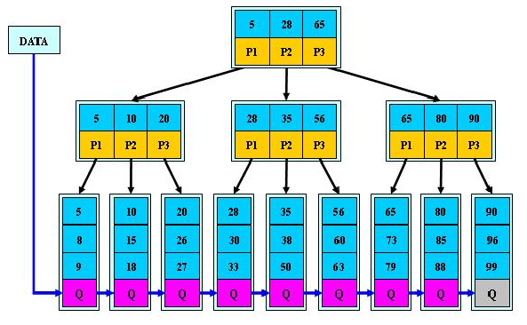

### B*树

B*树是B+树的变体，在B+树的非根和非叶子结点再增加指向兄弟的指针。

1. B* 树定义了非叶子结点关键字个数至少为$\frac{2}{3}M$，即块的最低使用率为$\frac{2}{3}$，而B+树的块的最低使用率为B+树的$\frac{1}{2}$。
2. 从第1个特点我们可以看出，B*树分配新结点的概率比B+树要低，空间使用率更高

## 图

为什幺要有图？

1. 线性表局限于一个直接前驱和一个直接后继。
2. 树也只能有一个直接前驱。
3. 当我们需要**多对多**的关系时，就需要使用**图**。

**图的常用概念**

1. **顶点**（**vertex**）

2. **边**（**edge**）

3. **路径**

4. **无向图**

   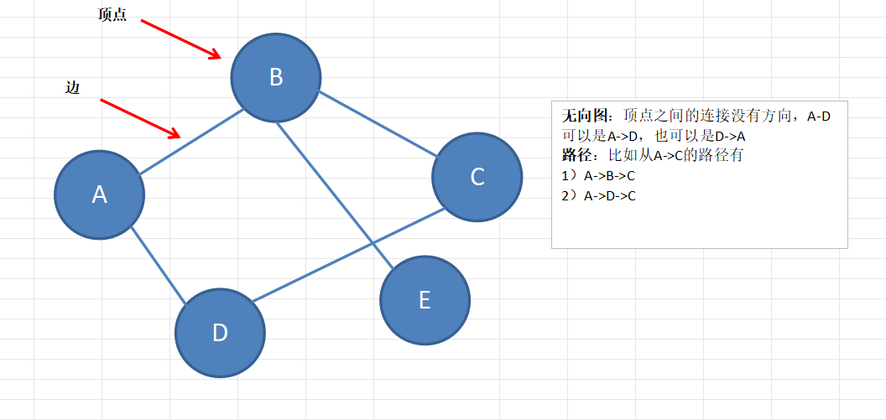

5. **有向图**

   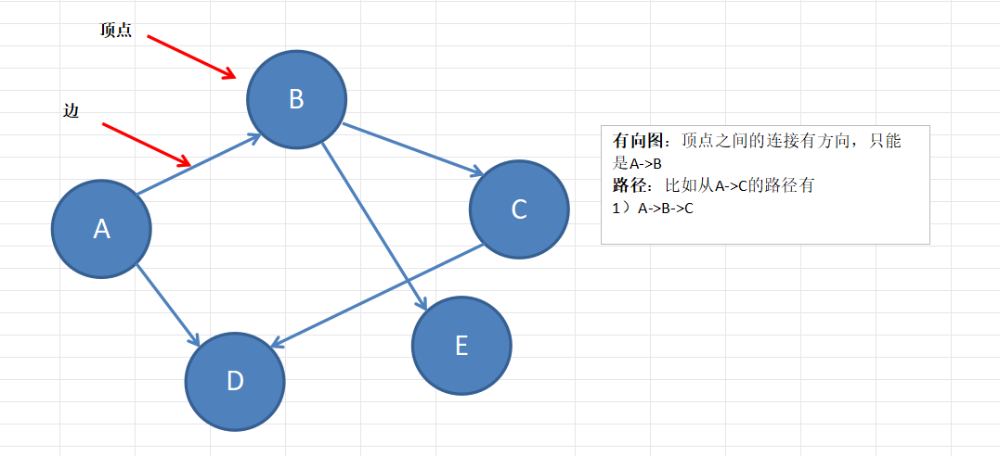

6. **带权图**（这种边带权值的图也叫**网**）

   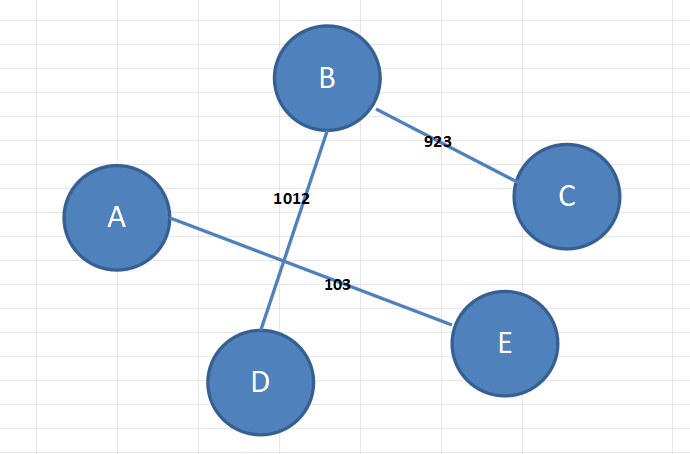

图的表示方式：二维数组表示（**邻接矩阵**）；链表表示（**邻接表**）

1. **邻接矩阵**

   - 邻接矩阵是表示图形中顶点之间相邻关系的矩阵，对于n个顶点的图而言，矩阵是的row和col表示的是1....n个点。


   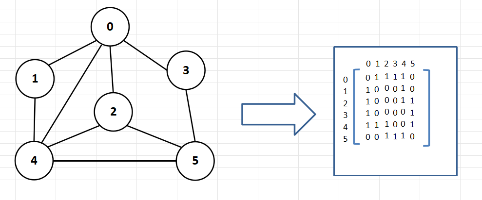

2. **邻接表**
   
   -  邻接矩阵需要为每个顶点都分配n个边的空间，其实有很多边都是不存在,会造成空间的一定损失。
   -  邻接表的实现只关心存在的边，不关心不存在的边。因此没有空间浪费，邻接表由数组+链表组成
   
   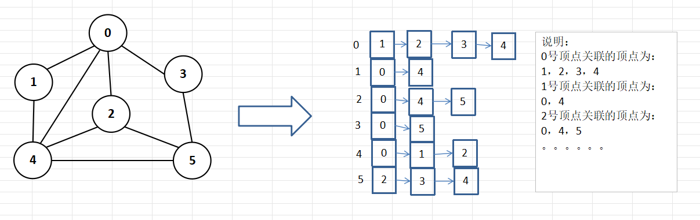

**创建一个无向图-简单案例**	

`Graph`

```java
package com.yukinoshita.dataStructure.graph;

import java.util.ArrayList;
import java.util.Arrays;
import java.util.LinkedList;

public class Graph {

    private ArrayList<String> vertexList;
    private int[][] edges;
    private int numOfEdges; 

    public static void main(String[] args) {
        
        int n = 5;
        String Vertexs[] = {"A", "B", "C", "D", "E"};
        Graph graph = new Graph(n);
        for(String vertex: Vertexs) {
            graph.insertVertex(vertex);
        }
        //添加边
        //A-B A-C B-C B-D B-E
		graph.insertEdge(0, 1, 1); // A-B
		graph.insertEdge(0, 2, 1); //
		graph.insertEdge(1, 2, 1); //
		graph.insertEdge(1, 3, 1); //
		graph.insertEdge(1, 4, 1); //
        graph.showGraph();
    }

    //构造器
    public Graph(int n) {
        edges = new int[n][n];
        vertexList = new ArrayList<String>(n);
        numOfEdges = 0;

    }

    //获取顶点数量
    public int getNumOfVertex() {
        return vertexList.size();
    }
    //展示图
    public void showGraph() {
        for(int[] link : edges) {
            System.err.println(Arrays.toString(link));
        }
    }
    //获取边的数量
    public int getNumOfEdges() {
        return numOfEdges;
    }
    //获取顶点的值
    public String getValueByIndex(int i) {
        return vertexList.get(i);
    }
    //获取权值
    public int getWeight(int v1, int v2) {
        return edges[v1][v2];
    }
    //插入顶点
    public void insertVertex(String vertex) {
        vertexList.add(vertex);
    }
    //插入边
    public void insertEdge(int v1, int v2, int weight) {
        edges[v1][v2] = weight;
        edges[v2][v1] = weight;
        numOfEdges++;
    }
}

```

## 并查集

> 由于目录编排原因，好像并查集是图？并不是，它是一种独立的抽象的数据结构。可以看做是一棵树或森林。
>
> 并查集的定义以及算法实现参考了[OI WIKI并查集](https://oi-wiki.org/ds/dsu/)以及[blog](https://blog.csdn.net/the_zed/article/details/105126583)提供了形象生动的例子。
>
> 同时参考了GPT所提供应用、代码。

**基本介绍**：

**并查集(DSU)**，全称为**Disjoint Set Union**。

1. 并查集是一种用于**管理元素所属集合**的数据结构，实现为一个森林，其中每棵树表示一个集合，树中的节点表示对应集合中的元素。

2. 顾名思义，并查集支持两种操作：
   - **合并（Union）**：合并两个元素所属集合（合并对应的树）

   - **查询（Find）**：查询某个元素所属集合（查询对应的树的根节点），这可以用于判断两个元素是否属于同一集合

   > 删除、移动属于扩展的操作，需要将parent数组增加值两倍，还新增一个size[]来记录每个集合中元素个数，其大小也是两倍。

   - 通常情况下并查集的标准实现只需要`find`和`unite`就行，如需扩展功能才将数组空间变为两倍，因此也给出两种代码。

**并查集的应用**：

1. **连通性问题**
   - 并查集最经典的应用之一是判断图中节点是否连通。假设你有一个无向图，需要动态地判断两个节点是否属于同一个连通块，或者在图中添加边并进行连通性判断。并查集通过“合并”和“查找”操作，能够在近乎常数时间内解决这一问题。
   - 判断两个城市是否在同一条道路网络中。
   - 判断两个计算机是否在同一个局域网中。
2. **最小生成树**
   - 并查集是 [Kruskal 算法](##克鲁斯卡尔算法)的核心部分。Kruskal 算法通过对边进行排序并逐步合并节点，最终得到图的最小生成树。在这个过程中，使用并查集判断两个节点是否属于同一集合，防止产生环。
   - 计算带权图的最小生成树，最小成本的通信网络布设。
3. **动态连通性**
   - 在一些实时问题中，可能会动态地增加边或删除边。并查集可以高效地处理这种动态连通性的问题，例如：在某些社交网络中判断两个人是否处于同一网络中，或者当一条连接断开时判断网络是否仍然连通。
   - 判断社交网络中两个用户是否在同一个群组。
   - 判断计算机网络中两个节点是否能通信。
4. **图的环形检测**
   - 在图的遍历过程中，环的检测是一个常见问题。利用并查集可以高效地检测图中是否有环。当你尝试合并两个已经在同一集合中的节点时，说明已经发现了一个环。
   - 判断一个无向图中是否存在环。
   - 判断一个任务依赖图中是否存在循环依赖。
5. **分割问题**
   - 在图中，分割或切割的目标是将图分割成多个连通块。并查集可以帮助快速地找到哪些节点属于同一块，从而实现图的分割。
   - 网络中的分区，找到某些节点之间的最大割集。
   - 计算机科学中的图像分割问题。
6. **动态连通性与并查集扩展**
   - 一些复杂的动态连通性问题，可以使用并查集的扩展版本进行处理。例如，在动态树形结构的查询和更新中，可以通过并查集进行高效操作。
   - 在数据流中，快速查询和更新不同数据块之间的连接关系。
7. **岛屿问题**
   - 给定一个二维矩阵，其中每个元素表示一个格子，格子值为 `1` 表示陆地，`0` 表示水域。通过并查集，可以快速求解岛屿的个数，即求连通的陆地块的个数。
   - 在一个地图中，找到所有孤立的岛屿区域。
8. **动态查询最小生成树**
   - 并查集也可以用于处理某些动态修改图的问题，如在某些图的边权改变时，需要动态查询和更新最小生成树。通过与其他算法结合，保持并查集的结构可以高效更新图中的连通信息。

**算法实现思路**：

1. **初始化**

2. **查询**`find`

   1. 我们需要沿着树向上移动，直至找到根节点。

      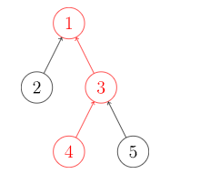

   2. 路径压缩，可以加快后续的查找速度。

      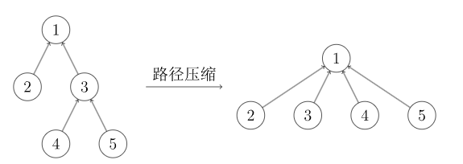

3. **合并**

   要合并两棵树，我们只需要将一棵树的根节点连到另一棵树的根节点。

   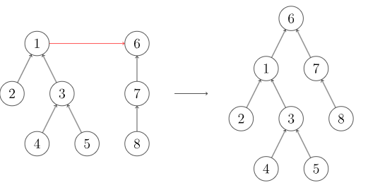

   补充：**启发式合并**

   合并时，选择哪棵树的根节点作为新树的根节点会影响未来操作的复杂度。我们可以将节点较少或深度较小的树连到另一棵，以免发生退化。

4. **删除**`erase`

   要删除一个叶子节点，我们可以将其父亲设为自己。为了保证要删除的元素都是叶子，我们可以预先为每个节点制作副本，并将其副本作为父亲。

   实际上，这里的删除操作，只是将该元素的parent指向他自己。

   - 该操作的效果是 **“断开”** 元素 `x` 与它原来集合的联系，使 `x` 成为一个新的单元素集合，但并没有真正删除 `x` 本身，也没有改变其它集合的结构。
   - 这意味着，`x` 会从原集合中“移除”，但其索引仍然存在于数据结构中。换句话说，`erase` 操作并没有修改 `parent` 数组的大小，也没有真正从数据结构中“删除”元素，只是把 `x` 从原来的集合中分离出来。

   - **为什么？**

     - 这样的设计通常用于 **懒惰删除**（lazy deletion）或者当需要在集合中分割元素时。这种方式避免了删除元素时可能出现的性能开销，特别是在处理大数据结构时。

     - 另外，`erase` 操作本身可能用于某些特定场景，比如让元素独立出来，变成一个单独的集合，供后续操作使用。

   - **进一步改进**：

     - 如果需要完全删除某个元素并从集合中移除，可以考虑设计一个额外的机制来真正删除元素，可能会涉及到管理集合中实际元素的列表或数组。

5. **移动**

   与删除类似，通过以副本作为父亲，保证要移动的元素都是叶子。

**带权并查集**：

我们还可以在并查集的边上定义某种权值、以及这种权值在路径压缩时产生的运算，从而解决更多的问题。

比如对于经典的[「NOI2001」食物链](https://www.luogu.com.cn/problem/P2024)，我们可以在边权上维护模 3 意义下的加法群。

### 标准并查集实现

`DSUDemo`

> 感谢GPT

```java
package com.yukinoshita.dataStructure.dsu;

import java.util.Arrays;

public class DSUDemo {
    public static void main(String[] args) {
        // 创建一个包含 5 个元素的并查集
        DSU dsu = new DSU(5);

        // 打印初始状态
        System.out.println("Initial state:");
        dsu.print();

        // 合并集合
        dsu.unite(0, 1);  // 将 0 和 1 合并
        dsu.unite(1, 2);  // 将 1 和 2 合并
        dsu.unite(3, 4);  // 将 3 和 4 合并

        // 打印合并后的状态
        System.out.println("After uniting (0,1), (1,2), (3,4):");
        dsu.print();

        // 查找操作
        System.out.println("Find root of 0: " + dsu.find(0));  // 输出 0 或 2，因为 0 和 2 在同一个集合中
        System.out.println("Find root of 4: " + dsu.find(4));  // 输出 4 或 3，因为 3 和 4 在同一个集合中

        // 再次合并 2 和 3
        dsu.unite(2, 3);  // 将 2 和 3 合并

        // 打印合并后的状态
        System.out.println("After uniting (2,3):");
        dsu.print();

        // 查找操作
        System.out.println("Find root of 0: " + dsu.find(0));  // 输出 2
        System.out.println("Find root of 4: " + dsu.find(4));  // 输出 2，因为 4 通过 3 和 2 连接到一起
    }
}

class DSU {
    int[] parent;  // 用于存储每个元素的父节点
    int[] size;    // 用于存储每个集合的大小

    // 构造函数：初始化并查集，设置每个元素的父节点为自己，集合大小为 1
    public DSU(int size_) {
        parent = new int[size_];
        size = new int[size_];

        // 初始化，父节点指向自己，集合大小为 1
        for (int i = 0; i < size_; i++) {
            parent[i] = i;    // 每个元素的父节点初始化为它自己
            size[i] = 1;      // 每个集合的初始大小为 1
        }
    }

    // 查找操作：返回元素 x 所在集合的根节点，同时使用路径压缩优化
    public int find(int x) {
        // 如果 x 的父节点是它自己，说明它是根节点，直接返回
        // 否则递归查找其父节点并进行路径压缩
        return x == parent[x] ? x : (parent[x] = find(parent[x]));
    }

    // 合并操作：将元素 x 和 y 所在的集合合并
    public void unite(int x, int y) {
        // 查找元素 x 和 y 的根节点
        int rootX = find(x);
        int rootY = find(y);

        // 如果 x 和 y 已经在同一个集合中，则不需要合并
        if (rootX != rootY) {
            // 根据集合大小来决定将哪个集合合并到另一个集合
            if (size[rootX] < size[rootY]) {
                parent[rootX] = rootY;  // 将 x 所在的集合合并到 y 所在的集合
                size[rootY] += size[rootX];  // 更新 y 所在集合的大小
            } else {
                parent[rootY] = rootX;  // 将 y 所在的集合合并到 x 所在的集合
                size[rootX] += size[rootY];  // 更新 x 所在集合的大小
            }
        }
    }

    // 打印当前并查集的父节点数组和集合大小数组
    public void print() {
        System.out.println("Parent: " + Arrays.toString(parent));  // 打印每个元素的父节点
        System.out.println("Size: " + Arrays.toString(size));      // 打印每个集合的大小
    }
}

```

### 扩展并查集实现

`ExtendedDSUDemo`

```java
package com.yukinoshita.dataStructure.extendedDsu;

import java.util.Arrays;

public class ExtendedDSUDemo {
    public static void main(String[] args) {
        DSU dsu = new DSU(5);
        dsu.print();
        dsu.unite(0, 1);
        dsu.unite(1, 2);
//        dsu.find(2);
        dsu.print();//此时输出parent[5,5,7,8,9,5,5,5,8,9]为什么呢？
                    //发现第2个元素和7号元素的父节点都应该是5才对？
                    //因为此时刚完成合并，没有进行过find，所以路径没压缩，只要加上那句注释掉的find，此时的parent[2]也会变成5
        dsu.move(0, 3);  // 将元素 0 移动到元素 3 所在的集合
        dsu.print();
    }
}

class DSU {
    int[] parent;
    int[] size;

    public DSU(int size_) {
        parent = new int[size_ * 2];
        size = new int[size_ * 2];

        // 初始化前半部分，元素属于不同的集合
        for (int i = 0; i < size_; i++) {
            parent[i] = i + size_;  // 初始化 parent 数组，前 size_ 个元素依次为 size_ 到 2*size_-1
            size[i] = 1;            // 每个集合的初始大小为 1
        }

        // 初始化后半部分，元素是自己的父节点
        for (int i = size_; i < size_ * 2; i++) {
            parent[i] = i;          // 后半部分，pa[i] = i，表示每个元素自己是根
            size[i] = 1;            // 初始集合大小为 1
        }
    }

    // 查找并进行路径压缩
    public int find(int x) {
        return x == parent[x] ? x : (parent[x] = find(parent[x]));
    }

    // 合并两棵树，按大小合并
    public void unite(int x, int y) {
        int rootX = find(x);
        int rootY = find(y);

        // 如果两个元素已经在同一个集合中，直接返回
        if (rootX != rootY) {
            // 按大小合并：将小树合并到大树下
            if (size[rootX] < size[rootY]) {
                parent[rootX] = rootY;
                size[rootY] += size[rootX];
            } else {
                parent[rootY] = rootX;
                size[rootX] += size[rootY];
            }
        }
    }

    // 将元素 x 移动到元素 y 所在的集合
    public void move(int x, int y) {
        int fx = find(x);  // 查找元素 x 所在的集合的根
        int fy = find(y);  // 查找元素 y 所在的集合的根

        // 如果 x 和 y 已经在同一个集合中，不需要移动
        if (fx == fy) return;

        // 将 x 移动到 y 所在的集合
        parent[x] = fy;  // 让 x 的父节点指向 y 所在的集合
        size[fx]--;      // 原集合的大小减 1
        size[fy]++;      // 目标集合的大小加 1
    }

    // 打印 parent 和 size 数组的状态
    public void print() {
        System.out.println("Parent: " + Arrays.toString(parent));
        System.out.println("Size: " + Arrays.toString(size));
    }
}

```


# 算法

> 前言：算法是属于编程功底性的东西，要求有，多不多无所谓。
>

## 排序算法-概论

### 分类

分为**内部排序**和**外部排序**，

1. 内部排序，是指将要处理的数据都加载到内部存储器（内存）完成排序
2. 外部排序，当数据量过大，无法全部加载到内存中时，需要借助外部存储进行排序

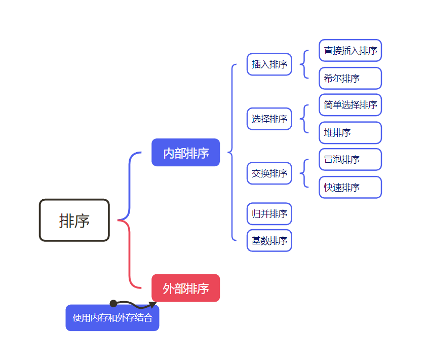

### 算法对比

| **排序算法** | **平均时间复杂度** | **最好情况** | **最坏情况** | **空间复杂度** | **排序方式** | **稳定性** |
| ------------ | ------------------ | ------------ | ------------ | -------------- | ------------ | ---------- |
| **冒泡排序** | $O(n^2)$           | $O(n)$       | $O(n^2)$     | $O(1)$   | In-place | 稳定 |
| **选择排序** | $O(n^2)$           | $O(n^2)$     | $O(n^2)$     | $O(1)$         | In-place | 不稳定 |
| **插入排序** | $O(n^2)$           | $O(n)$       | $O(n^2)$     | $O(1)$         | In-place | 稳定 |
| **希尔排序** | $O(n\log n)$ | $O(n\log n)$ | $O(n\log^2 n)$ | $O(1)$ | In-place | 不稳定 |
| **归并排序** | $O(n\log n)$ | $O(n\log n)$ | $O(n\log n)$ | $O(n)$ | Out-place | 稳定 |
| **快速排序** | $O(n\log n)$ | $O(n\log n)$ | $O(n^2)$ | $O(\log n)$ | In-place | 不稳定 |
| **堆排序**   | $O(n\log n)$ | $O(n\log n)$ | $O(n\log n)$ | $O(1)$ | In-place | 不稳定 |
| **计数排序** | $O(n+k)$ | $O(n+k)$ | $O(n+k)$ | $O(k)$ | Out-place | 稳定 |
| **桶排序**   | $O(n+k)$ | $O(n+k)$ | $O(n^2)$ | $O(n+k)$ | Out-place | 稳定 |
| **基数排序** | $O(n \times k)$ | $O(n \times k)$ | $O(n \times k)$ | $O(n+k)$ | Out-place | 稳定 |

**术语解释**：

1. **稳定**：如果a原本在b前面，而a=b，排序后a仍在b前面
2. **不稳定**：如果a原本在b前面，而a=b，排序后a有可能在b后面
3. **内排序**：所有排序操作都在内存中完成
4. **外排序**：由于数据太大，因此把数据放在磁盘中，而排序通过磁盘和内存的数据传输才能进行
5. **时间复杂度**： 一个算法执行所耗费的时间
6. **空间复杂度**：运行完一个程序所需内存的大小
7. **n**：数据规模
8. **k**：计数排序、桶排序等中桶的数量；基数排序中，数字的位数
9. **In-place**：不占用额外内存
10. **Out-place**：占用额外内存

### 实际测试的性能

> 不同算法对于不同测试数据大小的排序所用时间

| 数据量 | [冒泡排序](##1、冒泡排序(经典)) | [选择排序](##2、选择排序(经典)) | [插入排序](##3、插入排序(经典)) | [希尔排序](##4、希尔排序(经典)) | [快速排序](##5、快速排序(经典)) | [归并排序](##6、归并排序(经典)) | [基数排序](##7、基数排序(经典)) | [堆排序](##8、堆排序(经典)) |
| ------ | ------------------------------- | ------------------------------- | ------------------------------- | ------------------------------- | ------------------------------- | ------------------------------- | ------------------------------- | --------------------------- |
| 10000  | 43                              | 26                              | 22                              | 3                               | 1                               | 2                               | 2                               | 1                           |
| 50000  | 1845                            | 592                             | 431                             | 6                               | 6                               | 7                               | 3                               | 5                           |
| 80000  | 5250                            | 1470                            | 1074                            | 12                              | 9                               | 18                              | 10                              | 8                           |
| 140000 | 18690                           | 4337                            | 3214                            | 17                              | 12                              | 22                              | 14                              | 13                          |
| 500000 |                                 |                                 |                                 | 52                              | 37                              | 57                              | 35                              | 46                          |
| 900000 |                                 |                                 |                                 | 104                             | 64                              | 93                              | 35                              | 83                          |

## 1、冒泡排序(经典)

### 思路分析

冒泡排序的**基本思想**是：

对待排序的元素依次从前往后遍历，比较相邻元素的值，若相邻元素逆序，则交换位置，最终会使得值较大的元素逐渐从前移动到后面，犹如水中气泡冒上来一样。

**优化**：

因为在排序过程中，每个元素都会不断接近自己应在的位置，如果某一趟中没有进行交换，说明已排序完毕。（可新增`flag`来作为标志）

**图解**：

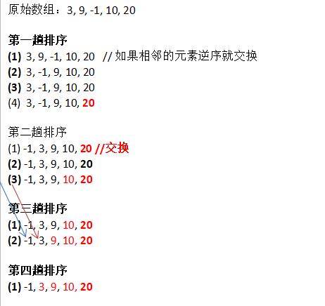

每一趟"冒泡"，就是将**最大**的那个元素放到**待排序元素**的最后，且每过一轮，待排序元素减一。

从上面例子明显可见，可以优化。

**小结**：

1. 一共进行`arr.length()-1`次排序
2. 每一趟排序的次数逐渐减少
3. 如果发现某一次没有交换，就可以结束排序（优化）
4. 时间复杂度为$O(n^2)$

### 代码实现

**算法性能测试**：

| 测试数据大小 | 花费时间（单位：毫秒） |
| ------------ | ---------------------- |
| 10000        | 43                     |
| 50000        | 1845                   |
| 80000        | 5250                   |
| 140000       | 18690                  |

`BubbleSort`

```java
package com.yukinoshita.algorithm.sort;

import java.util.Arrays;
import java.util.Random;

public class BubbleSort {
    public static void main(String args[]) {
        int[] arr = {3, 9, -1, 10, -2};

        System.out.println("排序前:" + Arrays.toString(arr));
        bubbleSort(arr);
        System.out.println("排序后:" + Arrays.toString(arr));

        // 测试算法性能
        testPerformance();
    }

    public static void bubbleSort(int[] arr) {
        boolean flag;
        for (int i = 0; i < arr.length - 1; i++) {
            flag = true;
            for (int j = 0; j < arr.length - i - 1; j++) {
                if (arr[j + 1] < arr[j]) {
                    int temp = arr[j];
                    arr[j] = arr[j + 1];
                    arr[j + 1] = temp;
                    flag = false;
                }
            }
            if (flag) break; // 如果一次排序都没有，说明已经有序
        }
    }

    // 测试算法性能的方法
    public static void testPerformance() {
        int size = 80000; // 数组大小
        int[] arr = new int[size];
        Random random = new Random();

        // 生成无序数组
        for (int i = 0; i < size; i++) {
            arr[i] = random.nextInt(100000); // 随机数范围可以根据需要调整
        }

        long startTime = System.currentTimeMillis(); // 记录开始时间
        bubbleSort(arr); // 排序
        long endTime = System.currentTimeMillis(); // 记录结束时间

        System.out.println("排序大小: " + size);
        System.out.println("排序时间: " + (endTime - startTime) + " 毫秒");
    }
}

```

## 2、选择排序(经典)

### 思路分析

**基本思想**为：

第一次从$arr[0]至arr[n-1]$中选取最小值，与$arr[0]$交换；第二次从$arr[1]至arr[n-1]$中选取最小值，与$arr[1]$交换；第三次从$arr[2]至arr[n-1]$中选取最小值，与$arr[2]$交换……

**图解**：

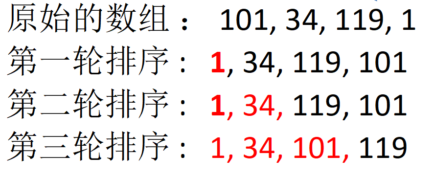

**说明**：

1. 选择排序有`arr.length-1`轮排序
2. 每一轮循环，都是找出当前待排序元素的最小值(的索引`minIndex`)，放置到最前面(`swap(arr[minIndex],arr[i])`)。
3. 时间复杂度为$O(n^2)$

### 代码实现

**算法性能测试**：

| 测试数据大小 | 花费时间（单位：毫秒） |
| ------------ | ---------------------- |
| 10000        | 26                     |
| 50000        | 592                    |
| 80000        | 1470                   |
| 140000       | 4337                   |

`SelectSort`

```java
package com.yukinoshita.algorithm.sort;

import java.util.Arrays;
import java.util.Random;

public class SelectSort {
    public static void main(String args[]) {
        int[] arr = {3, 9, -1, 10, -2};

        System.out.println("排序前:" + Arrays.toString(arr));
        selectSort(arr);
        System.out.println("排序后:" + Arrays.toString(arr));

        // 测试算法性能
        testPerformance();
    }

    private static void selectSort(int[] arr) {
        for (int i = 0; i < arr.length - 1; i++) {
            int minIndex = i;
            for (int j = i + 1; j < arr.length; j++) {
                if (arr[minIndex] > arr[j]) {
                    minIndex = j;
                }
            }
            // 交换位置
            int temp = arr[minIndex];
            arr[minIndex] = arr[i];
            arr[i] = temp;
        }
    }

    // 测试算法性能的方法
    private static void testPerformance() {
        int size = 80000; // 数组大小
        int[] arr = new int[size];
        Random random = new Random();

        // 生成无序数组
        for (int i = 0; i < size; i++) {
            arr[i] = random.nextInt(100000); // 随机数范围可以根据需要调整
        }

        long startTime = System.currentTimeMillis(); // 记录开始时间
        selectSort(arr); // 排序
        long endTime = System.currentTimeMillis(); // 记录结束时间

        System.out.println("排序大小: " + size);
        System.out.println("排序时间: " + (endTime - startTime) + " 毫秒");
    }
}

```

## 3、插入排序(经典)

### 思路分析

**基本思想**为：

把n个待排序的元素看成为一个有序表和一个无序表，**开始时有序表中只有一个元素**，无序表中有n-1个元素，排序过程中**每次从无序表中取出一个**元素，将它与有序表中元素依次**比较**，**插入到适当位置**，使之成为新的有序表。

### 代码实现

| 测试数据大小 | 花费时间（单位：毫秒） |
| ------------ | ---------------------- |
| 10000        | 22                     |
| 50000        | 431                    |
| 80000        | 1074                   |
| 140000       | 3214                   |

`InsertSort`

```java
package com.yukinoshita.algorithm.sort;

import java.util.Arrays;
import java.util.Random;

public class InsertSort {
    public static void main(String args[]) {
        int[] arr = {3, 9, -1, 10, -2};

        System.out.println("排序前:" + Arrays.toString(arr));
        insertSort(arr);
        System.out.println("排序后:" + Arrays.toString(arr));

        // 测试算法性能
        testPerformance();
    }

    private static void insertSort(int[] arr) {
        for(int i=1;i<arr.length;i++) {
            int insertVal = arr[i];//待插入有序表的元素
            int insertIndex = i-1;//该元素应该插入的位置
            while(insertIndex>=0 && insertVal<arr[insertIndex]) {
                //说明还没找到该插入的位置
                arr[insertIndex+1] = arr[insertIndex];
                insertIndex--;
            }
            arr[insertIndex+1] = insertVal;
        }
    }

    // 测试算法性能的方法
    public static void testPerformance() {
        int size = 50000; // 数组大小
        int[] arr = new int[size];
        Random random = new Random();

        // 生成无序数组
        for (int i = 0; i < size; i++) {
            arr[i] = random.nextInt(100000); // 随机数范围可以根据需要调整
        }

        long startTime = System.currentTimeMillis(); // 记录开始时间
        insertSort(arr); // 排序
        long endTime = System.currentTimeMillis(); // 记录结束时间

        System.out.println("排序大小: " + size);
        System.out.println("排序时间: " + (endTime - startTime) + " 毫秒");
    }


}

```

## 4、希尔排序(经典)

### 思路分析

首先是关于插入排序存在的问题：

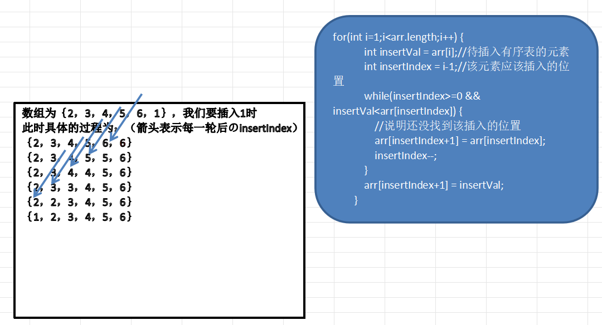

会发现当我们要插入的数据是较小的数时，后移的次数明显增多，对效率有影响

**希尔排序介绍**：

也是一种插入排序，他是简单插入排序经过改进后的一个**更高效版本**，也成为**缩小增量排序**

**基本思想**：

希尔排序是把记录按下标的一定增量**分组**，对每组使用直接插入排序算法排序；随着**增量**减少，每组包含的关键词越来越多，当增量减至1时，整个文件恰被分成一组，算法终止。

1. **分组**：希尔排序首先将整个待排序的数组按下标分成若干组。每组的元素之间的下标差为一个预先设定的**增量**（也称为“**步长**”）。例如，假设增量为 3，则数组中的元素会被分成多个子数组，**每个子数组包含的元素是下标相差 3 的元素**。
2. **直接插入排序**：对每组中的元素使用直接插入排序算法进行排序。直接插入排序是将待排序元素逐个插入到已排序序列中的方法，**适用于小规模数据的排序**。
3. **减少增量**：随着排序的进行，增量逐渐减少，通常会按照某种规则（如减半或减小固定值）来选择新的增量。每次减少增量后，分组的方式会发生变化，此时会有更多的元素被分到同一组中。
4. **最终排序**：当增量减小到 1 时，所有元素就会被视为一组，此时使用插入排序对整个数组进行排序。**由于之前的分组和局部排序，整体数据已经趋近于有序**，因此最后的插入排序能够更高效地完成。

- **总结**：希尔排序通过**先对远距离的元素进行排序**，然后**逐步缩小距离**，使得数据**逐渐接近有序**，从而**提高插入排序的效率**。这种分组和逐步排序的方式使得希尔排序比直接插入排序**在处理较大数组时效率更高**。

**图解**：

1. **初始数组**：
   假设我们有一个数组：
   
   ```java
   [8, 5, 3, 7, 6, 2, 4, 1]
   ```
   
2. **选择增量**：
   假设我们选择初始增量为 4。数组被分为两组：
   - 第一组（下标 0, 4）：[8, 6]
   - 第二组（下标 1, 5）：[5, 2]
   - 第三组（下标 2, 6）：[3, 4]
   - 第四组（下标 3, 7）：[7, 1]

3. **对每组进行插入排序**：
   对每一组进行插入排序：
   
   - 第一组：[6, 8] → 变为 `[6, 8]`
   - 第二组：[2, 5] → 变为 `[2, 5]`
   - 第三组：[3, 4] → 变为 `[3, 4]`
   - 第四组：[1, 7] → 变为 `[1, 7]`
   
   整体数组变为：
   ```
   [6, 2, 3, 1, 8, 5, 4, 7]
   ```
   
4. **减小增量**：
   将增量减小到 2。新的分组：
   - 第一组（下标 0, 2, 4, 6）：[6, 3, 8, 4]
   - 第二组（下标 1, 3, 5, 7）：[2, 1, 5, 7]

5. **对新组进行插入排序**：
   - 第一组：[3, 4, 6, 8] → 变为 `[3, 4, 6, 8]`
   - 第二组：[1, 2, 5, 7] → 变为 `[1, 2, 5, 7]`

   整体数组变为：
   ```
   [3, 1, 4, 2, 6, 5, 8, 7]
   ```

6. **再次减小增量**：
   将增量减小到 1。此时对整个数组进行插入排序：
   - 最终排序结果：
   ```
   [1, 2, 3, 4, 5, 6, 7, 8]
   ```

真-上述过程的图解：

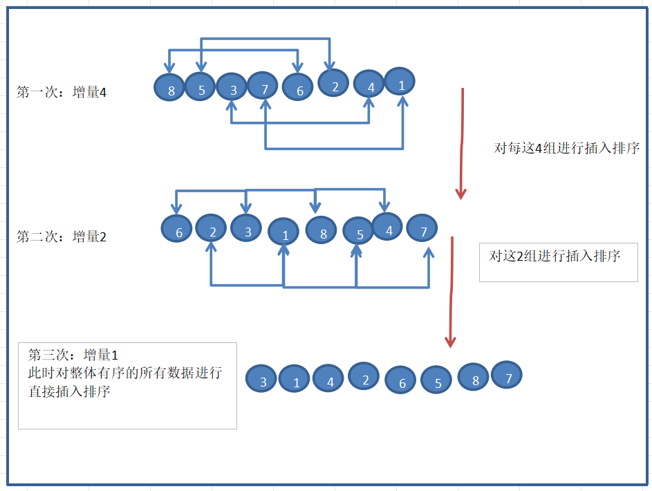

### 代码实现

#### 实现1：希尔排序[交换式]

> 该种方法每次比较完采用了交换的方式移动数据，效率非常低:(比原生的插入排序还慢！)
>
> （所以这种方式不能算是对插入排序的优化，只是用于演示思路比较清晰）

| 测试数据大小 | 花费时间（单位：毫秒） |
| ------------ | ---------------------- |
| 10000        | 71                     |
| 50000        | 1419                   |
| 80000        | 4179                   |
| 140000       | 13005                  |

`ShellSort`

```java
package com.yukinoshita.algorithm.sort;

import java.util.Arrays;
import java.util.Random;

public class ShellSort {
    public static void main(String args[]) {
        int[] arr = {8, 5, 3, 7, 6, 2, 4, 1};
        System.out.println("希尔排序每轮过程：");
        shellDetailedSort(arr);
        System.out.println("-------------下面展示shellSort--------------------");
        int[] arr2 = {8, 5, 3, 7, 6, 2, 4, 1};
        System.out.println("排序前:" + Arrays.toString(arr2));
        shellSort(arr2);
        System.out.println("排序后:" + Arrays.toString(arr2));

        // 测试算法性能
        testPerformance();
    }

    private static void shellSort(int[] arr) {
        for(int gap=arr.length/2;gap>0;gap/=2){
            for(int i=gap;i<arr.length;i++){
                for(int j=i-gap;j>=0;j-=gap){
                    if(arr[j]>arr[j+gap]){
                        int temp = arr[j];
                        arr[j] = arr[j+gap];
                        arr[j+gap] = temp;
                    }
                }
            }
        }
    }

    //详细演示了希尔排序每轮的操作
    private static void shellDetailedSort(int[] arr) {
        //arr含8个数据：{8, 5, 3, 7, 6, 2, 4, 1}
        //第一轮：增量为4
        for(int i=4;i<arr.length;i++){
            for(int j=i-4;j>=0;j-=4){
                if(arr[j]>arr[j+4]){
                    int temp = arr[j];
                    arr[j] = arr[j+4];
                    arr[j+4] = temp;
                }
            }
        }
        System.out.println("第一轮排序后："+Arrays.toString(arr));//{6, 2, 3, 1, 8, 5, 4, 7}

        //第二轮：增量为2
        for(int i=2;i<arr.length;i++){
            for(int j=i-2;j>=0;j-=2){
                if(arr[j]>arr[j+2]){
                    int temp = arr[j];
                    arr[j] = arr[j+2];
                    arr[j+2] = temp;
                }
            }
        }
        System.out.println("第二轮排序后："+Arrays.toString(arr));//{3, 1, 4, 2, 6, 5, 8, 7}

        //第三轮：增量为1
        for(int i=1;i<arr.length;i++){
            for(int j=i-1;j>=0;j-=1){
                if(arr[j]>arr[j+1]){
                    int temp = arr[j];
                    arr[j] = arr[j+1];
                    arr[j+1] = temp;
                }
            }
        }
        System.out.println("第三轮排序后："+Arrays.toString(arr));//{1, 2, 3, 4, 5, 6, 7, 8}
    }

    // 测试算法性能的方法
    public static void testPerformance() {
        int size = 10000; // 数组大小
        int[] arr = new int[size];
        Random random = new Random();

        // 生成无序数组
        for (int i = 0; i < size; i++) {
            arr[i] = random.nextInt(100000); // 随机数范围可以根据需要调整
        }

        long startTime = System.currentTimeMillis(); // 记录开始时间
        shellSort(arr); // 排序
        long endTime = System.currentTimeMillis(); // 记录结束时间

        System.out.println("排序大小: " + size);
        System.out.println("排序时间: " + (endTime - startTime) + " 毫秒");
    }

}

```

#### 实现2：希尔排序[移动式]

> 真-做到了对直接插入排序的究极优化！

| 测试数据大小 | 花费时间（单位：毫秒） |
| ------------ | ---------------------- |
| 10000        | 3                      |
| 50000        | 6                      |
| 80000        | 12                     |
| 140000       | 17                     |

`ShellSort`（对上述文件进行了覆盖并修改）

```java
package com.yukinoshita.algorithm.sort;

import java.util.Arrays;
import java.util.Random;

public class ShellSort {
    public static void main(String args[]) {
        int[] arr = {8, 5, 3, 7, 6, 2, 4, 1};
        System.out.println("排序前:" + Arrays.toString(arr));
        shellSort(arr);
        System.out.println("排序后:" + Arrays.toString(arr));

        // 测试算法性能
        testPerformance();
    }

    private static void shellSort(int[] arr) {
        for (int gap = arr.length / 2; gap > 0; gap /= 2) {
            for (int i = gap; i < arr.length; i++) {
                //对于第i个元素，采取直接插入的方法
                int insertVal = arr[i];
                int insertIndex = i - gap;
                while(insertIndex>=0&&insertVal<arr[insertIndex]) { //说明还没找到要插入的位置
                    arr[insertIndex+gap]=arr[insertIndex];
                    insertIndex-=gap;
                }
                arr[insertIndex+gap]=insertVal;
            }
        }
    }


    // 测试算法性能的方法
    public static void testPerformance() {
        int size = 140000; // 数组大小
        int[] arr = new int[size];
        Random random = new Random();

        // 生成无序数组
        for (int i = 0; i < size; i++) {
            arr[i] = random.nextInt(100000); // 随机数范围可以根据需要调整
        }

        long startTime = System.currentTimeMillis(); // 记录开始时间
        shellSort(arr); // 排序
        long endTime = System.currentTimeMillis(); // 记录结束时间

        System.out.println("排序大小: " + size);
        System.out.println("排序时间: " + (endTime - startTime) + " 毫秒");
    }

}

```

## 递归入门

### 简单迷宫问题

> 判断能否找到出路即可

`MiGong`

> 为穷尽所有路线！仅选择了一种迷宫探索的策略（使用if	else-if结构-》下右上左策略）

```java
package com.yukinoshita.dataStructure.recursion;

public class MiGong {
    public static void main(String[] args) {
        int[][] map = new int[8][7];
        //1为墙

        for (int j = 0; j < 7; j++) {
            map[0][j] = 1;
            map[7][j] = 1;
        }
        for (int i = 1; i <= 6; i++) {
            map[i][0] = 1;
            map[i][6] = 1;
        }
        map[3][1] = 1;
        map[3][2] = 1;
//        for(int i=0;i<8;i++){
//            for(int j=0;j<7;j++){
//                System.out.print(map[i][j]+" ");
//            }
//            System.out.println();
//        }
        if (findWay(map, 1, 1)) {
            System.out.println("Yes，可找到路：");
            //输出路径
            for (int i = 0; i < 8; i++) {
                for (int j = 0; j < 7; j++) {
                    System.out.print(map[i][j] + " ");
                }
                System.out.println();
            }
        } else {
            System.out.println("No");
        }
    }

    /**
     * 若能走到map[6][5],说明通路找到
     * map[i][j]为0表示没做够，1表示为墙，2表示可以走，3表示已走过
     * 策略：下->右->上->左
     *
     * @param map 传入的地图
     * @param i   从哪个位置开始走
     * @param j
     * @return 若能走通，true；反之为false
     */
    public static boolean findWay(int[][] map, int i, int j) {
        if (map[6][5] == 2) {
            return true;
        } else {
            if (map[i][j] == 0) {
                map[i][j] = 2;//假定该点可以走通
                if (findWay(map, i + 1, j)) {
                    return true;
                } else if (findWay(map, i, j + 1)) {
                    return true;
                } else if (findWay(map, i - 1, j)) {
                    return true;
                } else if (findWay(map, i, j - 1)) {
                    return true;
                } else {//改点走不通，是死路
                    map[i][j] = 3;
                    return false;
                }

            } else {//map[i][j]!=0 可能为1，2，3
                return false;
            }
        }
    }
}


```

### 八皇后问题(经典)

问题：在8×8的棋盘上放置8个皇后，任意两个皇后不能位于同一行、同一列、同一斜线，问有多少种摆法？

#### 思路分析

1. 第一个皇后先放第一行第一列
2. 第二个皇后放第二行第一列、判断是否ok，不ok再判断第二列、第三列...直到找到一个位置合适
3. 后续几个皇后的放置同理，直至最后一个皇后也放置成功，找到了一个成功解
4. 当得到了一个正确解后，在栈回退到上一个栈时，开始回溯......即，将第一个皇后放在第一行第一列的所有正确解全部得到
5. 然后再将第一个皇后放在第一行第二列，循环执行1234，直至第一个皇后八列均放置过。

说明：理论上应该创建一个二维数组来表示棋盘，但是可以通过算法用一个一维数组解决问题——`arr[8]={0,4,7,5,2,6,1,3}`，下标对应的是第几个皇后。故，`arr[i]=val`，表示第i+1个皇后放在第i+1行、第val+1列上

#### 代码实现

`Queue8`

```java
package com.yukinoshita.dataStructure.recursion;

//八皇后问题
public class Queue8 {
    int max = 8;
    int[] array = new int[max];
    static int count = 0;

    public static void main(String[] args) {
        Queue8 q = new Queue8();
        q.check(0);
        System.out.printf("解法一共有：%d种", count);
    }

    private void check(int n) {
        if (n == max) {//说明已经放置了八个皇后（0-7）
            print();
            return;
        }

        //对于第n个皇后，每一列依次去放到每一列j：
        for (int j = 0; j < 8; j++) {
            array[n] = j;
            if (!isAttack(n)) {
                check(n + 1);
            }
        }
    }

    //检查摆放第n个皇后时位置是否冲突的方法
    private boolean isAttack(int n) {
        for (int i = 0; i < n; i++) {
//            if(array[i]==array[n] || array[i]+n-i==array[n] || array[i]-i+n==array[n]){
//                return true;
//            }
            //分别为判断是否在同一列、同一斜线的条件
            if (array[i] == array[n] || Math.abs(n - i) == Math.abs(array[n] - array[i])) {
                return true;
            }
        }
        return false;
    }

    //将8个皇后位置信息输出的方法
    private void print() {
        for (int i = 0; i < 8; i++) {
            System.out.print(array[i] + " ");
        }
        System.out.println();
        count++;
    }
}

```

## 5、快速排序(经典)

> 实现1参考了[博客](https://blog.csdn.net/qq_39181839/article/details/109478094)，快排讲得很清晰，看完思路代码容易自己写出来。(开头给出的**各类排序算法的总结图**真的很好！)
>
> 实现2参考了atguigu[视频](https://www.bilibili.com/video/BV1E4411H73v/?spm_id_from=333.788.videopod.episodes&vd_source=31d39c465d959f9ebfb4e20fc1ca0a9d&p=67)，代码部分稍难理解，if条件判断过多，重要的是，代码不美观。
>
> 另外还有一篇[博客](https://blog.csdn.net/justidle/article/details/104203963)提到了**原地排序**和**非原地排序**的概念，涉及到空间复杂度，有空了解一下。

### 思路分析

快速排序是对冒泡排序的一种改进。有分治[^5]思想

**基本思想**为：

通过一趟排序将待排序元素**分割**成独立的两个部分，其中**一部分的所有数据要比另一部分的所有数据要小**，然后再按此方法对这两部分分别进行快速排序，整个排序过程可以**递归**进行，以此使得所有数据变成有序序列。

> 但是光凭这个基本思想还没法写出代码

### 代码实现

| 测试数据大小 | 花费时间（单位：毫秒） |
| ------------ | ---------------------- |
| 10000        | 1                      |
| 50000        | 6                      |
| 80000        | 9                      |
| 140000       | 12                     |
| 500000       | 37                     |
| 900000       | 64                     |

#### 实现1

> 个人感觉这种好理解

`QuickSort`

```java
package com.yukinoshita.algorithm.sort;

import java.util.Arrays;
import java.util.Random;

public class QuickSort {
    public static void main(String args[]) {
        int[] arr = {3, 9, -1, 10, -2};

        System.out.println("排序前:" + Arrays.toString(arr));
        quickSort(arr, 0, arr.length - 1);
        System.out.println("排序后:" + Arrays.toString(arr));

        // 测试算法性能
        testPerformance();
        
    }

    public static void quickSort(int[] arr, int start, int end) {
        if (start < end) {
            int l = start;
            int r = end;
            int base = arr[l];
            while (l < r) {
                //先从右向左，找到第一个小于base的数，将其移动到l的位置上
                while (l < r && arr[r] >= base) {
                    r--;
                }
                arr[l] = arr[r];

                //再从左向右，找到第一个大于base的数，将其移动到r的位置上
                while (l < r && arr[l] <= base) {
                    l++;
                }
                arr[r] = arr[l];
            }
            //退出时，l == r
            arr[l] = base;

            //再分别对左、右的数组进行快排
            quickSort(arr, start, l - 1);
            quickSort(arr, r + 1, end);
        }
    }

    // 测试算法性能的方法
    public static void testPerformance() {
        int size = 140000; // 数组大小
        int[] arr = new int[size];
        Random random = new Random();

        // 生成无序数组
        for (int i = 0; i < size; i++) {
            arr[i] = random.nextInt(100000); // 随机数范围可以根据需要调整
        }

        long startTime = System.currentTimeMillis(); // 记录开始时间
        quickSort(arr, 0, arr.length - 1); // 排序
        long endTime = System.currentTimeMillis(); // 记录结束时间

        System.out.println("排序大小: " + size);
        System.out.println("排序时间: " + (endTime - startTime) + " 毫秒");
    }
}

```

#### 实现1'

`QuickSort`

> 仅对上述quickSort部分作了一定修改如下，只是形式不同罢了
>
> > 展示核心部分代码：

```java
public static void quickSort(int[] arr, int start, int end) {
        if (start < end) {
            int pos = partition(arr,start,end);
            //再分别对左、右的数组进行快排
            quickSort(arr, start, pos-1);
            quickSort(arr, pos + 1, end);
        }
    }

    public static int partition(int[] arr, int left, int right) {
        int l = left;
        int r = right;
        int pivot = arr[l];
        while(l<r){
            while(l<r && arr[r]>=pivot){
                r--;
            }
            arr[l] = arr[r];
            while(l<r && arr[l]<=pivot){
                l++;
            }
            arr[r] = arr[l];
        }
        return l;
    }
```


#### 实现2

`QuickSort`

```java
package com.yukinoshita.algorithm.sort;

import java.util.Arrays;
import java.util.Random;

public class QuickSort {
    public static void main(String args[]) {
        int[] arr = {3, 9, -1, 10, -2};

        System.out.println("排序前:" + Arrays.toString(arr));
        quickSort(arr, 0, arr.length - 1);
        System.out.println("排序后:" + Arrays.toString(arr));

        // 测试算法性能
        testPerformance();

    }

    public static void quickSort(int[] arr, int left, int right) {
        int l = left;
        int r = right;
        int pivot = arr[(l + r) / 2];//把中间元素定为基准
        int temp = 0;//临时的交换变量

        while (l < r) {
            while (arr[l] < pivot) {
                l++;
            }
            while (arr[r] > pivot) {
                r--;
            }

            if (l >= r) {
                break;
            }


            temp = arr[l];
            arr[l] = arr[r];
            arr[r] = temp;

            //如果交换完后，arr[l]==pivot，则需将 r-- （试想一下arr[l]和arr[r]同时==pivot的情况，会无限循环）
            if (arr[l] == pivot) {
                r--;
            }
            if (arr[r] == pivot) {
                l++;
            }
        }
        //如果l==r必须l++,r--
        if (l == r) {
            l++;
            r--;
        }

        //向左递归
        if (left < r) {
            quickSort(arr, left, r);
        }

        //向右递归
        if (right > l) {
            quickSort(arr, l, right);
        }
    }

    // 测试算法性能的方法
    public static void testPerformance() {
        int size = 140000; // 数组大小
        int[] arr = new int[size];
        Random random = new Random();

        // 生成无序数组
        for (int i = 0; i < size; i++) {
            arr[i] = random.nextInt(100000); // 随机数范围可以根据需要调整
        }

        long startTime = System.currentTimeMillis(); // 记录开始时间
        quickSort(arr, 0, arr.length - 1); // 排序
        long endTime = System.currentTimeMillis(); // 记录结束时间

        System.out.println("排序大小: " + size);
        System.out.println("排序时间: " + (endTime - startTime) + " 毫秒");
    }
}

```

## 6、归并排序(经典)

### 思路分析

归并排序是利用**归并**的思想实现的排序方法，该算法采用经典的分治[^5]策略。

**图解**：

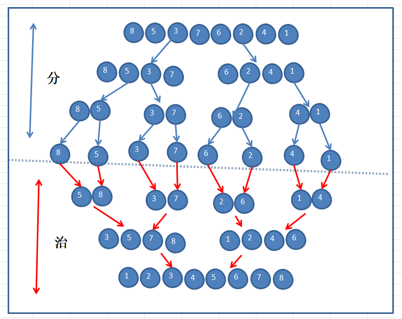

**代码流程图**：

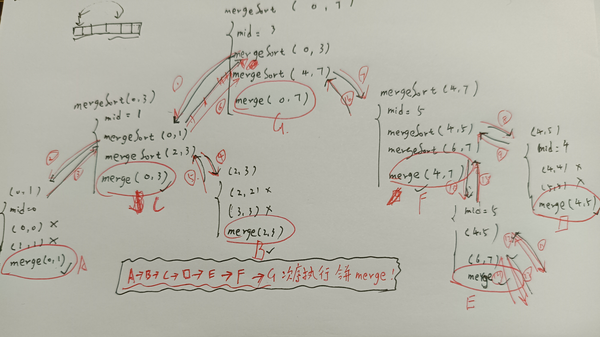

**提示+代码思路**：

1. 归并排序执行次数为`N-1`次，N为数据量大小，即`merge`方法执行的次数。
2. 由图解可知，我们需要完成“**分**”和“**治**”两个步骤：
   - 治，也就是合并`merge`的过程
   - merge需要参数为——int[] arr、left、right、mid、int[] temp
   - `arr`为原数组
   - `left`为待合并数据的左边位置、`right`为待合并数据的右边位置
   - `mid=(left+right)/2`
   - `temp`为临时数组
     1. merge是是对两个有序数组合并的过程（见红色箭头），单个元素的数组无疑是有序的。
     2. 合并时，需要有一个i、j分别代表左数组和右数组，依次比较，将小的那个元素放入到临时数组temp中
     1. 然后将左（或右）数组中剩余元素放入到temp中
     2. 最后将temp中元素拷贝到arr中
   - 分，也就是不断将大问题化为小问题的过程：
   - 如果传入参数`left<right`，就不断向左、右递归，进行拆分。
     1. 对`mergeSort`进行左右递归即可：
     2. `mergeSort(arr,left,mid,temp)`
     3. `mergeSort(arr,mid+1,right,temp)`
     4. `merge(left,right)`

### 代码实现

| 测试数据大小 | 花费时间（单位：毫秒） |
| ------------ | ---------------------- |
| 10000        | 2                      |
| 50000        | 7                      |
| 80000        | 18                     |
| 140000       | 22                     |
| 500000       | 57                     |
| 900000       | 93                     |

`MergeSort`

```java
package com.yukinoshita.algorithm.sort;

import java.util.Arrays;
import java.util.Random;

public class MergeSort {
    public static void main(String args[]) {
        int[] arr = {8, 5, 3, 7, 6, 2, 4, 1};
        int[] temp = new int[arr.length];//需要一个额外的空间开销

        System.out.println("排序前:" + Arrays.toString(arr));
        mergeSort(arr, 0, arr.length - 1, temp);
        System.out.println("排序后:" + Arrays.toString(arr));

        // 测试算法性能
        testPerformance();
    }

    private static void mergeSort(int[] arr, int left, int right, int[] temp) {
        if (left < right) {
            int mid = (left + right) / 2;//中间索引
            mergeSort(arr, left, mid, temp);//向左递归--分
            mergeSort(arr, mid + 1, right, temp);//向右递归--分
            merge(arr, left, right, mid, temp);
        }
    }

    public static void merge(int[] arr, int left, int right, int mid, int[] temp) {
        int i = left;//左边有序数组索引
        int j = mid + 1;//右边有序数组索引
        int t = 0;//临时数组temp所指

        //两个有序数组比较、放入temp
        while (i <= mid && j <= right) {
            if (arr[i] <= arr[j]) {
                temp[t++] = arr[i++];
            } else {
                temp[t++] = arr[j++];
            }
        }

        //将其中一个剩余的放入temp
        while (i <= mid) {
            temp[t++] = arr[i++];
        }
        while (j <= right) {
            temp[t++] = arr[j++];
        }

        //将temp拷贝到arr
        int k = left;
        t = 0;
        while (k <= right) {
            arr[k++] = temp[t++];
        }
    }

    // 测试算法性能的方法
    public static void testPerformance() {
        int size = 900000; // 数组大小
        int[] arr = new int[size];
        int[] temp = new int[size];
        Random random = new Random();

        // 生成无序数组
        for (int i = 0; i < size; i++) {
            arr[i] = random.nextInt(100000); // 随机数范围可以根据需要调整
        }

        long startTime = System.currentTimeMillis(); // 记录开始时间
        mergeSort(arr, 0, arr.length - 1, temp); // 排序
        long endTime = System.currentTimeMillis(); // 记录结束时间

        System.out.println("排序大小: " + size);
        System.out.println("排序时间: " + (endTime - startTime) + " 毫秒");
    }


}

```

## 7、基数排序(经典)

### 思路分析

**介绍**：

基数排序是一种**非比较型整数排序算法**，其原理是将整数按位数**切割**成不同的数字，然后**按每个位数分别比较**。由于整数也可以表达字符串（比如名字或日期）和特定格式的浮点数，所以基数排序也不是只能使用于整数。--[菜鸟教程](https://www.runoob.com/w3cnote/radix-sort.html) 

**基本思想**:

将所有待比较数值统一为同样的数值长度，数位较短的前面补零。然后，从最低位开始，依次进行一次排序。这样从最低位排序一直到最高位排序完成后，数据序列就变有序了。

> LSD(最低位优先)基数排序思想↑，另有MSD(最高位优先)实现方式。参考[blog](https://blog.csdn.net/m0_64003319/article/details/134540648)。

**图解**（非常好の图）：

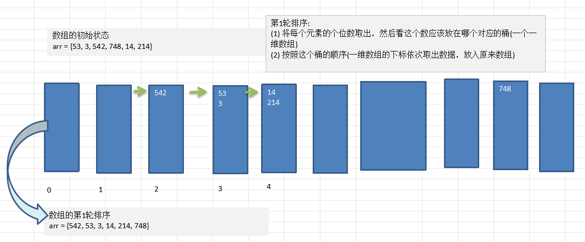

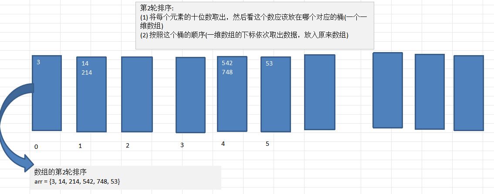

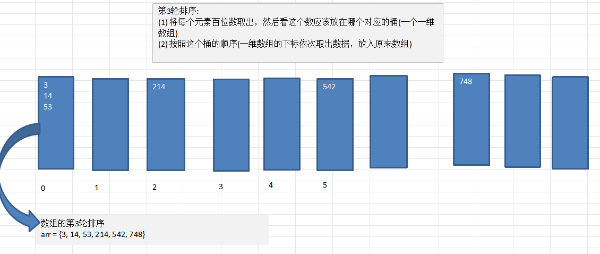

**代码思路**：

1. 关于上面桶如何表示？用一个二维数组`int[][] bucket = new int[10][?]`，？处要填`arr.length`，防止数据溢出。
2. 所以基数排序就是**空间换时间**的经典算法。
3. 在某轮取数据时，我们怎么知道要从某个桶中取几个数？因此需要有一个方法，告诉我们**每个桶中有几个数据**。
4. 因此定义一个一维数组``，表示每轮10个桶中的有效数据个数。

> 可以形象地表示为	不断把元素**放入桶中**，再**从桶中取出**的过程。这样一放一取要执行`maxLength`轮（`maxLength`为最高位数长度）

**小结**：

速度快+稳定，但是空间耗费巨大。

> 特别注意：基数排序只适用于正数的情况（问题出在去`maxLength`那里，不能有负数）。
>
> 额外的**解决方案**[^6]有两个：[偏移法](###偏移法)或[分开处理](###分开处理)（正数与负数），可跳转见补充方案详解

### 代码实现

| 测试数据大小 | 花费时间（单位：毫秒） |
| ------------ | ---------------------- |
| 10000        | 2                      |
| 50000        | 3                      |
| 80000        | 10                     |
| 140000       | 14                     |
| 500000       | 35                     |
| 900000       | 35                     |

`RadixSort`

```java
package com.yukinoshita.algorithm.sort;

import java.util.Arrays;
import java.util.Random;

public class RadixSort {
    public static void main(String args[]) {
        int[] arr = {53, 3, 542, 748, 14, 214};

        System.out.println("排序前:" + Arrays.toString(arr));
        radixSort(arr);
        System.out.println("排序后:" + Arrays.toString(arr));

        // 测试算法性能
        testPerformance();
    }

    private static void radixSort(int[] arr) {
        int[][] buckets = new int[10][arr.length];

        int[] bucketCounts = new int[10];

        //获取最大位数!
        int max = arr[0];
        for (int i = 1; i < arr.length; i++) {
            if (max < arr[i]) {
                max = arr[i];
            }
        }
        int maxLength = (max + "").length();//少女口阿！

        for (int i = 0, n = 1; i < maxLength; i++, n *= 10) {

            //放入桶中的过程
            //对arr中每个元素遍历，取出其第i位数放入对应桶中
            for (int j = 0; j < arr.length; j++) {
                int digit = arr[j] / n % 10;
                buckets[digit][bucketCounts[digit]] = arr[j];
                bucketCounts[digit]++;//用于记录第digit个桶中元素的个数
            }

            //从桶中取出的过程
            int index = 0;
            for (int j = 0; j < buckets.length; j++) {//从桶中取出的过程
                if (bucketCounts[j] != 0) {//若第j个桶不为空
                    for (int k = 0; k < bucketCounts[j]; k++) {
                        arr[index++] = buckets[j][k];
                    }
                    //从这个桶中取出元素后，一定要清零!bucketCounts[j] = 0
                    bucketCounts[j] = 0;
                }
            }
        }
        

    }

    // 测试算法性能的方法
    public static void testPerformance() {
        int size = 140000; // 数组大小
        int[] arr = new int[size];
        Random random = new Random();

        // 生成无序数组
        for (int i = 0; i < size; i++) {
            arr[i] = random.nextInt(100000); // 随机数范围可以根据需要调整
        }

        long startTime = System.currentTimeMillis(); // 记录开始时间
        radixSort(arr); // 排序
        long endTime = System.currentTimeMillis(); // 记录结束时间

        System.out.println("排序大小: " + size);
        System.out.println("排序时间: " + (endTime - startTime) + " 毫秒");
    }


}

```

## 8、堆排序(经典)

### 思路分析

**基本介绍**

1. 堆排序是利用堆这种数据结构设计的一种算法，堆排序是一种选择排序，最坏、最好、平均时间复杂度为$0(n\log n)$，是不稳定排序。
2. 堆是具有以下性质的**完全二叉树**：每个节点的值都大于等于其左右子节点的值，成为**大顶堆**；每个节点的值都小于等于其左右子节点的值，成为**小顶堆**。
3. 大顶堆**图解**，以及其映射到数组的形式（前有讲[顺序存储二叉树](###顺序存储二叉树)）。

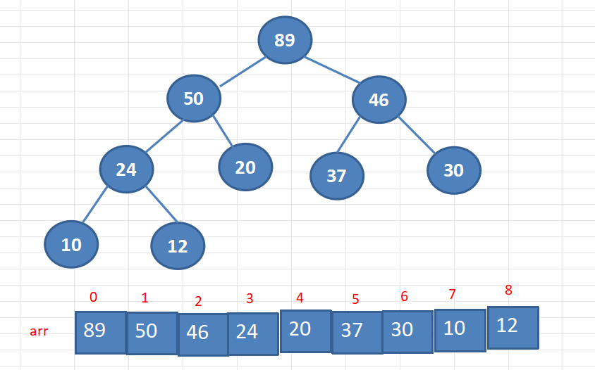

4. 一般升序用大顶堆，降序用小顶堆。

> 代码实现上：化为大顶堆形式后，通过将root**沉底**的方式，将最大元素放到数组末尾

**基本思想**

若要完成升序排序，采用大顶堆：

1. 将待排序序列构成一个**大顶堆**（数组形式）。
2. 此时，序列最大值就是堆顶的根节点。
3. 将其与末尾元素进行**交换**，此时末尾就成为最大元素。
4. 然后将剩余$n-1$个元素重新构造成一个堆，这样会得到n个元素的次小值。如此反复执行，便能得到一个有序序列。

> 可见在构建大顶堆的过程中，元素的个数逐渐减少，最后就得到一个有序序列。
>
> > 上述过程，初见，抽象。图解：

#### 思路分析（清晰版）

**构造大根堆图解**：

> 如果不能看懂，移步原文->菜鸟教程：[堆的基本存储](https://www.runoob.com/data-structures/heap-storage.html)->[堆的shift up](https://www.runoob.com/data-structures/heap-shift-up.html)->[堆的shift down](https://www.runoob.com/data-structures/heap-shift-down.html)->[基础堆排序](https://www.runoob.com/data-structures/heap-sort.html)->[优化堆排序](https://www.runoob.com/data-structures/heap-sort-optimization.html)

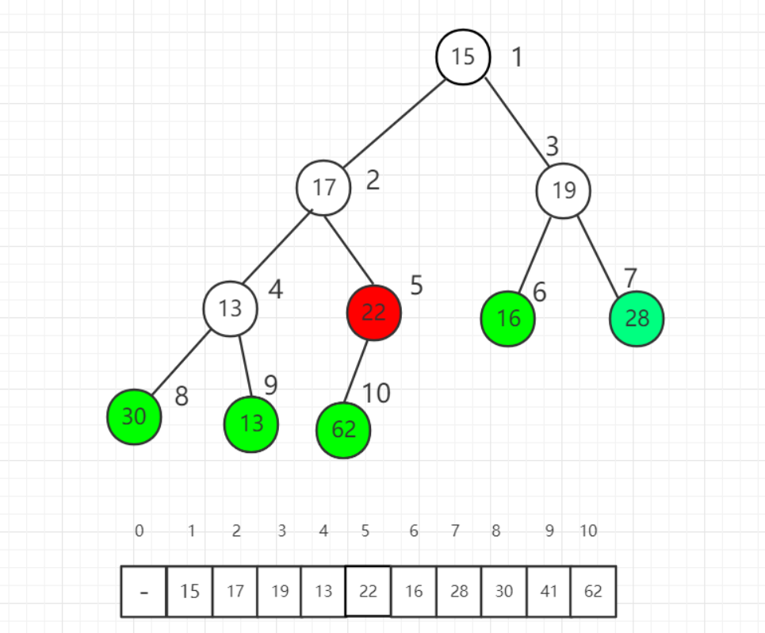

1. 上图为初始状态，首先利用完全二叉树的性质，得到**第一个非叶子节点**的位置——`k = arr.length/2`，也就是下标为5，值为22的节点（二叉树只是为了便于理解，实际存储方式是顺序），上图可见：只要`1<=i<=5`这个范围内的，都需要进行调整。目前这一步先对5这棵子树进行**调整**。

- > 调整：对应[堆的shift up](https://www.runoob.com/data-structures/heap-shift-down.html)，这里简单说明一下：
  >
  > 比较当前节点与其左右子节点的大小关系，找到最大的那个与当前节点交换（这里是5号与10号进行交换）

2. 第一步调整完结果如下。提示：节点标绿表示不需要再被操作的节点，标红表示当前要继续操作的节点：

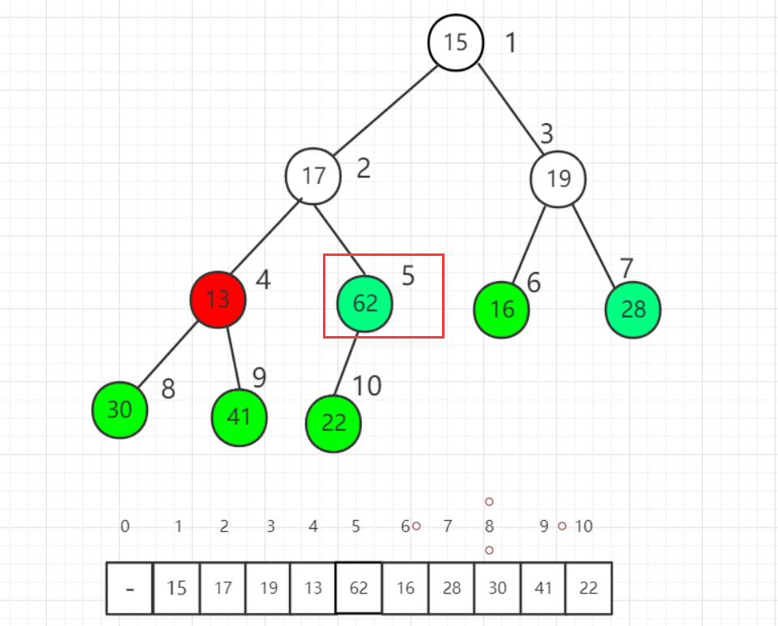

3. 同样道理的，对4号节点进行同样的**调整**。需要将4号与9号交换位置。

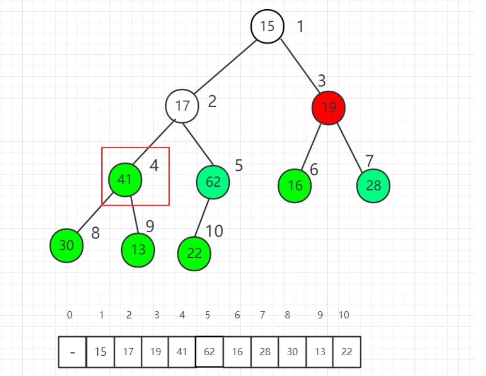

4. 对3号操作，需要将3号与7号交换：（原图没标绿……手动标一下……）

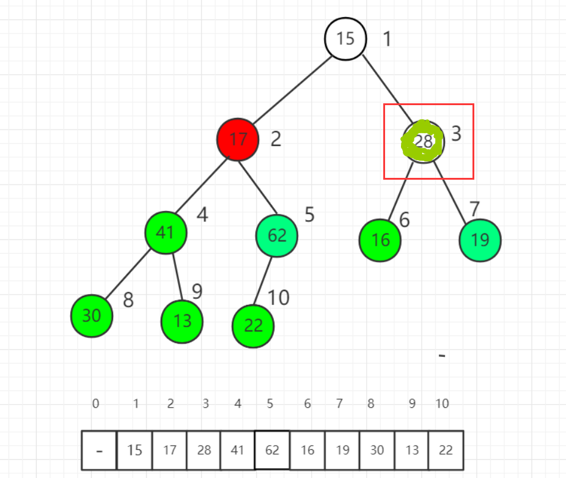

4. 对2号操作，将2号于5号交换：

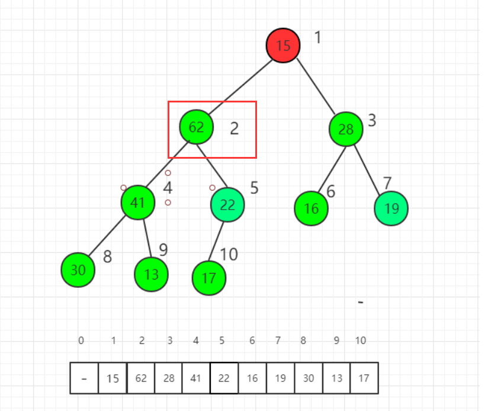

5. 最后对1号，也就是根节点进行调整，实现了一个大顶堆：

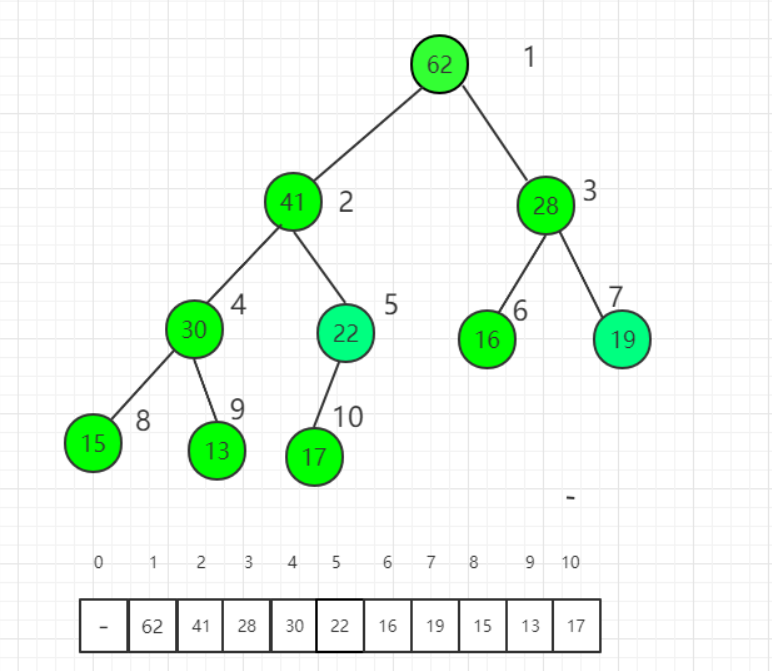

**思路对应代码部分**：

上述思路的**调整**，对应代码的`adjustHeap`方法，

而对于**从第一个非叶子节点处理到根节点**的代码为:

```java
for(int i=arr.length/2;i>=0;i--){
    //调整操作
    adjustHeap(arr,i,arr,length);
}
```

------

上述过程调整为一个大顶堆的操作应该能理解了，但最终目的还是为了实现对整个数组的**升序排序**，大顶堆只是这个过程用到的工具。

后续操作参考[优化堆排序](https://www.runoob.com/data-structures/heap-sort-optimization.html)。将堆顶最大元素与末尾元素交换，但是此时破坏了大顶堆的结构，我们可以利用已写好的`adjustHeap`方法，从上至下，可以对照二叉树来看，也可以看数组：

注意：

代码部分：

```java
for(int j= arr.length-1;j>0;j--){
            temp = arr[j];//将底部元素与顶部元素交换
            arr[j] = arr[0];
            arr[0] = temp;
            adjustHeap(arr, 0, j);
        }
```

我们每交换一次首尾，仅使用一次`adjustHeap`就可以把整个结构重新调整回大顶堆，理由是：交换完最大元素和末尾元素后，整个结构本身就是很有序的，换句话说，除了根节点，其他的子树都符合"大顶堆"的结构（父节点大于其左右子节点）。

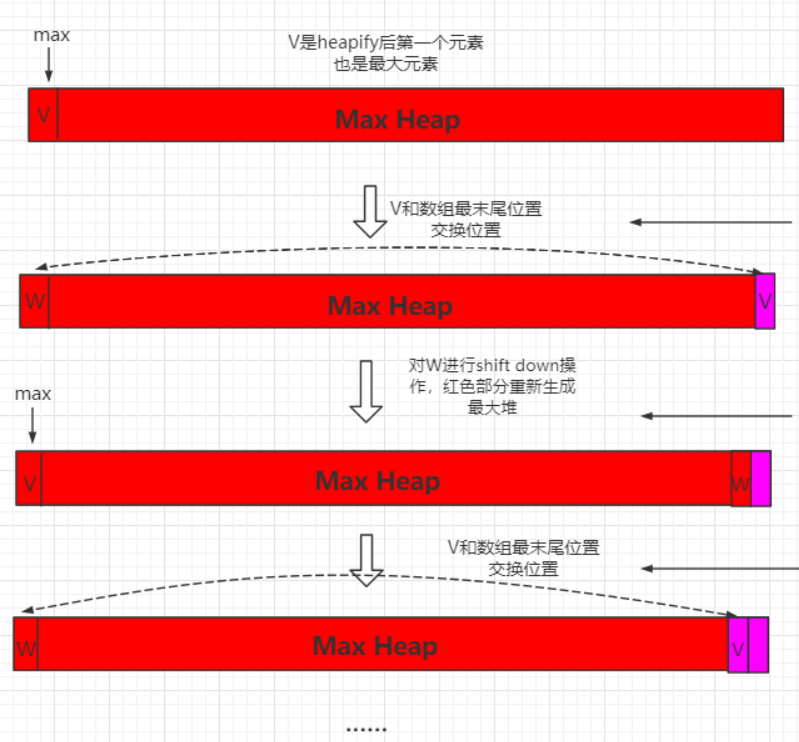

> 至此，解释完了所有的代码，再不理解，就静下来慢慢看，或者看看别的文章（这些文章我还没看，虽然都找了，但是光看菜鸟就看懂了[博客1](https://blog.csdn.net/u010452388/article/details/81283998)、[博客2](https://zhuanlan.zhihu.com/p/124885051)、[博客3](https://blog.csdn.net/weixin_51609435/article/details/122982075)），或者代码debug看看，或者画图一步步走下去，或者……

### 代码实现

| 测试数据大小 | 花费时间（单位：毫秒） |
| ------------ | ---------------------- |
| 10000        | 1                      |
| 50000        | 5                      |
| 80000        | 8                      |
| 140000       | 13                     |
| 500000       | 46                     |
| 900000       | 83                     |

`HeapSort`

```java
package com.yukinoshita.algorithm.sort;

import java.util.Arrays;

public class HeapSort {
    public static void main(String[] args) {
        int[] arr = {4,6,8,5,9};
        heapSort(arr);
        System.out.println(Arrays.toString(arr));
    }

    public static void heapSort(int[] arr) {
        int temp = 0;
        //分步演示：
//        adjustHeap(arr,1,arr.length);
//        adjustHeap(arr,0,arr.length);

        for(int i = arr.length/2 - 1; i >= 0; i--) {
            adjustHeap(arr, i, arr.length);
        }

        for(int j= arr.length-1;j>0;j--){
            temp = arr[j];//将底部元素与顶部元素交换
            arr[j] = arr[0];
            arr[0] = temp;
            adjustHeap(arr, 0, j);
        }
    }

    /**
     * 将以i对应的非叶子节点的树调整成大顶堆
     *
     * @param arr    待调整的数组
     * @param i      表示非叶子节点在数组中索引
     * @param length 表示对多少个元素进行调整,length逐渐减少
     */
    public static void adjustHeap(int[] arr, int i, int length) {
        int temp = arr[i];

        //k=2*i+1 是指节点i的左子节点
        for (int k = 2 * i + 1; k < length; k = k * 2 + 1) {
            if (k + 1 < length && arr[k] < arr[k + 1]) {//左子节点小于右子节点
                k++;
            }
            if (arr[k] > temp) {//子节点大于父节点
                arr[i] = arr[k];
                i = k;//i变为k，继续循环比较
            } else {
                break;
            }
        }
        //for循环结束，已经将以i为父节点的树的最大值，放在了最顶（局部）
        arr[i] = temp;//将temp放到调整后的位置
    }

}


```


## 查找算法-概论

### 分类

1. 顺序(线性)查找
2. 二分查找/折半查找
3. 插值查找
4. 斐波那契查找

### 简单介绍

1. 顺序查找操作的数据可以是无序的（就是遍历……）
2. 二分查找、插值查找、斐波那契查找要求在一个**有序数组**中

## 1、二分查找(经典)

### 思路分析

1. 首先确定该数组中间元素的下标`mid = (l+r)/2`
2. 然后让要查找的目标值与中间值比对
   - 如果`targetVal > arr[mid]`，则说明要查找的值在右边，需要**递归**向右查询
   - 如果`targetVal < arr[mid]`，则说明要查找的值在左边，需要**递归**向左查询
   - 如果`targetVal == arr[mid]`，已找到目标值
3. 什么时候需要退出递归？
   -  找到就结束递归
   -  遍历完整个数组都没找到，即`left>right`时

**图解演示找不到的情况**:

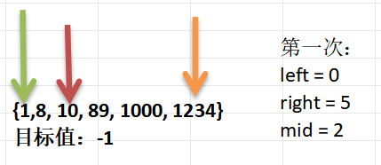

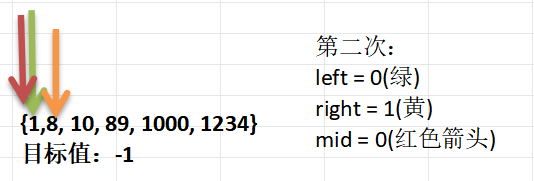

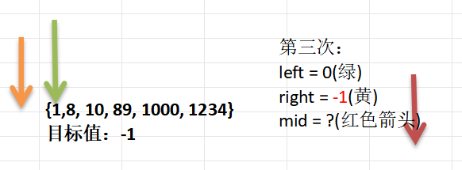

### 代码实现

#### 递归实现1

> 查找返回一个符合条件的值

`BinarySearch`

```java
package com.yukinoshita.algorithm.search;

public class BinarySearch {
    public static void main(String[] args) {
        //使用二分的前提：数组有序(ASC or DESC)
        int[] arr = {1, 4, 8, 19, 53, 84, 190, 201};
        int target = 201;
        int targetIndex = binarySearch(arr, 0, arr.length - 1, target);
        if (targetIndex != -1) {
            System.out.printf("目标值%d的下标为：%d\n", target, targetIndex);
        } else {
            System.out.println("找不到该值");
        }

    }

    public static int binarySearch(int[] arr, int left, int right, int target) {
        int targetIndex = -1;
        if (left > right) {
            return targetIndex;
        }

        int mid = left + (right - left) / 2;
        if (target > arr[mid]) {
            targetIndex = binarySearch(arr, mid + 1, right, target);
        } else if(target < arr[mid]) {
            targetIndex = binarySearch(arr, left, mid - 1, target);
        }else{
            targetIndex = mid;
        }
        return targetIndex;
    }
}

```

#### 递归实现2

> 上述算法实现仅能返回一个符合条件的目标值的下标，下面进行修改

修改思路为：

当二分查找内部进入`else`语句时，说明已经找了了某个值，后续就是return语句。

所以我们可以在else中：先将mid加入到list中，再向左、右邻近元素查询，若还有目标值就加入，方法返回类型也改为List。

下面是核心部分修改：

`方法binarySearch2()`

```java
public static ArrayList binarySearch2(int[] arr, int left, int right, int target) {
        if (left > right) {
            return new ArrayList<Integer>();
        }

        int mid = left + (right - left) / 2;
        if (target > arr[mid]) {
            return binarySearch2(arr, mid + 1, right, target);
        } else if (target < arr[mid]) {
            return binarySearch2(arr, left, mid - 1, target);
        } else {
            ArrayList<Integer> resIndexList = new ArrayList<>();
            int temp = mid - 1;
            while (true) {//说明左边已经没有target了
                if (temp < 0 || arr[temp] != target) {
                    break;
                }
                resIndexList.add(temp);
                temp--;
            }

            temp = mid + 1;
            while (true) {
                if (temp >= arr.length || arr[temp] != target) {
                    break;
                }
                resIndexList.add(temp);
                temp++;
            }
            resIndexList.add(mid);
            return resIndexList;
        }
    }

```

#### 非递归实现

`BinarySearch`

```java
package com.yukinoshita.algorithm.binarySearchNoRecur;

public class BinarySearchNoRecur {
    public static void main(String[] args) {
        int[] arr = {1, 3, 5, 7, 9, 11, 12, 16, 20};
        System.out.println("查找下标为："+binarySearch(arr,11));
    }

    public static int binarySearch(int[] arr, int target) {
        int left = 0;
        int right = arr.length - 1;
        while (left <= right) {
            int mid = left + (right - left) / 2;
            if (arr[mid] == target) return mid;
            else if (arr[mid] > target) right = mid - 1;
            else left = mid + 1;
        }
        return -1;
    }
}

```

## 2、插值查找

### 思路分析

**原理介绍**：

1. 插值查找类似于二分查找，不同的是插值查找每次从**自适应mid**处开始查找。
2. 将折半查找中的求mid的公式进行了改进如下：

$$
mid = \frac{low+high}{2}=low+\frac{1}{2}(high-low) \quad => \quad mid=low+\frac{key-a[low]}{a[high]-a[low]}(high-low)
$$

- 说明：low相当于left，high相当于right，key就是要找的值targetVal

3. 插值查找求mid代码为：`int midIndex = low + (high - low)*(key - a[low])/(a[high] - a[low])`
4. 相当于之前的$\frac{1}{2}$变成了与要查找的值有关的系数。改进了二分查找的：`int mid = left + (right - left)`

**图解**：

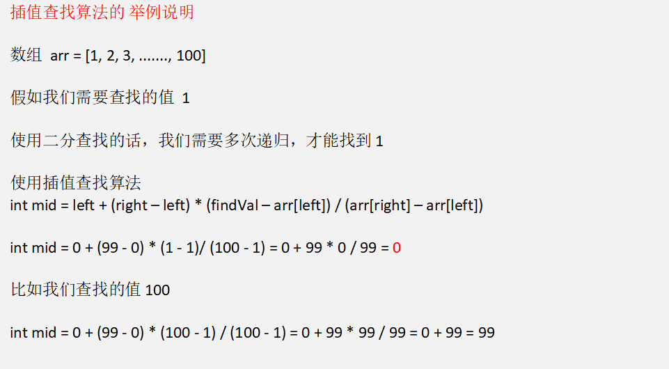

> 最精髓的地方在于自适应的mid

**注意事项**：

1. 对于数据量较大，**关键字分布较均匀**的查找表来说，采用**插值查找**，**速度较快**。
2. 关键字分布不均的情况下，该方法不一定比二分查找要好。

### 代码实现

`InsertValueSearch`

```java
package com.yukinoshita.algorithm.search;

public class InsertValueSearch {
    public static void main(String[] args) {
        int[] arr = new int[100];
        for (int i = 0; i < 100; i++) {
            arr[i] = i + 1;
        }

        int target = 100;
        int index = insertValueSearch(arr,0,arr.length-1,target);
        System.out.println("查找的目标值"+target+"的下标为："+index);

    }

    public static int insertValueSearch(int[] arr, int left, int right, int target) {
        int res = -1;
        //说明：target < arr[0] || target > arr[arr.length - 1]必须需要！
        //否则得到的mid值可能越界！(会导致某条语句出错……)
        if (left > right || target < arr[0] || target > arr[arr.length - 1]) {
            return res;
        }
        //求mid的公式
        int mid = left + (right - left) * (target - arr[left]) / (arr[right] - arr[left]);
        int midVal = arr[mid];
        if (target > midVal) {
            res = insertValueSearch(arr, mid + 1, right, target);
        } else if (target < midVal) {
            res = insertValueSearch(arr, left, mid - 1, target);
        } else {
            res = mid;
        }
        return res;
    }

}

```

## 3、斐波那契查找算法（黄金分割法）

### 思路分析

**基本介绍**：

1. **黄金分割**点是指将一条线段分成两段，使其中一部分与全长的比例等于另一部分与这部分之比，近似值$0.618$。
2. **斐波那契数列**$\{1,1,2,3,5,8,13,21,34,55\}$，发现斐波那契数列两个相邻数的比例无限接近于黄金分割0.618。
   - ps：$fibo[n]=fibo[n-1]+fibo[n-2],n>2;fibo[1]=fibo[2]=1$

**原理**：

**斐波那契查找**和**二分查找**、**插值查找**很像，仅仅改变了中间结点`mid`，即$mid = low+F(k-1)-1$

对于$F(k-1)-1$的理解：(结合图进行理解！)

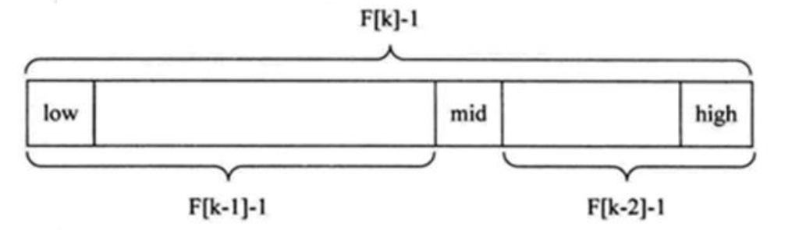

1. 由斐波那契数列$F[k]=F[k-1]+F[k-2]$的性质，可以得到$(F[k]-1) = (F[k-1]-1)+(F[k-2]-1)+1$，这里把**每一个括号**看成一个整体，对应上图的三个部分！可见等式右边的`+1`就是`mid`。即：`mid = low + F(k-1)-1`

2. 类似的，每一个子段也可以照此方式进行分割

3. 但顺序表长度n不一定刚好等于$F[k]-1$，所以需要将原来的顺序表长度n增加至$F[k]-1$。这里的k值只要能使得$F[k]-1$大于等于n即可，由`while(n>fib(k)-1) k++`得到k值。顺序表长度增加后，新增的位置`n+1到fib[k]-1`都赋值为n位置的值即可。

 > 第三点相对不好理解，结合代码来看吧。

### 代码实现

> 代码实现一定要多看多理解，不是那种光看理论就能立刻想出来对应代码的算法

`FibonacciSearch`

```java
package com.yukinoshita.algorithm.search;

import java.util.Arrays;

public class FibonacciSearch {

    public static int maxSize = 20;

    public static void main(String[] args) {
        int[] arr = {1, 8, 10, 89, 520, 1000, 1234,};
        System.out.println("index = "+fibSearch(arr,89));
    }

    //非递归方式得到一个fibonacci数列数组
    public static int[] fib() {
        int[] f = new int[maxSize];
        f[0] = 1;
        f[1] = 1;
        for (int i = 2; i < maxSize; i++) {
            f[i] = f[i - 1] + f[i - 2];
        }
        return f;
    }

    /**
     * 斐波那契查找算法
     * 使用非递归方式编写
     *
     * @param arr 数组
     * @param key 需要查找的关键码
     * @return 返回对应的下标，没有则返回1
     */
    public static int fibSearch(int[] arr, int key) {
        int low = 0;
        int high = arr.length - 1;
        int k = 0;//表示斐波那契分割数值的下标
        int mid = 0;
        int[] f = fib();
        //获取到k值
        while (high > f[k] - 1) {
            k++;
        }
        //因为f[k]的值可能大于arr的长度，因此使用Arrays类，构造一个新的数组，指向arr[]
        //不足的部分用0补足
        int[] temp = Arrays.copyOf(arr, f[k]);
        //新填充的部分用原数组的最后一个元素补齐
        for (int i = high + 1; i < arr.length; i++) {
            temp[i] = arr[high];
        }

        while (low <= high) {
            mid = low + f[k - 1] - 1;
            if(key < temp[mid]) { // 说明应该继续向左边查找
                high = mid - 1;
                //k--的说明：
                //全部元素 = 前面元素 + 后面元素
                //f[k] = f[k-1] + f[k-2]
                //因为前面有f[k-1]个元素
                //所以k--，相当于下次是对前面的、大小为f[k-1]的数组操作
                k--;
            }else if(key > temp[mid]) {
                low = mid + 1;
                //k -=2的说明：
                //全部元素 = 前面元素 + 后面元素
                //f[k] = f[k-1] + f[k-2]
                //因为后面有f[k-2]个元素
                //所以k-=2，相当于下次是对后面的、大小为f[k-2]的数组操作
                k -=2;
            }else{//找到
                //但需要确定返回的是哪个
                if(mid<=high){
                    return mid;
                }else{
                    return high;
                }
            }
        }
        return -1;
    }
}

```

## 深度优先搜索（DFS）

所谓图的遍历，即是对结点的访问。一个图有那么多个结点，如何遍历这些结点，需要特定策略，一般有两种访问策略: (1)**深度优先遍历** (2)**广度优先遍历**

**图的深度优先搜索**（**Depth First Search**）

1. 深度优先遍历，从初始访问结点出发，初始访问结点可能有多个邻接结点，深度优先遍历的策略就是首先访问第一个邻接结点，然后再以这个被访问的邻接结点作为初始结点，访问它的第一个邻接结点， 可以这样理解：每次都在访问完当前结点后首先访问当前结点的第一个邻接结点。
2. 我们可以看到，这样的访问策略是优先往纵向挖掘深入，而不是对一个结点的所有邻接结点进行横向访问。
3. 显然，深度优先搜索是一个递归的过程

**算法步骤**

1. 访问初始结点v，并标记结点v为已访问。
2. 查找结点v的第一个邻接结点w。
3. 若w存在，则继续执行4，如果w不存在，则回到第1步，将从v的下一个结点继续。
4. 若w未被访问，对w进行深度优先遍历递归（即把w当做另一个v，然后进行步骤123）。
5. 查找结点v的w邻接结点的下一个邻接结点，转到步骤3。

**深度优先遍历抽象图解**

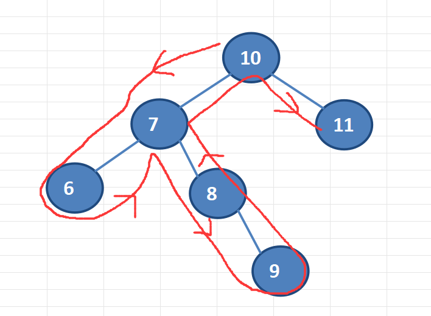

### 代码实现

以此为例：

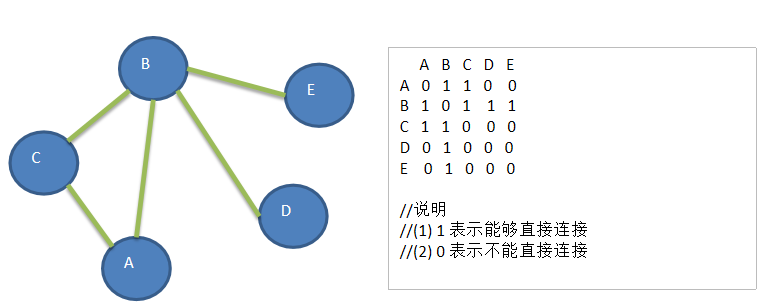

从A开始遍历，遍历所有节点

`Graph`

```java
package com.yukinoshita.dataStructure.graph;

import java.util.ArrayList;
import java.util.Arrays;
import java.util.LinkedList;

public class Graph {

    private ArrayList<String> vertexList;
    private int[][] edges;
    private int numOfEdges;
    //记录某个顶点是否被访问过
    private boolean[] vis;

    public static void main(String[] args) {

        int n = 5;
        String Vertexs[] = {"A", "B", "C", "D", "E"};
        Graph graph = new Graph(n);
        for (String vertex : Vertexs) {
            graph.insertVertex(vertex);
        }
        //添加边
        //A-B A-C B-C B-D B-E
        graph.insertEdge(0, 1, 1); // A-B
        graph.insertEdge(0, 2, 1); //
        graph.insertEdge(1, 2, 1); //
        graph.insertEdge(1, 3, 1); //
        graph.insertEdge(1, 4, 1); //
        graph.showGraph();

        graph.dfs();
    }

    //对dfs重载，遍历所有节点，进行dfs（确保了所有点能被访问到）
    public void dfs() {
        for(int i=0;i<getNumOfVertex();i++){
            dfs(vis, 0);
        }
    }


    //从某一个节点开始，进行深度优先搜索
    private void dfs(boolean[] visited, int i) {
        System.out.print(getValueByIndex(i) + "->");
        visited[i] = true;
        //查找节点i的第一个邻接节点
        int w = getFirstNeighbor(i);
        while (w != -1) {//说明有下一个邻接节点
            if (!visited[w]) {//再加上没有被访问过
                dfs(visited, w);
            }
            //如果w节点已经被访问过，得找下一个
            w = getNextNeighbor(i, w);
        }
    }

    /**
     * （？存疑）根据前一个邻接节点的下标来获取下一个邻接节点
     * @param v1 上一个节点的行号
     * @param v2 上一个节点的列号
     * @return 下一个节点在vertexList的下标j，没有则-1
     */
    public int getNextNeighbor(int v1, int v2) {
        for (int j = v2 + 1; j < vertexList.size(); j++) {
            if (edges[v1][j] > 0) {
                return j;
            }
        }
        return -1;
    }

    /**
     * 得到第一个邻接节点的下标
     *
     * @param index
     * @return 下一个邻接节点的下标，没有则-1
     */
    public int getFirstNeighbor(int index) {
        for (int j = 0; j < vertexList.size(); j++) {
            if (edges[index][j] > 0) {
                return j;
            }
        }
        return -1;
    }


    //构造器
    public Graph(int n) {
        edges = new int[n][n];
        vertexList = new ArrayList<String>(n);
        numOfEdges = 0;
        vis = new boolean[n];
    }

    //获取顶点数量
    public int getNumOfVertex() {
        return vertexList.size();
    }

    //展示图
    public void showGraph() {
        for (int[] link : edges) {
            System.err.println(Arrays.toString(link));
        }
    }

    //获取边的数量
    public int getNumOfEdges() {
        return numOfEdges;
    }

    //获取顶点的值
    public String getValueByIndex(int i) {
        return vertexList.get(i);
    }

    //获取权值
    public int getWeight(int v1, int v2) {
        return edges[v1][v2];
    }

    //插入顶点
    public void insertVertex(String vertex) {
        vertexList.add(vertex);
    }

    //插入边
    public void insertEdge(int v1, int v2, int weight) {
        edges[v1][v2] = weight;
        edges[v2][v1] = weight;
        numOfEdges++;
    }
}

```

## 广度优先搜索（BFS）

图的广度优先搜索(Broad First Search) 。类似于一个分层搜索的过程，广度优先遍历需要使用一个队列以保持访问过的结点的顺序，以便按这个顺序来访问这些结点的邻接结点

**广度优先遍历算法步骤**

1. 访问初始结点v并标记结点v为已访问。
2. 结点v入队列
3. 当队列非空时，继续执行，否则算法结束。
4. 出队列，取得队头结点u。
5. 查找结点u的第一个邻接结点w。
6. 若结点u的邻接结点w不存在，则转到步骤3；否则循环执行以下三个步骤：
   1. 若结点w尚未被访问，则访问结点w并标记为已访问。 
   2. 结点w入队列
   3. 查找结点u的继w邻接结点后的下一个邻接结点w，转到步骤6。

**广度优先搜索抽象图解**

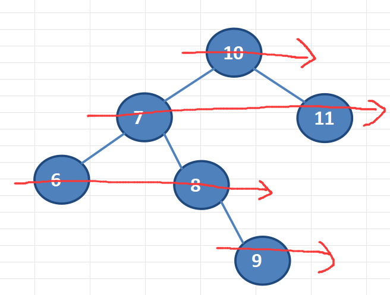

### 代码实现

`Graph`

```java
package com.yukinoshita.dataStructure.graph;

import java.util.ArrayList;
import java.util.Arrays;
import java.util.LinkedList;

public class Graph {

    private ArrayList<String> vertexList;
    private int[][] edges;
    private int numOfEdges;
    //记录某个顶点是否被访问过
    private boolean[] vis;

    public static void main(String[] args) {

        int n = 5;
        String Vertexs[] = {"A", "B", "C", "D", "E"};
        Graph graph = new Graph(n);
        for (String vertex : Vertexs) {
            graph.insertVertex(vertex);
        }
        //添加边
        //A-B A-C B-C B-D B-E
        graph.insertEdge(0, 1, 1); // A-B
        graph.insertEdge(0, 2, 1); //
        graph.insertEdge(1, 2, 1); //
        graph.insertEdge(1, 3, 1); //
        graph.insertEdge(1, 4, 1); //
        graph.showGraph();

        graph.bfs();
    }

    //遍历所有节点（确保所有点都被访问）
    public void bfs(){
        for(int i=0;i<getNumOfVertex();i++){
            if(!vis[i]){
                bfs(vis,i);
            }
        }
    }

    //对一个结点进行广度优先遍历的方法
    private void bfs(boolean[] vis, int i) {
        int u;//表示队列的头节点对应下标
        int w;//邻接节点w
        //队列，记录结点访问的顺序
        LinkedList queue = new LinkedList();
        //访问结点，输出结点信息
        System.out.print(getValueByIndex(i) + "=>");
        //标记为已访问
        vis[i] = true;
        //将这个结点加入队列
        queue.addLast(i);

        while (!queue.isEmpty()) {
            //取出队列的头节点下标
            u = (Integer) queue.removeFirst();
            //得到第一个邻接节点的下标
            w = getFirstNeighbor(u);
            while (w != -1) {//找到
                if (!vis[w]) {
                    System.out.print(getValueByIndex(w) + "=>");
                    vis[w] = true;
                    queue.addLast(w);
                }
                //以u为前驱，找w后面的下一个邻接节点
                w = getNextNeighbor(u, w);
            }

        }
    }

    /**
     * （？存疑）根据前一个邻接节点的下标来获取下一个邻接节点
     *
     * @param v1 上一个节点的行号
     * @param v2 上一个节点的列号
     * @return 下一个节点在vertexList的下标j，没有则-1
     */
    public int getNextNeighbor(int v1, int v2) {
        for (int j = v2 + 1; j < vertexList.size(); j++) {
            if (edges[v1][j] > 0) {
                return j;
            }
        }
        return -1;
    }

    /**
     * 得到第一个邻接节点的下标
     *
     * @param index
     * @return 下一个邻接节点的下标，没有则-1
     */
    public int getFirstNeighbor(int index) {
        for (int j = 0; j < vertexList.size(); j++) {
            if (edges[index][j] > 0) {
                return j;
            }
        }
        return -1;
    }


    //构造器
    public Graph(int n) {
        edges = new int[n][n];
        vertexList = new ArrayList<String>(n);
        numOfEdges = 0;
        vis = new boolean[n];
    }

    //获取顶点数量
    public int getNumOfVertex() {
        return vertexList.size();
    }

    //展示图
    public void showGraph() {
        for (int[] link : edges) {
            System.err.println(Arrays.toString(link));
        }
    }

    //获取边的数量
    public int getNumOfEdges() {
        return numOfEdges;
    }

    //获取顶点的值
    public String getValueByIndex(int i) {
        return vertexList.get(i);
    }

    //获取权值
    public int getWeight(int v1, int v2) {
        return edges[v1][v2];
    }

    //插入顶点
    public void insertVertex(String vertex) {
        vertexList.add(vertex);
    }

    //插入边
    public void insertEdge(int v1, int v2, int weight) {
        edges[v1][v2] = weight;
        edges[v2][v1] = weight;
        numOfEdges++;
    }
}

```

## 汉诺塔问题

汉诺塔：汉诺塔（又称河内塔）问题是源于印度一个古老传说的益智玩具。大梵天创造世界的时候做了三根金刚石柱子，在一根柱子上从下往上按照大小顺序摞着64片黄金圆盘。大梵天命令婆罗门把圆盘从下面开始按大小顺序重新摆放在另一根柱子上。并且规定，在小圆盘上不能放大圆盘，在三根柱子之间一次只能移动一个圆盘。

**思路**：

如果是有一个盘， A->C

如果我们有 n >= 2 情况，我们总是可以看做是两个盘——**一是最下边的盘**，**二是上面的其余所有盘**

1. 先把 最上面的盘 A->B，中间需借助C盘，即`hanoiTower(num-1,a,c,b)`
2. 再把最下边的盘 A->C，`System.out.println("第"+num+"个盘从 "+"A->C")`
3. 最后把B塔的所有盘 从 B->C，中间需借助A盘，即`hanoiTower(num-1,b,a,c)`

### 代码实现

`HanoiTower`

```java
package com.yukinoshita.algorithm.hanoitower;

public class HanoiTower {
    public static void main(String[] args) {
        hanoiTower(3,'A','B','C');
    }

    //使用分治算法解决汉诺塔问题
    public static void hanoiTower(int num,char a,char b,char c) {
        if(num==1){
            System.out.println("第1个盘从 "+a+"->"+c);
        }else{
            //如果num >= 2，我们总是可以看两个盘：1最下面的盘 和 上面的所有盘
            //1. 先把 上面的盘从A移动到B，移动过程会使用到C
            hanoiTower(num-1,a,c,b);
            //2. 再把 最下面的盘从A移动到C
            System.out.println("第"+num+"个盘从 "+a+"->"+c);
            //3. 把 B中所有盘移动到C，移动过程使用到A
            hanoiTower(num-1,b,a,c);
        }
    }
}

```

## 背包问题

在解决 **0-1 背包问题**时，我们的目标是选择若干物品放入背包，使得背包内物品的总价值最大，同时遵循背包容量的限制。具体来说，给定一组物品，每个物品都有一个 **重量** 和 **价值**，并且背包的容量也是有限的。我们需要从这些物品中选择一些，放入容量有限的背包中，要求背包内物品的 **总重量不超过背包的容量**，而 **总价值最大**。

**0-1 背包的动态规划解法**：

1. 设有 $n$个物品，每个物品 $i $的 **价值** 为 $ v[i]$，**重量** 为 $w[i]$，背包的最大容量为 $C$。
2. 定义一个二维数组 $ dp[i][j] $，表示考虑前 $ i $ 个物品，背包容量为 $j $ 时，能够获得的最大价值。即$ dp[i][j] $ 是当前背包容量 $j $ 和物品选择方案下的最大价值。

**递推公式**：

- **初始化**：
  
    - $dp[0][j] = 0  $（表示没有物品时，背包的最大价值为 0）
  -  $dp[i][0] = 0 $（表示背包容量为 0 时，无论选择哪些物品，总价值也为 0）
  
- **状态转移**：
    对于每个物品 $ i $和每个容量 $j$：
    
    - **如果当前物品的重量** $w[i] > j$（即当前背包容量不足以容纳这个物品），那么不能放入该物品，此时的最优解就是不放物品 $i$，即：
      $dp[i][j] = dp[i-1][j]$
      
    - **如果当前物品的重量** $w[i] \leq j$（即背包容量足够容纳当前物品），有两种选择：
      
      1. 不选择物品 $i $，此时的最优解为 $dp[i-1][j] $（即与不放入该物品时的情况一样）。
      2. 选择物品 $ i $，此时的最优解为物品 $ i $ 的价值加上剩余容量 $j - w[i] $ 能容纳的最大价值，即 $dp[i-1][j - w[i]] + v[i] $。
      
      这时我们需要取两者中的最大值：
      $$
      dp[i][j] = \max(dp[i-1][j], dp[i-1][j-w[i]] + v[i])
      $$

**总结**：

- $ dp[i][j] $ 表示在考虑前 $ i $ 个物品、容量为 $ j $ 的背包时，能够获得的最大价值。
- 对于每个物品 $ i $，如果它的重量 $ w[i] $ 超过当前背包容量 $ j $，就不能选它；否则，我们就要在 **选择它** 或 **不选择它** 之间做出最优决策，选择价值更大的方案。

**完整算法**：

1. 初始化 $ dp[0][j] = 0 $ 和 $ dp[i][0] = 0 $。
2. 对每个物品 $ i $ 和每个背包容量 $ j $ 更新 $ dp[i][j] $。
3. 最终答案就是 $ dp[n][C] $，表示在所有 $ n $ 个物品和容量为 $ C $ 的背包情况下，能够获得的最大价值。

**图解**

1. `weights`物品重量、`values`物品价值、`dp`用于求解的数组（初始化如下）（黄色部分是未来求解区）

   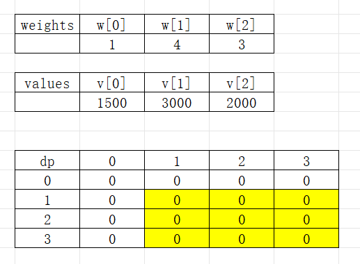

2. 当考虑第一件物品时：

   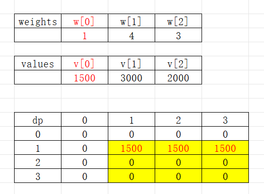

3. 考虑第二件物品时：

   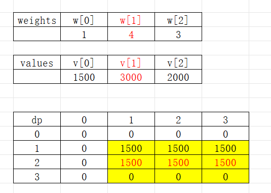

4. 考虑第三件物品：

   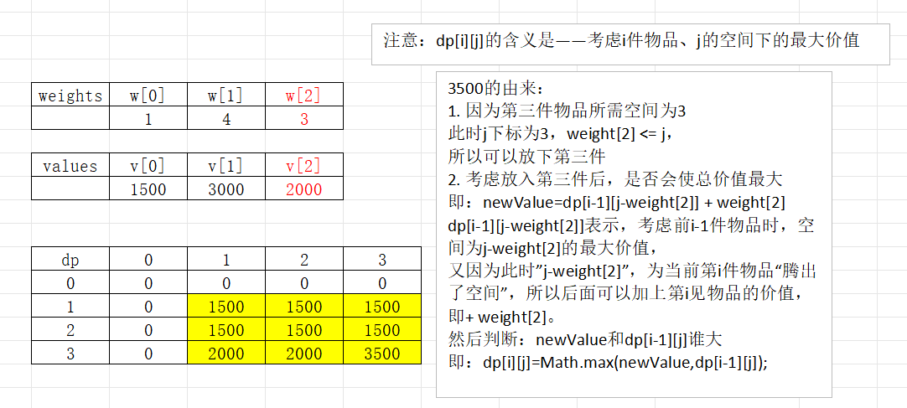

### 代码实现

`KnapsackProblem`

> **空间优化**：可以通过只使用一维数组来优化空间复杂度。因为每一行的状态仅依赖于前一行的状态。（拓展）

```java
package com.yukinoshita.algorithm.dynamicProgramming;

import java.util.Arrays;

public class KnapsackProblem {

    public static void main(String[] args) {
        // 物品的重量
        int[] weights = {1, 4, 3};
        // 物品的价值
        int[] values = {1500, 3000, 2000};

        // 物品数量
        int numItems = weights.length;
        // 背包容量
        int capacity = 4;

        // dp[i][j] 表示考虑前 i 个物品，背包容量为 j 时能够获得的最大价值
        int[][] dp = new int[numItems + 1][capacity + 1];

        // 为了记录被放入背包的商品，定义一个二维数组
        int[][] path = new int[numItems + 1][capacity + 1];

        // 动态规划求解最大价值
        for (int i = 1; i <= numItems; i++) {
            for (int j = 1; j <= capacity; j++) {
                if (weights[i - 1] > j) { // 当前背包容量不足以放入物品 i
                    dp[i][j] = dp[i - 1][j];
                } else {
                    // 如果放入当前物品 i 会得到更大的价值，更新 dp[i][j] 和 path
                    if (dp[i - 1][j] < dp[i - 1][j - weights[i - 1]] + values[i - 1]) {
                        dp[i][j] = dp[i - 1][j - weights[i - 1]] + values[i - 1];
                        path[i][j] = 1; // 记录当前物品 i 被放入背包
                    } else {
                        dp[i][j] = dp[i - 1][j];
                    }
                }
            }
        }

        // 打印 dp 数组，查看每个容量下的最大价值
        for (int[] row : dp) {
            System.out.println(Arrays.toString(row));
        }

        // 输出最大能够装入的价值
        System.out.println("最大能装的价值为：" + dp[numItems][capacity]);

        // 输出放入背包的物品
        int i = numItems;
        int j = capacity;
        while (i > 0 && j > 0) {
            if (path[i][j] == 1) {
                System.out.printf("第%d个商品放入背包\n", i);
                j -= weights[i - 1]; // 剩余背包容量
            }
            i--; // 遍历前一个物品
        }
    }
}

```

## KMP算法

### 暴力匹配法(bad)

假设现在str1匹配到 i 位置，子串str2匹配到 j 位置，则有:

1. 如果当前字符匹配成功（即`str1[i] == str2[j]`），则`i++，j++`，继续匹配下一个字符
2. 如果失配（即`str1[i]! = str2[j]`），令`i = i - (j - 1)，j = 0`。相当于每次匹配失败时，i 回溯，j 被置为0。
3. 用暴力方法解决的话就会有大量的回溯，每次只移动一位，若是不匹配，移动到下一位接着判断，浪费了大量的时间。

### 暴力匹配代码实现

`ViolenceMatch`

```java
package com.yukinoshita.algorithm.kmp;

public class ViolenceMatch {
    public static void main(String[] args) {
        String s1 = "yukinoYukinoShiTAyukinoYukinoshitaYukino";//23
        String s2 = "YukinoshitaYukino";
        int index = violenceMatch(s1,s2);
        System.out.println(index);
    }

    //暴力匹配算法实现
    public static int violenceMatch(String str1, String str2) {
        char[] s1 = str1.toCharArray();
        char[] s2 = str2.toCharArray();

        int len1 = s1.length;
        int len2 = s2.length;

        int i = 0;//指向s1的索引
        int j = 0;//指向s2的索引
        while(i<len1 && j<len2) {
            if(s1[i] == s2[j]) {
                i++;
                j++;
            }else{//没有匹配成功
                i = i-(j-1);
                j=0;
            }
        }

        if(j==len2){
            return i-j;
        }else{
            return -1;
        }
    }
}

```

### KMP算法

**KMP算法介绍**

1. KMP是一个解决模式串在文本串是否出现过，如果出现过，最早出现的位置的经典算法
2. **Knuth-Morris-Pratt 字符串查找算法**，简称为 “**KMP算法**”，常用于在一个文本串S内查找一个模式串P 的出现位置，这个算法由Donald Knuth、Vaughan Pratt、James H. Morris三人于1977年联合发表，故取这3人的姓氏命名此算法
3. KMP方法算法就利用之前判断过信息，通过一个next数组，保存模式串中前后最长公共子序列的长度，每次回溯时，通过next数组找到，前面匹配过的位置，省去了大量的计算时间
4. [参考blog](https://www.cnblogs.com/ZuoAndFutureGirl/p/9028287.html)

**示例-字符串匹配问题**

1. 有一个字符串 str1= "BBC ABCDAB ABCDABCDABDE"，和一个子串 str2="ABCDABD"
2. 现在要判断 str1 是否含有 str2, 如果存在，就返回第一次出现的位置, 如果没有，则返回-1
3. 要求：使用KMP算法完成判断，不能使用简单的暴力匹配算法

#### 详细思路

> 最详细的见此：[blog](https://www.cnblogs.com/ZuoAndFutureGirl/p/9028287.html)

以`str1 = "BBC ABCDAB ABCDABCDABDE"`以及`str2 = "ABCDABD"`进行举例，判断str1中是否含有str2。

1. 首先，用str1的第一个字符与str2的第一个字符比较，发现不匹配，则关键词后移一位

   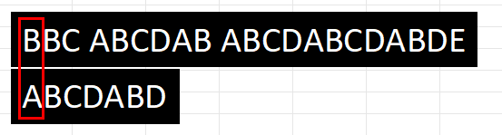

2. 再往后比较，不匹配则一直重复步骤1

   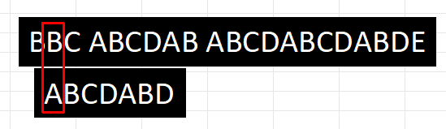

3. 重复步骤1，直到找到str1中和str2的第一个字符匹配（如下：）

   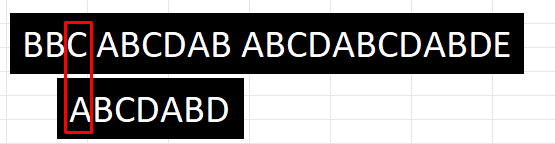

   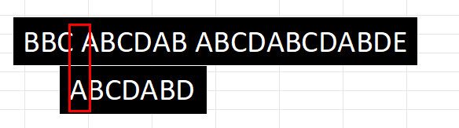

   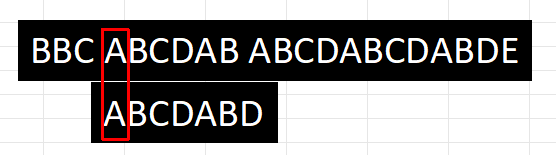

4. 之后方别移动`i`和`j`，比较两个str1与str2的重合度，发现当子串到最后的`'D'`时与源字符串的`' '`不匹配

   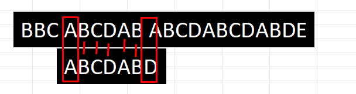

5. 之后就是与暴力匹配有所区别的地方，不能简单地再让子串第一个字母A与源字符串的'B'、'C'、'D'进行比较，这些步骤都是浪费的，因为第4步其实已经比较过"BCD"了，我们知道了子串的第一个字符'A'不可能与'B'、'C'、'D'匹配上。更准确说，当str1的空格与str2的'D'不匹配时，我们已经遍历过str1中的"ABCDAB"，所以正确地做法是将子串直接移动到下一个'A'的位置，这样子做才能提升搜索效率，而不要再让B与A比较

   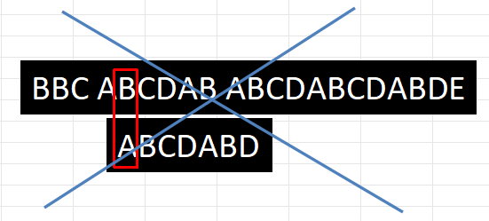

6. 怎么样能把这些重复步骤省略呢？我们可以对子串`str2`计算**部分匹配表**

   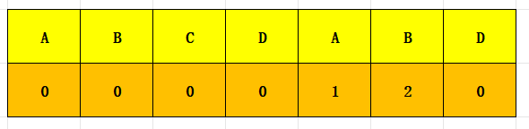

   - 如何得到部分匹配表？
   - 先介绍**前缀**与**后缀**，例如字符"yukino"，**前缀**就是"y"、"yu"、"yuk"、"yuki"、"yukin"；**后缀**就是"o"、"no"、"ino"、"kino"、"ukino"
   - **部分匹配值**：一个字符串前缀和后缀共有元素的最大长度，回到"ABCDADB"这个例子：
     - "A"前缀和后缀都为空，所以部分匹配值为0
     - "AB"的前缀是"A"，后缀是"B"，所以部分匹配值为0
     - "ABC"的前缀是"A"、"AB"，后缀是"B"、"BC"，所以部分匹配值为0
     - "ABCD"的前缀是"A"、"AB"、"ABC"，后缀是"D"、"CD"、"BCD"，所以部分匹配值为0
     - "ABCDA"的前缀是"**A**"、"AB"、"ABC"、"ABCD"，后缀是"**A**"、"DA"、"CDA"、"BCDA"，所以部分匹配值为1
     - "ABCDAB"的前缀是"A"、"**AB**"、"ABC"、"ABCD"、"ABCDA"，后缀是"B"、"**AB**"、"DAB"、"CDAB"、"BCDAB"，所以部分匹配值为2
     - 同理，"ABCDABD"的部分匹配值为0
   - 这样就能从理论层面，知道如何得到部分匹配值表。（关键是看代码怎么实现——利用`next`数组）

7. 那么这个表怎么用呢？回到刚才str1中的空格与str2中的D不匹配的时刻，此时前六个字符"ABCDAB"是匹配的，最后一个字符"B"对应的"部分匹配值"为2，因此按照如下公式移动步数：
   $$
   移动位数=已匹配的字符数-部分匹配值
   $$
   因此此时移动的步数为：$6-2=4$步，如下所示：

   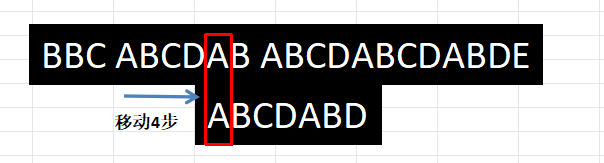

8. 下一次发现，空格与字符C又不匹配，同样根据公式计算，需移动$2(已匹配字符数)-0(第一个字符'B'所对应的部分匹配值)=2$步：

   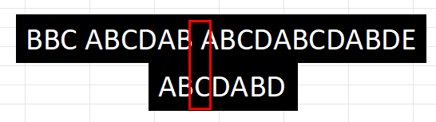

   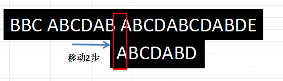

9. 后续步骤同理，不再说明，下图匹配成功。

   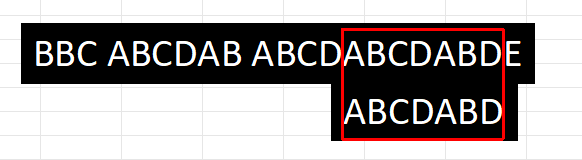

10. 至此也理解了这个移动的公式的妙处，但是如何用代码实现？（利用`next`数组）

**代码思路总结**：

1. 获得子串的部分匹配值表`next`
2. 使用部分匹配值表完成kmp搜索

#### 代码实现

`KMP`

ps：核心的就是两个方法——`kmpNext`求出子串的部分匹配表，`kmpSearch`kmp搜索。其中最最核心的，分别是这两个方法中的`while`语句，是如何处理`j`的更新的！两个方法中的`i`和`j`含义各有不同。至于为什么`j = next[j-1]`，则见博客底层原理。

```java
package com.yukinoshita.algorithm.kmp;

import java.util.Arrays;

public class KMP {
    public static void main(String[] args) {
        String str1 = "BBC ABCDAB ABCDABCDABDE";
        String str2 = "ABCDABD";

        int[] next = kmpNext(str2);

        System.out.println("部分匹配值表："+Arrays.toString(next));
        System.out.println("匹配的第一个下标为："+kmpSearch(str1,str2,next));
    }

    /**
     * kmp搜索算法
     *
     * @param str1 源字符串
     * @param str2 子串
     * @param next 子串对应的部分匹配表
     * @return 返回第一个匹配的位置，否则-1
     */
    public static int kmpSearch(String str1, String str2, int[] next) {
        for (int i = 0, j = 0; i < str1.length(); i++) {
            //需要处理str1.charAt(i)!=str2.charAt(j)的情况，去调整j的大小
            //KMP算法核心点
            while (j > 0 && str1.charAt(i) != str2.charAt(j)) {
                j = next[j - 1];
            }

            if (str1.charAt(i) == str2.charAt(j)) {
                j++;
            }
            if (j == str2.length()) {
                return i - j + 1;
            }
        }
        return -1;
    }

    //获取子串的部分匹配表
    public static int[] kmpNext(String str) {
        int[] next = new int[str.length()];
        next[0] = 0;//如果字符串长度为1，部分匹配值一定是0

        for (int i = 1, j = 0; i < next.length; i++) {
            //当str.charAt(i) != str.charAt(j)时，需要从next[j-1]获取新的j
            //直到我们发现有 str.charAt(i) == str.charAt(j) 成立时才推出
            //这是kmp算法的核心……
            while (j > 0 && str.charAt(i) != str.charAt(j)) {
                j = next[j - 1];
            }

            //当str.charAt(i) == str.charAt(j)时，部分屁匹配值就是+1
            if (str.charAt(i) == str.charAt(j)) {
                j++;
            }
            next[i] = j;
        }
        return next;
    }
}

```

## 贪心-集合覆盖(简单例子)

例子很简单，主要是了解这种思想--**贪心算法**[^11]

**题目**：

假设存在如下表的需要付费的广播台，以及广播台信号可以覆盖的地区。 如何选择最少的广播台，让所有的地区都可以接收到信号

| 广播台 | 覆盖地区               |
| ------ | ---------------------- |
| K1     | "北京", "上海", "天津" |
| K2     | "广州", "北京", "深圳" |
| K3     | "成都", "上海", "杭州" |
| K4     | "上海", "天津"         |
| K5     | "杭州", "大连"         |

**步骤**：

1. 遍历所有的广播电台, 找到一个覆盖了最多未覆盖的地区的电台（此电台可能包含一些已覆盖的地区，但没有关系）
2. 将这个电台加入到一个集合中(比如ArrayList), 想办法把该电台覆盖的地区在下次比较时去掉。
3. 重复第1步直到覆盖了全部的地区

**代码**：

`GreedyAlgorithm`

```java
package com.yukinoshita.algorithm.greedy;

import java.util.ArrayList;
import java.util.HashMap;
import java.util.HashSet;

public class GreedyAlgorithm {

    public static void main(String[] args) {
        //创建广播电台，放入到Map
        HashMap<String, HashSet<String>> broadcasts = new HashMap<String, HashSet<String>>();
        //将各个电台放入到broadcasts
        HashSet<String> hashSet1 = new HashSet<String>();
        hashSet1.add("北京");
        hashSet1.add("上海");
        hashSet1.add("天津");

        HashSet<String> hashSet2 = new HashSet<String>();
        hashSet2.add("广州");
        hashSet2.add("北京");
        hashSet2.add("深圳");

        HashSet<String> hashSet3 = new HashSet<String>();
        hashSet3.add("成都");
        hashSet3.add("上海");
        hashSet3.add("杭州");


        HashSet<String> hashSet4 = new HashSet<String>();
        hashSet4.add("上海");
        hashSet4.add("天津");

        HashSet<String> hashSet5 = new HashSet<String>();
        hashSet5.add("杭州");
        hashSet5.add("大连");

        //加入到map
        broadcasts.put("K1", hashSet1);
        broadcasts.put("K2", hashSet2);
        broadcasts.put("K3", hashSet3);
        broadcasts.put("K4", hashSet4);
        broadcasts.put("K5", hashSet5);

        //allAreas 存放所有地区
        HashSet<String> allAreas = new HashSet<String>();
        allAreas.add("北京");
        allAreas.add("上海");
        allAreas.add("天津");
        allAreas.add("广州");
        allAreas.add("深圳");
        allAreas.add("成都");
        allAreas.add("杭州");
        allAreas.add("大连");

        //创建ArrayList 存放所有地区
        ArrayList<String> selects = new ArrayList<String>();

        //遍历过程中的电台覆盖的地区和当前还没有覆盖的地区
        HashSet<String> tempSet = new HashSet<String>();


        String maxKey = null;
        while (allAreas.size() != 0) {
            maxKey = null;

            for (String key : broadcasts.keySet()) {
                tempSet.clear();
                HashSet<String> areas = broadcasts.get(key);
                tempSet.addAll(areas);
                tempSet.retainAll(allAreas);//retainAll是取出tempSet和allAreas中公共的，重新赋值给tempSet
                if (tempSet.size() > 0 &&
                        (maxKey == null || tempSet.size() > broadcasts.get(maxKey).size())) {
                    maxKey = key;
                }
            }
            if (maxKey != null) {
                selects.add(maxKey);
                allAreas.removeAll(broadcasts.get(maxKey));
            }

        }

        System.out.println("选择的电台为" + selects);//[K1,K2,K3,K5]


    }

}

```

## 普利姆算法

**实际问题——修路问题**

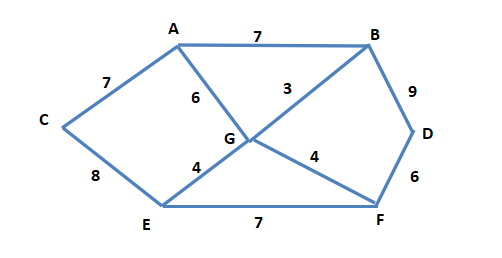

有ABCDEFG七个村庄，修路使得村庄连通，同时要求修路公里数最小，问修路方案。

### 最小生成树

修路问题本质就是就是最小生成树问题， 先介绍一下**最小生成树(Minimum Cost Spanning Tree)，简称MST**。

1. 给定一个带权的无向连通图,如何选取一棵生成树,使树上**所有边上权的总和为最小**,这叫最小生成树

2. N个顶点，一定有N-1条边

3. 包含全部顶点

4. N-1条边都在图中

   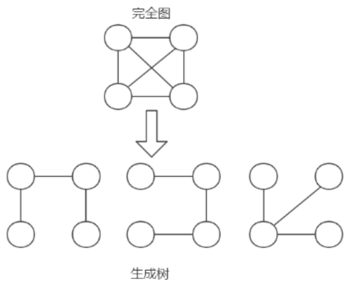

5. **求最小生成树**的算法主要是**普里姆算法**和**克鲁斯卡尔算法**

### 普利姆算法介绍

1. **普利姆(Prim)算法**求最小生成树，也就是在包含n个顶点的连通图中，找出只有(n-1)条边包含所有n个顶点的连通子图，也就是所谓的**极小连通子图**

2. **算法步骤**：

   1. 设$G=(V,E)$是连通网，$T=(U,D)$是最小生成树，$V,U$是顶点集合，$E,D$是边的集合
   2. 若从顶点$u$开始构造最小生成树，则从集合V中取出顶点$u$放入集合$U$中，标记顶点$v$的$visited[u]=1$
   3. 若集合$U$中顶点$u_i$与集合$V-U$中的顶点$v_j$之间存在边，则寻找这些边中权值最小的边，但不能构成回路，将顶点$v_j$加入集合$U$中，将边$(ui,vj)$加入集合$D$中，标记$visited[vj]=1$
   4. 重复步骤2，直到$U$与$V$相等，即所有顶点都被标记为访问过，此时$D$中有$n-1$条边

3. 虽然步骤用了离散数学的术语显得抽象，但是图解很清晰：

   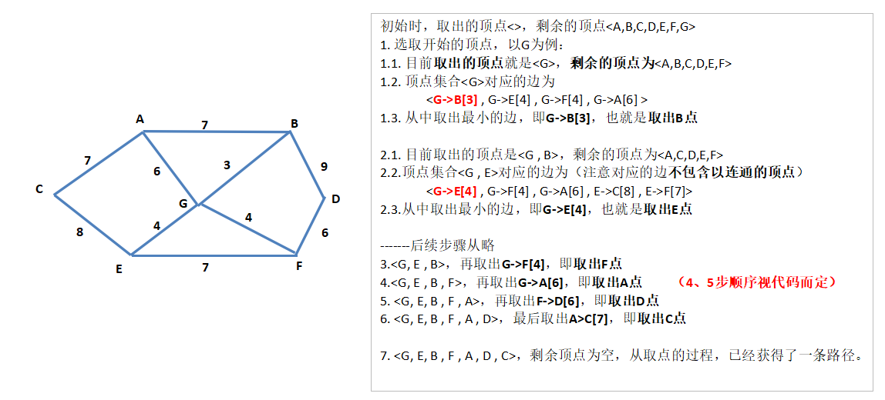

   ∴最终修路：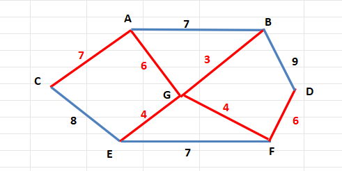

4. 为什么这种“**每次  在已访问过的节点的基础上  选取最短的路径加入**”能得到最短总路径呢？仔细想想，是因为修路问题的题目条件是——**每个节点都必须连通**，因此比如一开始选取了G，他就必须要和其他的某个村庄有联系，那么不妨就选取最短的那个，每次都这样找，总的修路路径就是最短的。

### 代码实现

`PrimAlgorithm`

```java
package com.yukinoshita.algorithm.prim;

import java.util.Scanner;

public class PrimAlgorithm {
    private static final int INF = Integer.MAX_VALUE;

    public static void main(String[] args) {
        int vertexNum = 7;
        char[] villages = {'A', 'B', 'C', 'D', 'E', 'F', 'G'};
//        int[][] weight = new int[vertexNum][vertexNum];
        int[][] weight = {
                {INF, 7, 7, INF, INF, INF, 6},
                {7, INF, INF, 9, INF, INF, 3},
                {7, INF, INF, INF, 8, INF, INF},
                {INF, 9, INF, INF, 7, 6, INF},
                {INF, INF, 8, 7, INF, 7, 4},
                {INF, INF, INF, 6, 7, INF, 4},
                {6, 3, INF, INF, 4, 4, INF}
        };
        
//        for(int i = 0; i < vertexNum; i++){
//            for(int j = 0; j < vertexNum; j++){
//                weight[i][j] = Integer.MAX_VALUE;//表示此路不通
//            }
//        }
        //输入各村庄之间的路径：
        //0-6 表示A-G，之后输入对应
//        int v1,v2,len=0;
//        Scanner sc = new Scanner(System.in);
//        System.out.println("输入地图数据:");//0 1 7 0 2 7 0 6 6 2 4 8 1 6 3 1 3 9 4 6 4 4 5 7 3 5 6 5 6 4 -1
//        while(true){
//            v1=sc.nextInt();
//            if(v1 == -1) break;
//            v2=sc.nextInt();
//            len=sc.nextInt();
//            weight[v1][v2] = len;
//            weight[v2][v1] = len;
//        }


        Graph graph = new Graph(vertexNum, villages, weight);
//        graph.showGraph();

        MinTree minTree = new MinTree();
        minTree.prim(graph, 6);

    }
}

//最小生成树
class MinTree {

    /**
     * 普利姆算法来创建最小生成树
     *
     * @param graph 图
     * @param v     开始构建的顶点
     */
    public void prim(Graph graph, int v) {
        boolean[] visited = new boolean[graph.vertexNum];
        visited[v] = true;

        //用v1，v2记录两个顶点的下标
        int v1 = -1;
        int v2 = -1;
        int minLen = Integer.MAX_VALUE;
        //因为有graph.vertexNum个顶点，所以prim算法结束应该有graph.vertexNum-1条边被记录
        for (int k = 0; k < graph.vertexNum - 1; k++) {

            //其实每一次就是在已访问过的节点的基础上，判断最短的路径并加入
            for (int i = 0; i < graph.vertexNum; i++) {         //访问过的节点    i
                for (int j = 0; j < graph.vertexNum; j++) {     //未访问过的节点   j
                    if (visited[i] && !visited[j] && graph.weight[i][j] < minLen) {
                        minLen = graph.weight[i][j];
                        v1 = i;
                        v2 = j;
                    }
                }
            }
            System.out.println("修路：" + graph.villages[v1] + "<--" + graph.weight[v1][v2] + "-->" + graph.villages[v2]);
            visited[v1] = true;
            visited[v2] = true;
            minLen = Integer.MAX_VALUE;

//            //其实每一次就是在已访问过的节点的基础上，判断最短的路径并加入
//            for(int i=0;i<graph.vertexNum;i++){         //访问过的节点    i
//                if(!visited[i]){//找到访问过的节点i
//                    continue;
//                }
//                for(int j=0;j<graph.vertexNum;j++){     //未访问过的节点   j
//                    if(visited[j]){//找到未访问过的节点j
//                        continue;
//                    }
//                    if(graph.weight[i][j] < minLen){
//                        minLen = graph.weight[i][j];
//                        v1 = i;
//                        v2 = j;
//                    }
//                }
//            }

        }
    }
}

class Graph {
    int vertexNum;//节点个数
    char[] villages;
    int[][] weight;//带权图

    Graph(int vertexNum, char[] villages, int[][] weight) {
        this.vertexNum = vertexNum;
        this.villages = villages;
        this.weight = weight;
    }

    void showGraph() {
        for (int i = 0; i < vertexNum; i++) {
            for (int j = 0; j < i; j++) {
                if (weight[i][j] != Integer.MAX_VALUE) {
                    System.out.println(villages[i] + "<--" + weight[i][j] + "-->" + villages[j]);
                }
            }
        }
    }
}
```

## 克鲁斯卡尔算法

> 和Prim算法一样，也是求最小生成树的，先补[并查集](##并查集)部分知识，对于Kruskal算法的“判断该节点属于哪一类”可以有更深刻的理解。

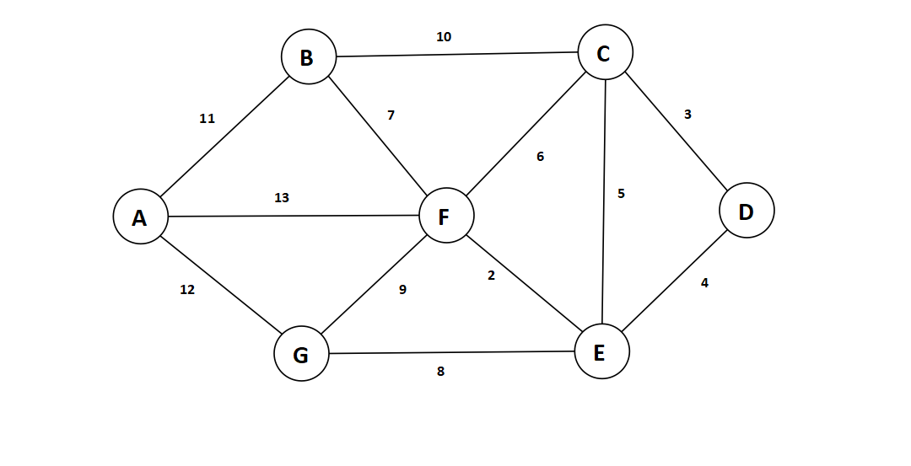

如上图，给城市的公交站修路，使得所有点连通，同时总路径最小。

**思路**

1. Kruskal算法，是用来求加权连通图的最小生成树的算法。
2. **基本思想**：按照权值**从小到大**的顺序选择n-1条边，并保证这n-1条边**不构成回路**。
3. **做法**：
   - 将边按权值从小到大排序
   - 不断将按边的权值从小到大加入森林，同时保证森林中不产生回路，直到选择了n-1条边。

**图解**

1. 首先有n个顶点，则需选择n-1条边

2. 第一步选择`E-F[2]`边

   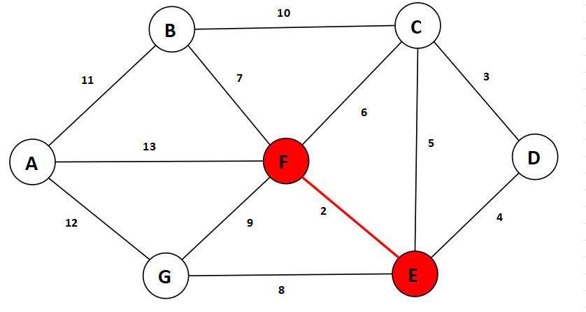

3. 第二步，选择`C-D[3]`边

   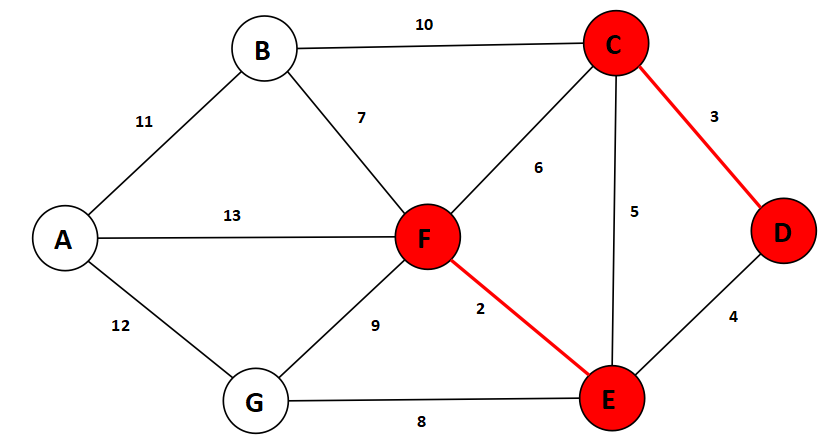

4. 第三步，选择`D-E[4]`边

   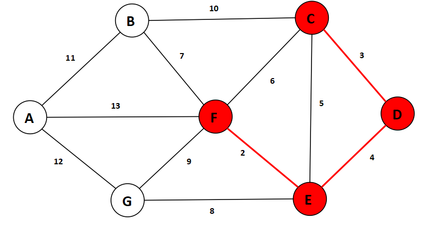

5. 第四步，拟选择`C-E[5]`但是发现构成回路，不能选；拟选择`C-F[6]`但是发现构成回路，不能选；故选择`B-F[7]`。

   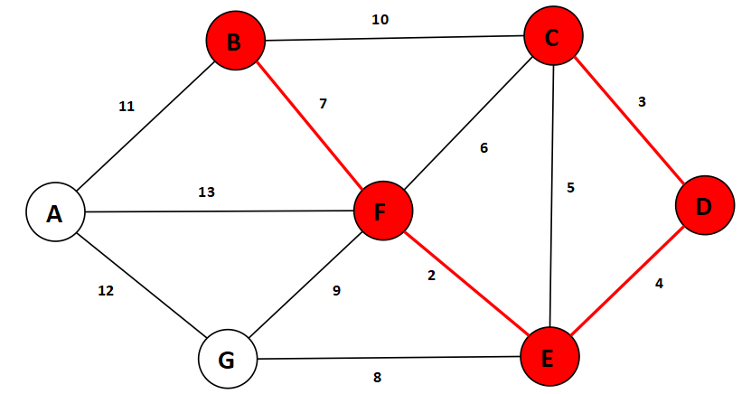

6. 第五步，选择`E-G[8]`

   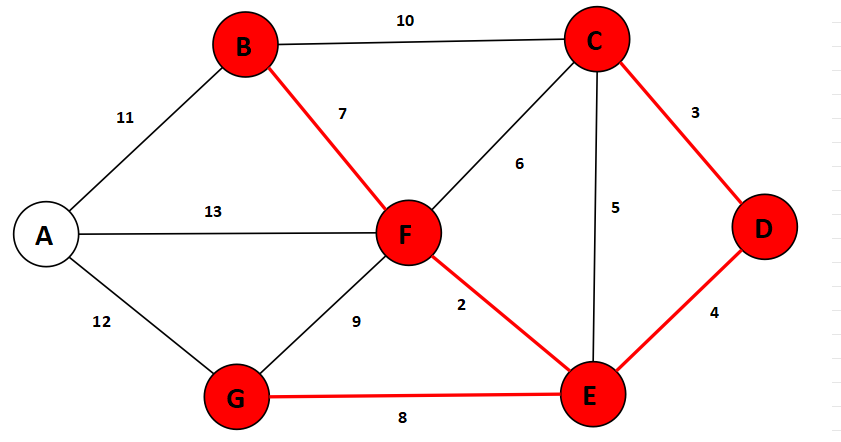

7. 第六步，拟选择`F-G[9]`构成回路，不能选；拟选择`B-C[10]`，构成回路，不能选；故选择`A-B[11]`

   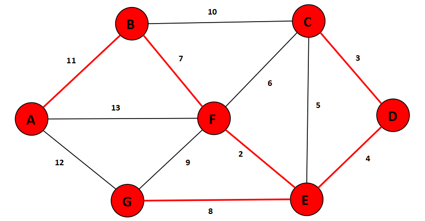

8. 已选择$n-1$，即6条边，最小生成树已生成。最后结果为：`E-F[2]`、`C-D[3]`、`D-E[4]`、`B-F[7]`、`E-G[8]`、`A-B[11]`

上述过程中，有两个问题需要解决：

1. 将边按权值从小到大排序，这个易解决

2. 每次新加入边时，需判断是否会构成回路，这个要利用**并查集**：
   - 以下面状态举例：
   - 此时：
     - `C`的终点节点为`F`
     - `D`的终点节点为`F`
     - `E`的终点节点为`F`
     - `F`的终点节点为`F`
   - 如果新加入的边，其两个节点的终点节点相同，比如`C-E[5]`，`C`和`E`的终点节点都为`F`，用并查集里面的术语来讲，`C`与`E`就是同一树上的节点，此时若连接`C`与`E`，则会构成回路。

   > 不懂什么意思就看看[并查集](##并查集)这种数据结构。

### 代码实现

`KruskalDemo`

```java
package com.yukinoshita.algorithm.kruskal;

import java.util.Arrays;

public class KruskalDemo {
    private static final int INF =Integer.MAX_VALUE;
    public static void main(String[] args){
        char[] vertexs = {'A','B','C','D','E','F','G'};
        //此处构造是，自身顶点是0，是跟后续“并查集”的算法有关
        // 即，while(i != 0) { i = ends[i]; }，去找到"根节点"，判断某两条边是否是"同一个集合"，防止回路生成
        int[][] matrix = {
                {0, 11, INF, INF, INF, 13, 12},
                {11, 0, 10, INF, INF, 7, INF},
                {INF, 10, 0, 3, 5, 6, INF},
                {INF, INF, 3, 0, 4, INF, INF},
                {INF, INF, 5, 4, 0, 2, 8},
                {13, 7, 6, INF, 2, 0, 9},
                {12, INF, INF, INF, 8, 9, 0}
        };
                Kruskal kruskal = new Kruskal(vertexs, matrix);
//                kruskal.print();
                kruskal.createMinTree();
    }
}


class Kruskal{
    private int edgeNum;//边的个数
    private char[] vertexs;//顶点集合
    private int[][] matrix;//邻接矩阵

    Edge[] edges;//所有边

    private static final int INF =Integer.MAX_VALUE;
    public Kruskal(char[] vertexs, int[][] matrix){
        int vlen = vertexs.length;
        this.vertexs = new char[vlen];


        //复制拷贝，对外不影响
        for(int i = 0; i < vlen; i++){
            this.vertexs[i] = vertexs[i];
        }

        //初始化邻接矩阵
        this.matrix = new int[vlen][vlen];
        for(int i = 0; i < matrix.length; i++){
            for(int j = 0; j < matrix[i].length; j++){
                this.matrix[i][j] = matrix[i][j];
            }
        }

        //统计边的个数
        for(int i = 0; i < matrix.length; i++){
            for(int j = i+1; j < matrix[i].length; j++){
                if(matrix[i][j] != INF){
                    this.edgeNum++;
                }
            }
        }
        edges = getEdges();
    }

    private Edge[] getEdges(){
        Edge[] edges1 = new Edge[this.edgeNum];
        int k = 0;
        //给边赋值（由于是无向图，只需遍历上三角（不包括自身））
        for(int i=0;i<matrix.length;i++){
            for(int j=i+1;j<matrix[i].length;j++){
                if(matrix[i][j] != INF){
                    edges1[k++] = new Edge(vertexs[i],vertexs[j],matrix[i][j]);
                }
            }
        }
        Arrays.sort(edges1);
        return edges1;
    }

    //pirnt
    public void print(){
        for(int i=0;i<matrix.length;i++){
            System.out.println(Arrays.toString(matrix[i]));
        }
        System.out.println("打印边，"+"总共"+edges.length+"条边：");
        for(int i=0;i<edges.length;i++){
            System.out.println(edges[i]);
        }
    }

    //返回对应站点的下标  'A' -> 0，找不到则-1
    private int getPosition(char ch){
        for(int i=0;i<vertexs.length;i++){
            if(vertexs[i] == ch){
                return i;
            }
        }
        return -1;
    }

    /**
     * 获取下标为i的顶点对应的“终点”节点 对应的下标
     * 用于后续判断，新加入的边是否会造成回路
     * @param ends 记录每个顶点的终点的数组，初始化时，每个顶点的终点都是自身
     * @param i 传入的顶点对应下标
     * @return 获取下标为i的顶点对应的“终点”对应的下标
     */
    private int getEnd(int[] ends,int i){
        if(i != ends[i]){
            return ends[i] = getEnd(ends,ends[i]);
        }
        return i;
    }

    //生成最小生成树算法
    public void createMinTree(){
        int index = 0;
        int[] ends = new int[edgeNum];//用于保存 当前已有边的顶点的集合中 每个顶点的终点
        for(int i=0;i<ends.length;i++){//用并查集的思路，给所有节点的 根节点 设置为其自身，也就是各自为一棵树
            ends[i] = i;
        }

        Edge[] result = new Edge[vertexs.length-1];//保存最后结果（最后只需顶点数 - 1 条边即可）

        //edges是在构造时，已经按照边的权值从小到大拍好的Edge数组
        //对边edges进行遍历
        for(int i=0;i<edgeNum;i++){
//            //优化
//            if(index == vertexs.length){
//                break;//此时已经能将所有顶点练成最小生成树，后面的边没必要遍历了
//            }

            //获取当前边的两个顶点的下标
            int p1 = getPosition(edges[i].start);
            int p2 = getPosition(edges[i].end);

            //获取当前边两个顶点各自的终点
            int m = getEnd(ends,p1);
            int n = getEnd(ends,p2);

            //若没有构成回路
            if(m != n){
//                ends[m] = getEnd(ends,n);//将边m的终点设置为n的终点（做了一个压缩路径！）
                ends[m] = n;//设置m的终点
                result[index++] = edges[i];//有一条边加入结果中
            }
        }

        //输出最小生成树：
        System.out.println("最小生成树为：");
        for(int i=0;i<index;i++){
            System.out.println(result[i]);
        }

    }
}

//边的类
class Edge implements Comparable<Edge>{
    char start;//起点
    char end;//终点
    int weight;//权
    public Edge(char start, char end, int weight){
        this.start = start;
        this.end = end;
        this.weight = weight;
    }

    @Override
    public int compareTo(Edge o) {
        return weight - o.weight;
    }

    @Override
    public String toString() {
        return "Edge{" +
                "start=" + start +
                ", end=" + end +
                ", weight=" + weight +
                '}';
    }
}
```

## 迪杰斯特拉算法

**算法介绍**
**Dijkstra 算法** 是经典的 **最短路径算法**，用于计算从一个源顶点到图中其他所有顶点的最短路径。它的核心思想是从起始顶点开始，逐步“扩展”到其他顶点，每次选择距离起始顶点最近的未处理顶点，从而逐步找到最短路径。Dijkstra 算法本质上是基于 **贪心算法** 的思想，优先选择当前最短的路径。

**算法过程**

1. **初始化**
   假设我们以顶点 $v$ 作为起始点，图中的顶点集合为 $V = \{ v_1, v_2, \cdots, v_n \}$。
   初始化一个距离集合 $Dis = \{ d_1, d_2, \cdots, d_n\}$，其中 $d_i$ 表示从起点 $v$ 到顶点 $v_i$ 的当前最短距离。
   - 对于起点 $v$，距离为 0，即 $d_v = 0$；
   - 对于其他顶点，初始距离设置为无穷大（表示还未找到路径）。
     初始时，所有顶点都没有被访问过，所有的距离值都存储在集合 $Dis$ 中。
2. **选择当前最短的顶点**
   从距离集合 $Dis$ 中选择当前距离最小的顶点 $v_i$，并将其从 $Dis$ 集合中移除。
   此时，$v$ 到 $v_i$ 的路径就是最短路径。
3. **更新邻接顶点的距离**
   以 $v_i$ 为中心，更新从 $v$ 到其他尚未访问顶点的距离。
   对于每个未访问的邻接顶点 $v_j$，我们需要比较：
   - 从 $v$ 直接到 $v_j$ 的距离（即$dis[v_j]$）；
   - 从 $v$ 经由 $v_i$ 到 $v_j$ 的距离（即 $dis[v_i] + \text{weight}[v_i][v_j]$）。
     如果通过 $v_i$ 的路径更短，就更新 $Dis$ 中对应的距离，并且更新 $v_j$ 的前驱节点为 $v_i$，表示通过 $v_i$ 到达 $v_j$。
4. **重复步骤 2 和 3**
   重复执行步骤 2 和步骤 3，直到所有顶点都被访问过，或者找到了目标顶点的最短路径。
5. **终止条件**
   当所有顶点都被处理过时，或者当最短路径已经找到（即目标顶点的距离已经确定），算法结束。

**思路总结**：

Dijkstra 算法通过**逐步“扩展”**最短路径来寻找从源顶点到其他顶点的最短路径。它的核心思想是：**每次选择当前已知的最短路径**，**更新其邻接顶点的路径**，并通过不断重复这一过程，最终得到从起点到所有其他顶点的最短路径。

**题目**：

求G点到其余各点的最短路径（后一版代码可以更进一步求出具体路径是什么）

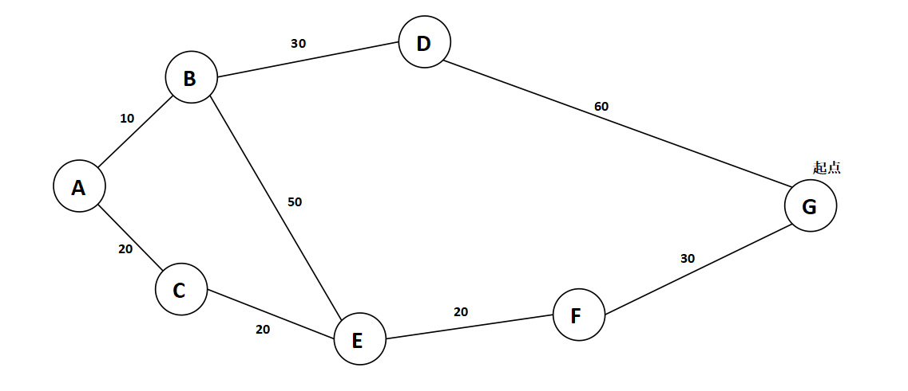

### 代码实现(简洁版)

`DijkstraAlgorithm`

```java
import java.util.Arrays;

public class DijkstraAlgorithm {
    public static void main(String[] args) {
        // 顶点数组，表示图中的7个顶点
        char[] vertex = {'A', 'B', 'C', 'D', 'E', 'F', 'G'};
        
        // 无限大表示没有连接的边
        final int N = 65535;
        
        // 邻接矩阵表示图，0表示自己到自己，其他值表示两点之间的权重
        int[][] matrix = {
            // A   B   C   D   E   F   G
            {0,  10, 20, N,  N,  N,  N}, // A
            {10, 0,  N, 30, 50,  N,  N}, // B
            {20, N, 0,  N, 10,  N,  N}, // C
            {N, 30, N, 0,  N,  N, 60},  // D
            {N, 50, 10, N, 0,  20, N},  // E
            {N, N, N, N, 20, 0,  30},  // F
            {N, N, N, 60, N, 30, 0}    // G
        };
        
        // 选择源顶点
        int start = 0; // 从 A（索引 0）开始

        // 调用 Dijkstra 算法计算最短路径
        dijkstra(matrix, start, vertex.length);
    }

    /**
     * Dijkstra 算法实现
     * 
     * @param graph 邻接矩阵表示的图
     * @param start 起始节点的索引
     * @param vertexCount 顶点数量
     */
    public static void dijkstra(int[][] graph, int start, int vertexCount) {
        int[] dist = new int[vertexCount]; // dist[i]存储从start到i的最短路径
        boolean[] visited = new boolean[vertexCount]; // visited[i]表示i节点是否已访问

        // 初始化：所有距离为无穷大，起始节点的距离为0
        Arrays.fill(dist, 65535); 
        dist[start] = 0;

        for (int i = 0; i < vertexCount; i++) {
            // 选择未访问的节点中距离起点最小的节点
            int u = -1;
            int minDist = 65535;
            for (int j = 0; j < vertexCount; j++) {
                if (!visited[j] && dist[j] < minDist) {
                    u = j;
                    minDist = dist[j];
                }
            }

            // 如果所有节点都已访问，退出循环
            if (u == -1) {
                break;
            }

            // 标记当前节点已访问
            visited[u] = true;

            // 更新与当前节点相邻节点的距离
            for (int v = 0; v < vertexCount; v++) {
                // 如果从u到v有路径且v节点未访问过
                if (graph[u][v] != 65535 && !visited[v]) {
                    int newDist = dist[u] + graph[u][v];
                    if (newDist < dist[v]) {
                        dist[v] = newDist; // 更新最短路径
                    }
                }
            }
        }

        // 打印从起始节点到其他节点的最短路径
        System.out.println("从 " + (char)('A' + start) + " 出发的最短路径：");
        for (int i = 0; i < vertexCount; i++) {
            if (dist[i] == 65535) {
                System.out.println((char)('A' + i) + " 不可达");
            } else {
                System.out.println((char)('A' + i) + " 的最短路径长度为: " + dist[i]);
            }
        }
    }
}

```

### 代码实现(封装)

`DijkstraAlgorithm`

```java
package com.yukinoshita.algorithm.dijkstra;

import java.util.Arrays;

public class DijkstraAlgorithm {
    public static void main(String[] args) {
        char[] vertex = {'A', 'B', 'C', 'D', 'E', 'F', 'G'};
        final int N = 65535;
        int[][] matrix = {
                {0, 10, 20, N, N, N, N},
                {10, 0, N, 30, 50, N, N},
                {20, N, 0, N, 10, N, N},
                {N, 30, N, 0, N, N, 60},
                {N, 50, 10, N, 0, 20, N},
                {N, N, N, N, 20, 0, 30},
                {N, N, N, 60, N, 30, 0}
        };
        Graph graph = new Graph(vertex, matrix);
//        graph.showGraph();
        graph.dijkstra(6);

        graph.showResult();
    }
}

class Graph {
    private char[] vertex;//顶点数组
    private int[][] matrix;//邻接矩阵
    //里面有三个表：1. 记录已访问过节点的表；2. 前驱节点的下标；3. 已访问的节点到其余节点的距离
    private VisitedVertex vis;

    public Graph(char[] vertex, int[][] matrix) {
        this.vertex = vertex;
        this.matrix = matrix;
    }

    public void showGraph() {
        for (int[] m : matrix) {
            System.out.println(Arrays.toString(m));
        }
    }

    /**
     * Dijkstra算法实现
     *
     * @param index 开始顶点（起点）
     */
    public void dijkstra(int index) {
        vis = new VisitedVertex(vertex.length, index);
        update(index);

        for (int j = 1; j < vertex.length; j++) {
            index = vis.updateArr(); //选择新的访问顶点
            update(index);
        }
    }

    //更新加入index节点后 的 vis（每一个顶点对应前一个顶点的下标、访问过的顶点到其余顶点的距离）
    private void update(int index) {
        int len = 0;
        for (int j = 0; j < matrix[index].length; j++) {
            //len = 出发顶点到index的距离 + index到j的距离
            len = vis.getDis(index) + matrix[index][j];
            if (!vis.isVisited(j) && len < vis.getDis(j)) {
                vis.updatePre(j, index);//更新j的前驱为j
                vis.updateDis(j, len);//更新出发节点到j的距离为len
            }
        }
    }

    //显示结果：
    public void showResult() {
        System.out.println("所有顶点是否都已访问过?visted[]为:"+Arrays.toString(vis.visited));

        int start = 0;
        for (int i = 0; i < vis.dis.length; i++) {
            if (vis.dis[i] == 0) {
                start = i;
                break;
            }
        }
        System.out.println("起点" + vertex[start] + "到其余顶点的最短距离为：");
        for (int i = 0; i < vertex.length; i++) {
            System.out.println(vertex[start] + "->" + vertex[i] + "(" + vis.dis[i] + ")");
        }

        System.out.println("每个顶点的前驱顶点为：");
        for (int i = 0; i < vertex.length; i++) {
            if (vertex[i] != vertex[vis.preVisited[i]]) {
                System.out.println(vertex[i] + "的pre是" + vertex[vis.preVisited[i]]);
            } else {
                System.out.println(vertex[i] + "是起始点");
            }
        }
    }

}

class VisitedVertex {
    //记录各个顶点是否被访问过（1访问过，0未访问）
    public int[] visited;
    //每一个点对应的前一个顶点的下标
    public int[] preVisited;
    //记录已访问过的节点到其余节点的距离
    public int[] dis;

    /**
     * @param vertexNums 顶点个数
     * @param index      出发节点下标
     */
    public VisitedVertex(int vertexNums, int index) {
        this.visited = new int[vertexNums];
        this.preVisited = new int[vertexNums];
        this.dis = new int[vertexNums];
        Arrays.fill(dis, 65535);
        dis[index] = 0;
        visited[index] = 1;
        for (int i = 0; i < preVisited.length; i++) {
            preVisited[i] = i;//初始化每个顶点的前驱为自己（也就是没有前驱）
        }
    }

    public boolean isVisited(int index) {
        return visited[index] == 1;
    }

    /**
     * 更新出发顶点到index顶点的距离
     *
     * @param index
     * @param len
     */
    public void updateDis(int index, int len) {
        dis[index] = len;
    }

    /**
     * 更新前驱pre顶点的前驱为index
     *
     * @param pre
     * @param index
     */
    public void updatePre(int pre, int index) {
        preVisited[pre] = index;
    }

    /**
     * 返回出发顶点到index顶点的距离
     *
     * @param index
     * @return
     */
    public int getDis(int index) {
        return dis[index];
    }

    //继续选择并返回 下一个 访问结点
    public int updateArr() {
        int minLen = 65535, index = 0;
        for (int i = 0; i < visited.length; i++) {
            if (visited[i] == 0 && dis[i] < minLen) {
                minLen = dis[i];
                index = i;
            }
        }
        visited[index] = 1;//更新这个节点被访问过
        return index;
    }

}
```

## 弗洛伊德算法

**Floyd算法介绍**

1. 和Dijkstra算法一样，弗洛伊德(Floyd)算法也是一种用于寻找给定的加权图中顶点间最短路径的算法。该算法名称以创始人之一、1978年图灵奖获得者、斯坦福大学计算机科学系教授罗伯特·弗洛伊德命名
2. 弗洛伊德算法(Floyd)计算图中各个顶点之间的最短路径
3. 迪杰斯特拉算法用于计算图中某一个顶点到其他顶点的最短路径
4. 弗洛伊德算法 VS 迪杰斯特拉算法：迪杰斯特拉算法通过选定的被访问顶点，求出从出发访问顶点到其他顶点的最短路径；弗洛伊德算法中每一个顶点都是出发访问点，所以需要将每一个顶点看做被访问顶点，求出从每一个顶点到其他顶点的最短路径。

**弗洛伊德算法思路**：

1. 假设图中有顶点 $ v_i $、$ v_j$ 和 $ v_k $，其中 $ L_{ik} $表示从顶点 $v_i $到顶点 $ v_k $ 的最短路径，$ L_{kj} $ 表示从顶点 $ v_k $ 到顶点 $ v_j $ 的最短路径。那么，顶点 $ v_i $ 到顶点 $ v_j $ 的最短路径 $ L_{ij} $ 可以通过以下方式计算：

$$
L_{ij} = \min(L_{ij}, L_{ik} + L_{kj})
$$

   也就是说，从 $ v_i $ 到 $ v_j $ 的最短路径，可能是直接从 $ v_i $ 到 $ v_j $ 的路径（即 $ L_{ij} $），或者是通过一个中间顶点 $ v_k $ 经过 $ v_k $ 的路径，即先从 $ v_i $ 到 $ v_k $，再从 $ v_k $ 到 $ v_j $。

2. 在实际算法中，针对每一对顶点 $ (v_i, v_j) $，我们都会依次考虑所有可能的中间顶点 $ v_k $（即图中的每个顶点），计算并更新从 $ v_i $ 到 $ v_j $ 的最短路径。具体来说，对于每一个中间顶点 $ v_k $，我们更新所有顶点对 $ (v_i, v_j) $ 的最短路径：

   $$
   L_{ij} = \min(L_{ij}, L_{ik} + L_{kj})
   $$

3. 最终，当所有的顶点都作为中间点被考虑过之后，我们就能够得到每一对顶点之间的最短路径。


**图解**：

求每A-G点到其余各点的最短路径/距离？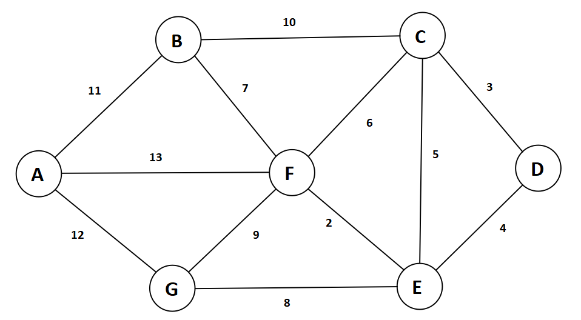

1. 在算法进行过程中，重点维护两张表：**距离表**、**前驱表**，初始化如下：

   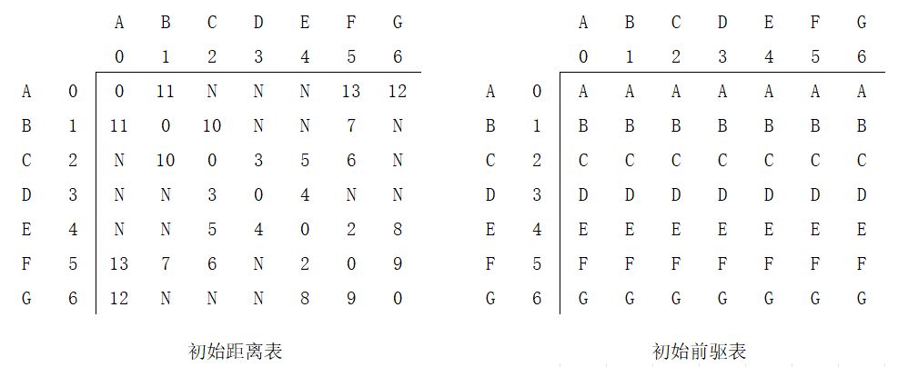

2. 仅以第一次为例，将A作为中间节点，对两张表进行更新：其中，只更新了B-A-G[23]（经过中间顶点A），**故更新B-G为23**，标黄的B-F[7]比B-A-F[24]小，所以**不更新B-F**。

   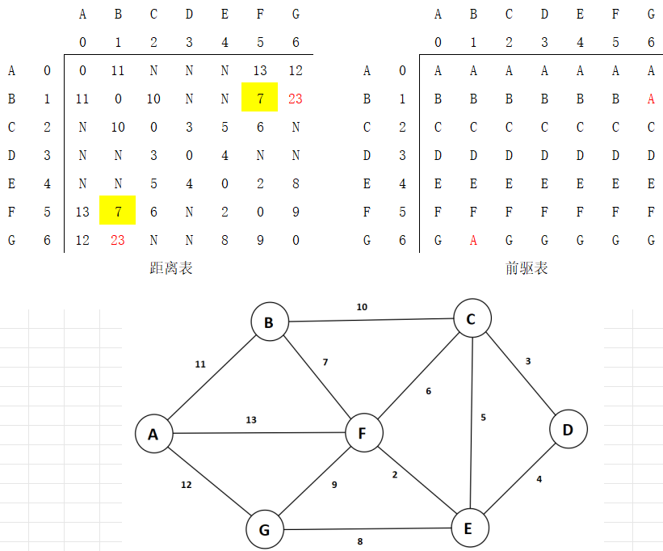

3. 真--人工手动跑一遍结果（代码验证无误）

   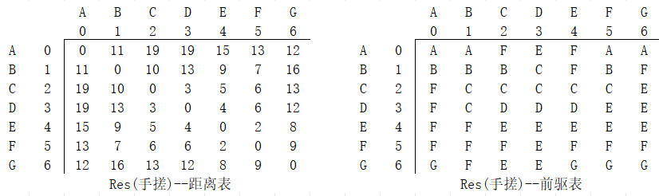

### 代码实现

`FloydAlgorithm`

```java
package com.yukinoshita.algorithm.floyd;

import java.util.Arrays;

public class FloydAlgorithm {
    public static final int N = 65535;
    public static void main(String[] args) {
        char[] vertex = {'A','B','C','D','E','F','G'};
        int[][] matrix = {
                {0, 11, N, N, N, 13, 12},
                {11, 0, 10, N, N, 7, N},
                {N, 10, 0, 3, 5, 6, N},
                {N, N, 3, 0, 4, N, N},
                {N, N, 5, 4, 0, 2, 8},
                {13, 7, 6, N, 2, 0, 9},
                {12, N, N, N, 8, 9, 0}
        };
        Graph graph = new Graph(vertex.length,vertex,matrix);
        graph.floyd();
        graph.showGraph();

        System.out.print("输出某两点的最短路径:");
        graph.path(0,3);//输出A到D的最短路径
    }
}

class Graph {
    private char[] vertex;
    private int[][] dis;//最短路矩阵
    private int[][] pre;//前驱矩阵

    public Graph(int n, char[] vertex, int[][] matrix) {
        this.vertex = new char[n];
        this.dis = new int[n][n];
        this.pre = new int[n][n];
        //初始化
        for (int i = 0; i < n; i++) {
            this.vertex[i] = vertex[i];
            for (int j = 0; j < n; j++) {
                dis[i][j] = matrix[i][j];
                pre[i][j] = i;
            }
        }
    }

    public void showGraph(){
        System.out.println("距离表为：");
        for(int i =0;i<dis.length;i++){
            System.out.println(Arrays.toString(dis[i]));
        }
        System.out.println("前驱表为：");
        for(int i =0;i<pre.length;i++){
            System.out.println(Arrays.toString(pre[i]));
        }
    }

    public void floyd(){
        int len = 0;
        for(int k =0;k<dis.length;k++){//遍历中间节点
            //从i到j  与  从i到k再到j的比较。
            for(int i =0;i<dis.length;i++){
                for(int j =0;j<dis.length;j++){
                    len = dis[i][k] + dis[k][j];
                    if(len < dis[i][j]){
                        dis[i][j] = len;
                        pre[i][j] = pre[k][j];
                    }
                }
            }
        }
    }

    public void path(int v1, int v2) {
        if (v1 == v2) {
            System.out.print(vertex[v1] + " ");
        } else if (pre[v1][v2] == v1) {
            System.out.print(vertex[v1] + " " + vertex[v2] + " ");
        } else {
            path(v1, pre[v1][v2]); // 递归输出路径
            System.out.print(vertex[v2] + " ");
        }
    }


}

```

## 马踏棋盘/骑士周游问题

> DFS算法的应用

### 思路分析

**骑士周游问题的解决步骤和思路：**

1. **创建棋盘**

   初始化一个棋盘 `chessBoard`，它是一个二维数组，最终会显示出棋盘被访问的顺序（从1开始计数），也作为标记某个点是否被访问过使用（0则表示未访问过）。

2. **设置当前位置已访问**

   将骑士的当前位置标记为已访问，并根据当前位置计算骑士能够跳到的合法位置。将这些位置存放在一个集合（如 `ArrayList`）中，最多包含8个合法的跳跃位置。每走一步，将步数 `step` 加 1（`step`从1开始）。

3.  **遍历可能的跳跃位置**

   遍历 `ArrayList` 中存放的所有跳跃位置，检查哪个位置可以合法地走通。如果找到可以继续走的合法位置，则继续往下走；如果走不通，进行回溯，尝试其他可能的路径。

4. **判断是否完成任务**

   在每一步后，通过比较当前步数 `step` 和应走的总步数（例如，棋盘上总共有 64 格）来判断骑士是否完成了任务。如果步数未达到目标，表示任务尚未完成，需要将当前走的这步回溯（标记为未访问 + 从棋盘上移除step）

### 引入贪心算法的优化

**原始算法回顾：**

在原始的回溯算法中，每当骑士移动到一个新位置时，它会尝试从当前的位置出发，向所有可能的方向移动，直至找到一个合法的位置。如果某个位置无法继续走下去，算法就会回溯，尝试其他路径。这个过程有可能产生很多冗余的回溯操作，特别是当某些路径已经没有出路时，算法依然需要探索。

**优化的贪心策略：**

在优化后的版本中，我们对每一步的可能跳跃位置进行了排序，排序的依据是**下一步的合法移动的数量**。具体做法是，对于每一个当前位置，首先计算出它的所有可能的跳跃位置，接着计算每一个跳跃位置的下一步可能走的格子的数量（即它的“后继”点的数量），然后将这些点按“后继点数量”进行非递减排序，优先选择那些后继点数量少的点进行探索。

**为什么这个优化是有效的？**

1. **减少回溯的次数：**

   通过优先选择“后继点数目少”的点，我们可以有效减少不必要的回溯。原因如下：

   - 如果我们首先选择一个“后继点数目少”的点，那么骑士的下一步选择就会变得相对明确，不会出现太多的回溯，因为如果某个位置后继点数多，则它很可能导致更多的可能路径，造成更多的回溯操作。
   - 反之，如果先选择了“后继点数目多”的点，可能导致骑士走入一个“死胡同”，这时算法会进行回溯，重新尝试其他的路径。通过贪心策略，减少了这类不必要的回溯。

2. **更高效的路径探索：**

   通过排序后的优先选择，我们相当于是在“预测”哪些路径最有可能找到解，并优先探索这些路径。这使得每次选择跳跃点时，骑士能较早地走到棋盘的“易走”区域，避免在困难区域做无谓的探索，从而提高算法的效率。

3. **防止局部最优：**

   贪心算法的一大优势是局部最优的选择能够帮助我们尽量避免走入死胡同。通过选择“后继点数目少”的位置，实际上是让骑士先走到那些可能性更少的地方，这样如果后续真的出现死局（即所有可能的后继都被访问过），程序可以尽早发现并进行回溯，而不是等到最后一步才回溯。

4. **贪心策略的实际效果：**
   - 在没有优化的情况下，骑士可能在某些点周围存在很多可选的下一步位置（例如：有多个合法的跳跃位置），但这些位置的后继可能很复杂，导致更多的回溯。而引入贪心算法后，程序会先探索那些“跳跃空间”最小的路径，尽量避免复杂的回溯。
   - **非递减排序**的策略本质上是在优先选择“后继点最少”的点，这是一种启发式的选择方法。通过这种方法，算法通常能够更快地找到解决方案，或者发现路径的死胡同，减少了回溯的开销。

> 优化前：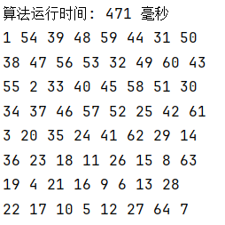
>
> 优化后：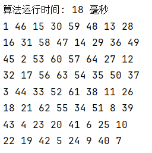

### 代码实现

`HorseStepChess`

```java
package com.yukinoshita.algorithm.horseStepOnAChessBoard;

import java.awt.*;
import java.util.ArrayList;

public class HorseStepChess {
    private static int R; // 棋盘行数
    private static int C; // 棋盘列数
    private static int[][] chessBoard; // 使用棋盘作为标记数组（也同时记录行动路线）
    private static boolean isFinished;

    // 定义马的8个可能的移动方向
    private static final int[] X_MOVE = {-2, -1, 1, 2, 2, 1, -1, -2};
    private static final int[] Y_MOVE = {1, 2, 2, 1, -1, -2, -2, -1};

    public static void main(String[] args) {
        R = C = 8;
        chessBoard = new int[R][C];
        KnightTour(0, 0, 1);

        for (int i = 0; i < chessBoard.length; i++) {
            for (int j = 0; j < chessBoard[i].length; j++) {
                System.out.print(chessBoard[i][j] + " ");
            }
            System.out.println();
        }
    }

    /**
     * 骑士周游方法
     *
     * @param r    当前行
     * @param c    当前列
     * @param step 第 step 步（从1开始）
     */
    public static void KnightTour(int r, int c, int step) {
        chessBoard[r][c] = step; // 标记当前位置为第几步

        // 获取当前位置可走的下一步位置
        ArrayList<Point> nextPoints = getNext(new Point(c, r));
        while (!nextPoints.isEmpty()) {
            Point p = nextPoints.remove(0);

            // 判断该点是否未被访问过（chessBoard[][]为0就是未访问过）
            if (chessBoard[p.y][p.x] == 0) { // 注意 Point.x 是列，Point.y 是行
                KnightTour(p.y, p.x, step + 1);
            }
        }

        // 回溯
        // 如果未完成任务且走不通，则重置当前格子
        if (step < R * C && !isFinished) {
            chessBoard[r][c] = 0;
        } else {
            isFinished = true; // 任务完成
        }
    }

    // 获取当前位置下一步可能走的所有点
    public static ArrayList<Point> getNext(Point current) {
        ArrayList<Point> points = new ArrayList<>();
        for (int i = 0; i < 8; i++) {
            int newX = current.x + X_MOVE[i];
            int newY = current.y + Y_MOVE[i];
            if (newX >= 0 && newX < C && newY >= 0 && newY < R) {
                points.add(new Point(newX, newY));
            }
        }
        return points;
    }
}

```

### 优化后代码

1. 在`KnightTour`方法里，获取了当前点的下一步可走的所有点后，进行排序：

```java
// 获取当前位置可走的下一步位置
ArrayList<Point> nextPoints = getNext(new Point(c, r));
//排序--优化部分，当按 下一个位置的下一次可能位置数 非递减排序时，可以减少回溯次数。
sortPoints(nextPoints);
```

2. `sortPoints`方法

```java
//为了优化骑士周游回溯的次数
    public static void sortPoints(ArrayList<Point> ps) {
        ps.sort(new Comparator<Point>(){
            @Override
            public int compare(Point o1, Point o2) {
                //获取o1的下一步所有可能位置 的个数
                int size1 = getNext(o1).size();
                //获取02的下一步所有可能位置 的个数
                int size2 = getNext(o2).size();
                return size1 - size2;
            }
        });
    }
```

3. 在`main`方法中，可以以下方式对比优化前后的效率（测优化前就在`KnightTour`方法注释掉sortPoints）

```java
public static void main(String[] args) {
        R = C = 8;
        chessBoard = new int[R][C];

        // 记录算法开始时间
        long startTime = System.currentTimeMillis();
        KnightTour(0, 0, 1);
        // 记录算法结束时间
        long endTime = System.currentTimeMillis();
        // 输出运行时间
        System.out.println("算法运行时间: " + (endTime - startTime) + " 毫秒");

        for (int i = 0; i < chessBoard.length; i++) {
            for (int j = 0; j < chessBoard[i].length; j++) {
                System.out.print(chessBoard[i][j] + " ");
            }
            System.out.println();
        }
    }
```


# 附录：其他补充

| 脚注  | 对应解释                                             | 脚注  | 对应解释                               |
| ----- | ---------------------------------------------------- | ----- | -------------------------------------- |
| [^1]  | [中缀表达式](##中缀表达式)                           | [^2]  | [前缀表达式](##前缀表达式)             |
| [^3]  | [后缀表达式](##后缀表达式)                           | [^4]  | [递归](##递归)                         |
| [^5]  | [分治](##分治)                                       | [^6]  | [基数排序处理负数](##基数排序处理负数) |
| [^7]  | [斐波那契查找的意义何在?](##斐波那契查找的意义何在?) | [^8]  | [自用の界面菜单](##自用の界面菜单)     |
| [^9]  | [前缀编码](##前缀编码)                               | [^10] | [动态规划](##动态规划)                 |
| [^11] | [贪心算法](##贪心算法)                               |       |                                        |

## 中缀表达式

[^1]:中缀表达式

中缀表达式，就是我们常见的表达式，如$(3+4) \times 5-6$，但是对于计算机来说操作较为复杂。

因此，在计算结果时，一般需要转换为其他表达式来计算（一般是后缀表达式）

## 前缀表达式

[^2]:前缀表达式

前缀表达式，又称**波兰式**。前缀表达式的运算符位于操作数之前

e.g.$(3+4)\times5-6$对应的前缀表达式为$-*+3456$ （关键在于将原先表达式转换为前缀表达式）

- 前缀表达式的求值：
  - **从右至左**扫描前缀表达式，遇到数字时，压入堆栈，遇到运算符时，弹出栈顶的两个数，用运算符对他们进行运算，并将结果入栈。重复该过程直至表达式最左端。
  - e.g.	$-*+3456$ 
  - 将6、5、4、3压入堆栈（`numStack=[6,5,4,3]`）
  - 遇到+，弹出3、4，运算$3+4=7$，将7入栈。（`numStack=[6,5,7]`）
  - 遇到*，弹出7、5，运算$7 \times 5=35$，将35入栈（`numStack=[6,35]`）
  - 遇到-，弹出35、6，运算$35-6=29$，将29入栈（`numStack=[29]`）

## 后缀表达式

[^3]: 后缀表达式

后缀表达式，又称**逆波兰表达式**，与前缀表达式类似，只是运算符放在操作数之后。

- 例如$(3+4)\times 5 -6$的后缀式为：$3 \quad 4 + 5 \times 6 - $

- $a+b$为$a \quad b +$ 
- $a+(b-c)$为$a \quad b \quad c - +$
- $a+(b-c)\times d$为$a \quad b \quad c - d \times +$
- $a+d \times (b-c)$为$a \quad d \quad b \quad c - \times +$
- $a=1+3$为$a \quad 1 \quad 3 +=$

后缀表达式的求值：

**从左至右**表达式，遇到数字时，压入堆栈，遇到运算符时，弹出栈顶的两个数，用运算符对他们进行运算，并将结果入栈。重复该过程直至表达式最右端。(演示过程和前缀表达式一致)

> 关键在于如何将中缀表达式转换为后缀表达式

## 递归

[^4]: 递归

### 递归介绍

 简单来说，递归就是**自己调用自己**，每次调用时**传入不同的变量**。

递归调用机制：

1. 当程序每次调用一个方法时，就会开辟一个独立的空间（栈）
2. 每个空间的数据（局部变量），都是独立的

递归能解决的问题：

1. 数学类：八皇后问题、汉诺塔、阶乘问题、迷宫问题、球和篮子问题
2. 算法中：快排、归并排序、二分查找、分治算法
3. 将用栈解决的问题->使用递归，代码简洁

### 递归需遵守的规则

1. 执行一个方法，就创建一个独立空间
2. 局部变量独立
3. 引用类型变量是共享的（例如数组）
4. 递归必须设计**递归出口**，**必须向退出递归的条件逼近**
5. 当一个方法执行完毕，谁调用，谁接收返回结果，并且继续执行调用者后面的代码

## 分治

[^5]: 分治

> 先见[博客1](https://blog.csdn.net/daaikuaichuan/article/details/80765604?ops_request_misc=&request_id=&biz_id=102&utm_term=%E5%88%86%E6%B2%BB&utm_medium=distribute.pc_search_result.none-task-blog-2~all~sobaiduweb~default-2-80765604.142^v100^pc_search_result_base5&spm=1018.2226.3001.4187)与[博客2](https://www.cnblogs.com/leishitou/p/5436201.html)的解释

1. 分治法是一种很重要的算法。字面上的解释是“分而治之”，就是把一个复杂的问题分成两个或更多的相同或相似的子问题，再把子问题分成更小的子问题……直到最后子问题可以简单的直接求解，原问题的解即子问题的解的合并。这个技巧是很多高效算法的基础，如排序算法(快速排序，归并排序)，傅立叶变换(快速傅立叶变换)……
2. 分治算法可以求解的一些经典问题
   1. 二分搜索
   2. 大整数乘法
   3. 棋盘覆盖
   4. 合并排序
   5. 快速排序
   6. 线性时间选择
   7. 最接近点对问题
   8. 循环赛日程表
   9. [汉诺塔](##汉诺塔问题)

**分治算法的基本步骤**

分治法在每一层递归上都有三个步骤：

1. 分解：将原问题分解为若干个规模较小，相互独立，与原问题形式相同的子问题
2. 解决：若子问题规模较小而容易被解决则直接解，否则递归地解各个子问题
3. 合并：将各个子问题的解合并为原问题的解。

**分治(Divide-and-Conquer(P))算法设计模式**：

```java
if |P|≤n0
   then return(ADHOC(P))
//将P分解为较小的子问题 P1 ,P2 ,…,Pk
for i←1 to k
do yi ← Divide-and-Conquer(Pi)   递归解决Pi
T ← MERGE(y1,y2,…,yk)   合并子问题
return(T)

```

其中$|P|$表示问题P的规模；$n_0$为一阈值，表示当问题P的规模不超过$n_0$时，问题已容易直接解出，不必再继续分解。`ADHOC(P)`是该分治法中的基本子算法，用于直接解小规模的问题P。因此，当P的规模不超过$n_0$时直接用算法`ADHOC(P)`求解。算法`MERGE(y1,y2,…,yk)`是该分治法中的合并子算法，用于将P的子问题P1 ,P2 ,…,Pk的相应的解y1,y2,…,yk合并为P的解。


## 基数排序处理负数

[^6]: 基数排序处理负数

### 偏移法

#### 介绍

1. **找出最小值**：首先遍历数组，找出最小值。
2. **偏移所有数**：将数组中的所有元素都加上一个正数，使得数组中的所有元素都变为非负数。这个正数可以是绝对值最小值加一。例如，如果最小值是 -10，可以将所有元素加 11，使得最小值变为 1。
3. **进行基数排序**：对偏移后的数组进行基数排序。
4. **恢复原值**：排序完成后，再将每个元素减去之前加的正数，恢复到原始值。

#### 代码实现

```java
private static void radixSort(int[] arr) {
    // 找到最小值
    int min = arr[0];
    for (int value : arr) {
        if (value < min) {
            min = value;
        }
    }

    // 偏移量
    int offset = Math.abs(min);
    int[][] buckets = new int[10][arr.length];
    int[] bucketCounts = new int[10];

    // 获取最大值
    int max = arr[0] + offset; // 加上偏移量
    for (int i = 1; i < arr.length; i++) {
        arr[i] += offset; // 偏移
        if (arr[i] > max) {
            max = arr[i];
        }
    }
    
    int maxLength = (max + "").length();

    for (int i = 0, n = 1; i < maxLength; i++, n *= 10) {
        // 放入桶中的过程
        for (int j = 0; j < arr.length; j++) {
            int digit = arr[j] / n % 10;
            buckets[digit][bucketCounts[digit]] = arr[j];
            bucketCounts[digit]++;
        }

        // 从桶中取出的过程
        int index = 0;
        for (int j = 0; j < buckets.length; j++) {
            if (bucketCounts[j] != 0) {
                for (int k = 0; k < bucketCounts[j]; k++) {
                    arr[index++] = buckets[j][k];
                }
                bucketCounts[j] = 0;
            }
        }
    }

    // 恢复原值
    for (int i = 0; i < arr.length; i++) {
        arr[i] -= offset; // 恢复
    }
}
```

#### 解释
1. **偏移处理**：在进行排序前，将所有数加上偏移量（绝对值最小值），确保数组中所有元素为非负数。
2. **基数排序**：对偏移后的数组进行基数排序。
3. **恢复值**：排序完成后，减去偏移量以恢复到原始值。

这种方法较为简单，且在排序完成后，时间复杂度仍然保持在 $(O(d \cdot (n + k)))$，其中 d 是数字的位数，n 是元素个数，k 是基数的大小。

### 分开处理

#### 介绍

1. **分为正负数组**：创建两个数组，分别存放正数和负数。
2. **对正数进行基数排序**：对正数数组进行基数排序。
3. **对负数进行基数排序**：对负数数组的绝对值进行基数排序，然后将结果反转。
4. **合并结果**：将负数数组（排序后）和正数数组（排序后）合并。

#### 代码实现

```java
import java.util.Arrays;
import java.util.Random;

public class RadixSort {
    public static void main(String[] args) {
        int[] arr = {53, -3, 542, 748, 14, -214};

        System.out.println("排序前: " + Arrays.toString(arr));
        radixSort(arr);
        System.out.println("排序后: " + Arrays.toString(arr));

        // 测试算法性能
        testPerformance();
    }

    private static void radixSort(int[] arr) {
        // 分为正负数组
        int[] positive = Arrays.stream(arr).filter(x -> x >= 0).toArray();
        int[] negative = Arrays.stream(arr).filter(x -> x < 0).map(Math::abs).toArray(); // 取绝对值

        // 对正数进行基数排序
        if (positive.length > 0) {
            radixSortPositive(positive);
        }

        // 对负数进行基数排序
        if (negative.length > 0) {
            radixSortPositive(negative);
            // 反转负数排序后的结果
            reverseArray(negative);
        }

        // 合并结果
        int index = 0;

        // 先填充负数
        for (int num : negative) {
            arr[index++] = -num; // 恢复负号
        }

        // 然后填充正数
        for (int num : positive) {
            arr[index++] = num;
        }
    }

    private static void radixSortPositive(int[] arr) {
        int[][] buckets = new int[10][arr.length];
        int[] bucketCounts = new int[10];

        // 获取最大值
        int max = Arrays.stream(arr).max().getAsInt();
        int maxLength = (max + "").length();

        for (int i = 0, n = 1; i < maxLength; i++, n *= 10) {
            // 放入桶中的过程
            for (int j = 0; j < arr.length; j++) {
                int digit = arr[j] / n % 10;
                buckets[digit][bucketCounts[digit]] = arr[j];
                bucketCounts[digit]++;
            }

            // 从桶中取出的过程
            int index = 0;
            for (int j = 0; j < buckets.length; j++) {
                if (bucketCounts[j] != 0) {
                    for (int k = 0; k < bucketCounts[j]; k++) {
                        arr[index++] = buckets[j][k];
                    }
                    bucketCounts[j] = 0;
                }
            }
        }
    }

    private static void reverseArray(int[] arr) {
        int left = 0, right = arr.length - 1;
        while (left < right) {
            int temp = arr[left];
            arr[left] = arr[right];
            arr[right] = temp;
            left++;
            right--;
        }
    }

    // 测试算法性能的方法
    public static void testPerformance() {
        int size = 140000; // 数组大小
        int[] arr = new int[size];
        Random random = new Random();

        // 生成无序数组
        for (int i = 0; i < size; i++) {
            arr[i] = random.nextInt(200000) - 100000; // 生成范围为 -100000 到 100000 的随机数
        }

        long startTime = System.currentTimeMillis(); // 记录开始时间
        radixSort(arr); // 排序
        long endTime = System.currentTimeMillis(); // 记录结束时间

        System.out.println("排序大小: " + size);
        System.out.println("排序时间: " + (endTime - startTime) + " 毫秒");
    }
}
```

#### 解释
1. **分开处理**：
   - 使用 `Arrays.stream` 分别创建正数数组 `positive` 和负数数组 `negative`（取绝对值）。

2. **基数排序**：
   - 对正数数组调用 `radixSortPositive` 方法进行排序。
   - 对负数数组同样调用 `radixSortPositive`，但处理时将元素取绝对值。

3. **反转负数数组**：
   - 对负数排序后的结果进行反转，以确保负数按正确顺序排列。

4. **合并结果**：
   - 先将负数（带负号）放入最终数组，再将正数放入，得到完整的排序结果。

### 两者比较、总结

#### 偏移法
- **优点**：
  - 实现相对简单，不需要额外的空间来存储正数和负数数组。
  - 对于负数和正数的排序都是在同一个数组中进行的，合并结果的步骤被省略。

- **缺点**：
  - 需要对整个数组进行遍历以找出最小值并计算偏移量，这在数据量很大时会增加时间开销。
  - 需要额外的空间用于桶（假设桶大小为常数，空间复杂度为 $O(n)$），但实际上，空间利用率可能受到偏移量影响。

#### 分开处理法
- **优点**：
  - 明确分开了负数和正数的排序，逻辑更清晰。
  - 在处理负数时，直接对绝对值排序，可以有效避免负数带来的问题。

- **缺点**：
  - 需要额外的数组来存储正数和负数，空间复杂度更高（需要 $O(n)$ 的额外空间）。
  - 合并结果时需要再次遍历数组，增加了额外的时间开销。

#### 性能比较
- **时间复杂度**：两种方法的时间复杂度均为 $O(d \cdot (n + k))$，其中 $d$ 是数字的位数，$n$ 是元素个数，$k$ 是基数的大小。因此，从理论上讲，时间复杂度相同。
- **实际性能**：
  - 对于大多数情况，偏移法在空间上更高效，适合数据范围较小的情况。
  - 分开处理法在逻辑上更易于理解，且能更好地处理极端情况（例如全是负数或全是正数）。

#### 结论
在性能上，两种方法在大多数情况下相似，但具体的选择可以根据实际需求和数据特性来决定。

如果需要处理的数组范围较大且包含负数，分开处理法可能会更加灵活；如果希望简化实现，偏移法是一个不错的选择。

## 斐波那契查找的意义何在?

[^7]: 斐波那契查找的意义何在?

这个问题，我浅浅看了几篇文章，但都没有满意的答案。

可能的原因千奇百怪：

1. 斐波那契查找在计算`mid`值时，只使用了加减法——`mid = low + f[k-1] - 1`，而二分查找使用了除法，除法是极耗费时间的。但是吧，也没那么耗时间，很多编辑器都优化成>>1了，也没比加减法慢。
2. 斐波那契查找将mid点设置在0.618处，如果所以元素落在$[low,mid-1]$区间的概率较大，判断一次的可能更高；而二分查找两个区间长度都为一半，所以仅需判断一次的概率相比更小。貌似很有道理，但是为什么是0.618？我没看到一篇文章有过详细的数学证明……所以还是觉得这两者查找效率半斤八两。

## 自用の界面菜单

[^8]: 自用の界面菜单

> 测试用咯~

```java
char operate = ' ';
        Scanner scanner = new Scanner(System.in);
        while (true) {
            System.out.println("---------------------");
            System.out.println("q：退出程序");
            System.out.println("q：退出程序");
            System.out.println("q：退出程序");
            System.out.println("q：退出程序");
            System.out.print("Enter operation: ");
            operate = scanner.next().charAt(0);
            System.out.println("---------------------");

            switch (Character.toLowerCase(operate)) {
                case 'e' -> {

                }
                case 'd' -> {

                }
                case 's' -> {
                }
                case 'h' -> {
                }
                case 'q' -> {
                }
                default -> System.out.println("Invalid operation");
            }
```


## 前缀编码

[^9]: 前缀编码

简单理解：10010110100是编码结果，但是在解读时，a编码为1，b编码为10，那么在解读这个编码时，开头的1究竟是1？还是说10是b？

如果在一个编码方案中，任何一个编码都不是其他任何编码的前缀（最左子串），则称该编码是前缀编码。

补充资料：[blog1](https://blog.csdn.net/qq_30787727/article/details/112210023)、[blog2](https://blog.csdn.net/ak201605050122/article/details/100169591)。

## 动态规划

[^10]: 动态规划

**动态规划介绍**：

1. **动态规划(Dynamic Programming)**算法的核心思想是：将**大问题划分为小问题**进行解决，从而一步步获取最优解的处理算法
2. 动态规划算法与分治算法类似，其基本思想也是将待求解问题分解成若干个子问题，先求解子问题，然后从这些子问题的解得到原问题的解。
3. 与分治法不同的是，**适合于用动态规划求解的问题，经分解得到子问题往往不是互相独立的**。 ( 即下一个子阶段的求解是建立在上一个子阶段的解的基础上，进行进一步的求解 )
4. 动态规划可以通过**填表**的方式来逐步推进，得到最优解

## 贪心算法

[^11]: 贪心算法

**贪心算法介绍**：

1. 贪婪算法(贪心算法)是指在对问题进行求解时，在每一步选择中都采取最好或者最优(即最有利)的选择，从而希望能够导致结果是最好或者最优的算法
2. 贪婪算法所得到的结果**不一定是最优的结果(有时候会是最优解)**，但是都是相对近似(接近)最优解的结果
